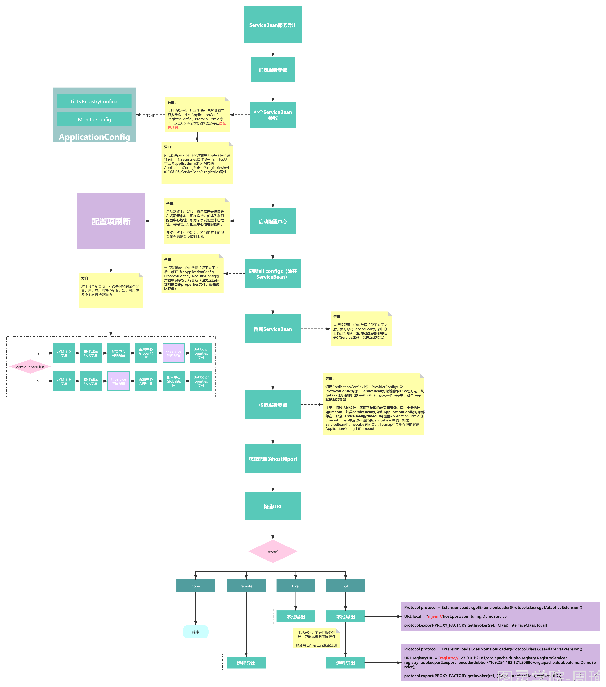
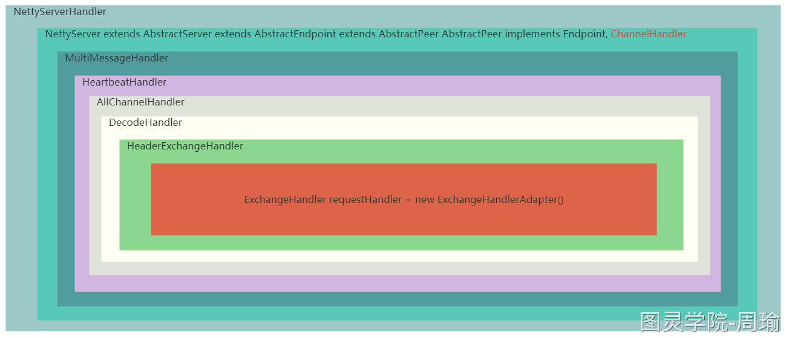
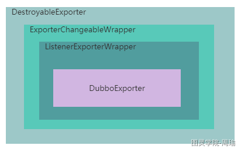
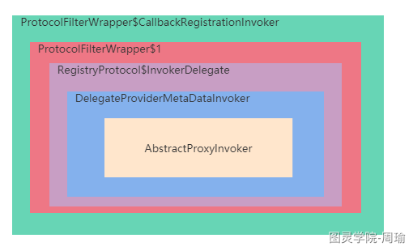

## Dubbo服务导出源码解析

[toc]

#### 服务导出大概原理

服务导出的入口为ServiceBean中的export()方法，当Spring启动完之后，通过接收Spring的ContextRefreshedEvent事件来触发export()方法的执行。

一个ServiceBean对象就标识一个Dubbo服务，ServiceBean对象中的参数就标识服务的参数，比如timeout，该对象的参数值来至@Service注解中的所定义的。

服务导出主要做两件事：

1. 根据服务的参数信息，启动对应的网络服务(nettty、tomcat、jetty等)，用来接收网络请求。
2. 将服务的信息注册到注册中心。

但是在做这两件事之前先得把服务的参数确定好，因为一个Dubbo服务的参数，除开可以在@Service注解中去配置，还会继承Dubbo服务所属应用(Application)上的配置，还可以在配置中心或JVM环境变量中去配置某个服务的参数，所以首先要做的是确定好当前服务最终的(优先级最高)的参数值。

确定好服务参数之后，就跟去锁配置的协议启动对应的网络服务。在启动网络服务器时，并且在网络服务器接收请求的过程中，都可以从服务参数中获取信息，比如最大连接数，线程数，socket超时时间等等。

启动完网络服务器之后，就将服务信息注册到注册中心。同事还有向注册中心注册监听器，监听Dubbo中的童泰配置信息变更。

#### 服务概念的演化

1. DemoService接口表示一个服务，此时的服务表示服务定义。
2. DemoServiceImpl表示DemoService服务的具体实现，此时的服务表示服务的具体实现。
3. DemoService+group+version表示一个服务，此时的服务增加了分组和版本概念。
4. http://127.0.0.1:12000/com.obgnahzz.DemoService表示一个服务，此时的服务增加了机器IP和Port，表示远程机器可以通过这个URL来使用com.obgnahzz.DemoService这个服务
5. http://127.0.0.1:12000/com.obgnahzz.DemoService?timeout=3000&version=1.0.0&application=dubbo-demo-provider-application表示一个服务，此时的服务是拥有参数的，比如超时时间、版本号、所属应用。

在dubbo中就是用最后一种方式来表示服务的。

#### 服务导出的思路

服务导出要做的几件事情：

1. 确定服务的参数
2. 确定服务支持的协议
3. 改造服务的最终URL
4. 将服务URL注册到注册中心去
5. 根据服务扶持的不同协议，启动不同的Server，用来接收和处理请求
6. 因为Dubbo支持动态配置服务参数，所以服务导出时还需要绑定一个监听器Listenner来监听服务的参数是否有修改，如果返现有修改，则需要重新进行导出

所在服务导出时，需要从以上几个地方获取协议，结果可能是一个协议，也可能是多个协议，从而确定出协议。

#### 确定服务的参数

在执行ServiceConfig.export()时，此时ServiceConfig对象就代表一个服务，我们已经知道了这个服务的名字(就是接口名)，并且此时这个服务可能已经有一些参数了，就是@Service注解上所定义的参数。

但是在Dubbo中，除开可以在@Service注解中给服务配置参数，还有很多地方也可以给服务配置参数，比如：

1. dubbo.properties文件，你可以建立这个文件，dubbo会去读取这个文件的内容作为服务的参数，Dubbo源码中叫做**PropertiesConfiguration**。
2. 配置中心，dubbo在2.7版本之后就支持分布式配置中心，你可以在Dubbo-Admin中去修改这个dubbo.properties文件，当然配置中心支持按应用进行配置，也可以按全局进行配置两种，在Dubbo源码中**AppExternalConfiguration**标识应用配置，**ExternalConfiguration**标识全局配置。
3. 系统环境变量，你可以在启动应用程序时，通过-D的方式来指定参数，在Dubbo源码中叫**SystemConfiguration**。
4. 再加上通过@Service注解所配置的参数，在Dubbo的源码中交**AbstractConfig**。

服务的参数可以从这四个位置来，这四个位置上如果赔了同一个参数的话，优先级从高到低如下：

**SystemConfiguration -> AppExternalConfiguration -> ExternalConfiguration -> AbstractConfig -> PropertiesConfiguration**

#### 确定服务支持的协议

确定服务支持的协议还是比较简单的，就是看用户配置了多少个Protocol。和服务参数一样，Protocol也是可以在各个配置点进行配置的。

1. 首先SpringBoot的application.properties文件中就可能配置了协议
2. 也可能在dubboo.properties文件配置了协议
3. 也可能在配置中心也配置了协议
4. 也可能通过-D的方式配置了协议

所以在服务导出时，需要从以上几个地方获取协议，结果可能是一个协议，也可能是多个协议，从而确定出最终协议。

#### 构造服务最终的URL

有了确定的协议，服务名，服务参数后，自然就可以组装成服务的URL了。

但是还有一点非常重要，在Dubbo中支持服务动态配置，注意，这个和配置中心不是一个概念，动态配置是可以再服务导出后动态的去修改服务配置的，而配置中心咋不能打到这一效果。

动态配置，其实就是继续给服务增加一些参数，所以在把服务的URL注册到注册中心去之前，得先按照动态配置中所添加的配置重谢一下URL，也就是应用上动态配置中的参数。

只有这样做完之后得到的URL才是真正正确的服务提供者URL。

#### 将服务URL注册到注册中心去

有了准确的服务URL之后，就可以把URL注册到注册中心上去了。

这个步骤并不简单，只不过这里要去寻找用户是否配置了多个注册中心，将服务URL注册到每个注册中心中去。

#### 根据服务URL启动Server

在服务URL中指定了协议，比如Http协议、Dubbo协议。根据不同的协议启动对应的Server。

比如Http协议就启动Tomcat、Jetty。

比如Dubbo协议就启动Netty。

不能只启动Server，还需要绑定一个RequestHandler，用来处理请求。

比如，Http协议对应的就是InternalHandler。Dubbo协议对应的就是Exchangehandler。

Dubbo协议启动Server：

1. 调用DubboProtocol的openServer(URL url)方法开始启动Server
2. 调用DubboProtocol的createServer(url)方法，在createServer()方法中调**Exchangers.bind(url, requestHandler)**中，会先根据URL得到一个Exchanger，默认为HeaderExchanger
3. 其中requsetHandler标识请求处理器，用来处理请求
4. 在**Exchangers.bind(url, requestHandler)**中，先会根据URL得到一个Exchanger，默认为HeaderExchanger
5. HeaderExchanger中包括HeaderExchangeClient、HeaderExchangeServer
6. HeadExchangeClient负责发送心跳，HeaderExchangeServer负责接收心跳，如果超时则会关闭channel
7. 在构造HeaderExchangeServer之前，会通过调用Transporters.bind(url, new DecodeHandler(new HeaderExchangeHandler(handler)))方法得到一个Server
8. 默认会使用getTransporter去bind(URL url, ChannelHandler listener)从而得到一个Servlet，此时的listener就是外部传过来的DecodeHandler
9. 在NettyTransporter的bind方法中回去new NettyServer(url, listener)，所以上面返回的Server默认就是NettyServer
10. 在构造NettyServer时，会调用ChannelHandlers.wrap（handler, ExecutorUtil.setThreadName(url, SERVER_THREAD_POOL_NAME)）再构造一个ChannelHandler
11. warp中的handler就是上面的listener
12. 在wrap方法中会调用new MultiMessageHandler(new HeartbeatHandler(ExtensionLoader.getExtensionLoader(Dispatcher.class).getAdaptiveExtension().dispatch(handler, url)))构造一个ChannelHandler
13. 构造完ChannelHandler后，就是真正的去开启Server了，会调用AbstractServer抽象类的doOpen方法
14. 在NettyServer中，会实现doOpen方法，会调用new NettyServerHandler(getUrl(), this)构造一个NettyServerHandler，并bind地址
15. DubboProtocol协议的启动Server流程结束

1. NettyServerHandler：与NettyServer直接绑定的请求处理器，负责从Netty接收到请求，channelRead()方法获取到请求，然后调用下一层的Handler（NettyServer）的received()方法将请求传递下去，此时的请求还是Object msg
2. NettyServer：NettyServer的父类AbstractPeer中存在received()，该方法没有做什么，直接把msg传递给下一层Handler（MultiMessageHandler）
3. MultiMessageHandler：此Handler会判断msg是否是一个MultiMessage，如果是，则对MultiMessage进行拆分，则把拆分出来的msg传递给下层Handler（HeartbeatHandler），如果不是，则直接把msg传递给下层Handler（HeartbeatHandler）
4. HeartbeatHandler：此Handler通过received()方法接收到msg，然后判断该msg是不是一个心跳请求或心跳响应，如果是心跳请求，则此Handler返回一个Response对象（很简单的一个对象），如果是心跳响应，则打印一个日志，不会有其他逻辑，如果都不是，则把msg传递给下层Handler（AllChannelHandler）。
5. AllChannelHandler：此Handler通过received()方法接收到msg，然后把msg封装为一个ChannelEventRunnable对象，并把ChannelEventRunnable扔到线程池中去，异步去处理该msg。在ChannelEventRunnable中会把msg交给下一个Handler（DecodeHandler）
6. DecodeHandler：此Handler通过received()方法接收到msg，会对msg解析decode解码，然后交给下一个Handler(HeaderExchangeHandler)
7. HeaderExchangeHandler：此Handler通过received()方法接收到msg，会判断msg的类型

1. 1. 如果Request是TwoWay，则会调用下一个Handler(DubboProtocol中的**requestHandler**)的reply方法得到一个结果，然后返回
   2. 如果Request不是TwoWay，则会调用下一个Handler(DubboProtocol中的**requestHandler**)的received方法处理该请求，不会返回结果

1. requestHandler：此Handler是真正的处理请求逻辑，在received()方法中，如果msg是Invocation，则会调用reply方法，但不会返回reply方法所返回的结果，在reply方法中把msg强制转换为Invocation类型 inv，然后根据inv得到对应的服务Invoker，然后调用invoke(inv)方法，得到结果。

#### 服务导出源码流程

1. ServiceBean.export()方法是导出的入口方法，会执行ServiceConfig.export()方法完成服务导出，导出完了之后会发布一个Spring时间ServiceBeanExportedEvent
2. 在ServiceConfig.export()方法中会调用checkAndUpdateSubConfigs()，这个方法主要完成AbstractConfig的参数刷新(从配置中心获取参数等等)，刷新完后悔检查stub、local、mock等参数是否配置争取
3. 参数刷新和检查完成了之后，就会开始导出服务，如果配置了延迟导出，那么则按照指定的时间利用ScheduledExecutorService来进行延迟导出
4. 否则调用doExport()进行服务导出
5. 继续调用doExportUrls()进行服务导出
6. 首先通过loadRegistries()方法获得所有配置的注册中心的URL，可能配置了多个注册中心，那么当前所导出的服务需要注册到每个配置中心去，这里，注册中心的以URL的方式来表示，使用的是什么注册中心、注册中心的地址和端口，给注册中心所配置的参数等等，都会存在URL上，次URL以***registry://**开始
7. 获得到注册中心的registryURLs之后，就会遍历当前服务所有的ProtocolConfig，调用doExportUrlsFor1Protocol(protocolConfig, registryURLs)方法把当前服务按每个协议每个注册中心分别进行导出
8. 在doExportUrlsFor1Protocol()方法中，会先构造一个URL
   1. 服务的协议dubbo://
   2. 服务的IP和Port，如果指定了就取指定的，没有指定IP就获取服务器上网卡的IP
   3. 以及服务的Path，如果没有指定PATH参数，则取接口
   4. 以及服务的参数，参数包括服务的参数，服务中某个方法的参数
   5. 最终得到的URL类似：dubbo://192.168.1.1:12000/com.obgnahzz.DemoService?time=3000&sayHello.loadbalance=random
9. 得到服务URL之后，会把服务URL最后一个参数添加到registryURL中区，然后把registryURL、服务的接口、当前服务实现类ref生成一个Invoker代理对象，再把这个带来对象和当前ServiceConfig对象包装成一个DelegateProviderMetaDataInvoker对象，DelegateProviderMetaDataInvoker就标识了完成的一个服务
10. 接下来会使用Protocol去export导出服务了，导出之后将得到一个Exporta对象(该Exporter对象，可以理解为主要可以卸载(unexport)服务，什么时候会写在服务？在优雅关闭Dubbo应用的时候)
11. 当调用protocol.export(wrapperInvoker)方法时，因为protocol是Protocol接口的一个Adaptive对象，所以会根据wrapperInvoker的getUrl方法得到一个url，根据此url的协议找到对应的扩展点，此时扩展点就是RegistryProtocol，但是，因为Protocol接口有两个包装类，一个ProtocolFilterWrapper、ProtocolListenerWrapper，所以实际上调用export方法时，会讲过这两个包装类的export方法，但是这两个包装的export方法中都会Registry协议进行了判断，不会做过多处理，所以最终会直接电泳RegistryProtocol的export(Invoker<T> originInvoker)方法
12. 在RegitryProtocol的export(Invoker<T> originInvoker)方法中，主要完成了一下几件事：
    1. 生成监听器，监听动态配置中心此时服务的参数数据的变化，一旦监听到变化，则重写服务URL，并且在服务导出时先重写一个服务URL
    2. 拿到重写之后的URL，调用doLocalExport()进行服务导出，在这个方法中会滴啊用DubboProtocol的export方法去导出服务，导出成功后会得到一个ExporterChangeableWrapper
       1. 在DubboProtocol的export方法中主要做的事情就是启动NettyServer，并且设置一些列的RequestHandler，以便在接收到请求时能依次被这些RequestHandler所处理
       2. 这些RequestHandler在上文已经整理过了
    3. 从originInvoker中获取注册中心的实现类，比如ZookeeperRegistry
    4. 将讲话后的服务URL调用ZookeeperRegistry.registry()方法注册到注册中心去
    5. 最后将ExporterChangeableWrapper封装为DestroyableExporter对象返回，完成服务导出

#### Exporter架构

一个服务导出成功后，会生成对应的Exporter

1. DestroyableExporter：Exporter最外层的包装类，这个类的主要作用是可以用来unexporter对应的服务
2. ExporterChangeableWrapper：这个类主要负责在unexport对应服务之前，把服务URL从注册中心中移除，把该服务对应的动态配置监听器移除
3. ListenerExporterWrapper：这个类主要负责在unexport对应服务之后，把服务导出监听器移除
4. DubboExporter：这个类保存了对应服务的Invoker对象，和当前服务的唯一标志，当NettyServer接收到请求后，会更趋请求中的服务信息，找到服务对应的DubboExporter对象，然后从对象中得到Invoker对象

#### 服务端Invoker架构

1. ProtocolFilterWrapper$CallbackRegistrationInvoker：回去调用下层Invoker，下层Invoker执行完之后，会遍历过滤器，查看是否过滤实现了ListenableFilter接口，如果有，则回调对应的onResponse方法，比如TimoutFilter，当调用完下层Invoker之后，就会计算服务的执行时间。
2. ProtocolFilterWrapper$1：ProtocolFilterWrapper中的过滤器组成的Invoker，利用该Invoker，可以执行服务端的过滤器，执行完过滤器之后，调用下层Invoker
3. RegistryProtocol$InvokerDelegate：服务的委托类，里面包含了DelegateProviderMetaDataInvoker对象和服务对应的providerUrl，执行时直接调用下层Invoker
4. AbstractProxyInvoker：服务接口的代理类，绑定了对应的实现类，执行时会利用反射调用服务实现类实例的具体方法，并且得到结果

#### 服务监听器原理总结

服务在导出的过程中需要向动态配置中心的数据进行订阅，以便当管理人员修改了动态配置中心对应服务的参数后，服务体工程能即使做出变化。

此功能涉及到版本兼容，因为在Dubbo2.7之前也存在此功能，Dubbo2.7开对此功能进行了调整。

在Dubbo2.7之前，仅支持多某个服务的动态配置

在Dubbo2.7之后，不进支持对单个服务的动态配置，也支持对某个应用的动态配置(相当于对这个应用下的所有服务生效)

为了达到这个功能，需要利用Zookeeper的Watcher机制，所以对于服务提供者而言，我到底监听哪个Zookeeper节点的数据变化呢？

这个节点是有规则的，并且在Dubbo2.7前后也不一样

Dubbo2.7之前

监听的zk路径是

/dubbo/com.obgnahzz.DemoService.DemoService/configurators/override://0.0.0.0/com.obgnahzz.DemoService?category=configurators&compatible_config=true&dynamic=false&enabled=true&timeout=6000

注意，监听的节点名字的变化，而不是节点内容

Dubbo2.7之后

监听的zk路径是

* 服务：/dubbo/config/dubbo/com.obgnahzz.DemoService.configurators节点的内容
* 应用：/dubbo/config/dubbo/dubbo-demo-provider-appplication.configurators节点的内容

注意，要和配置中心路径区分开来，配置中心的路径是：

* 应用：/dubbo/config/dubbo/com.obgnahzz.DemoService/dubbo.properties节点的内容
* 全局：/dubbo/config/dubbo/dubbo.properties节点的内容

所以在一个服务进行导出时，需要在服务提供者段给当前服务生成一个对应的监听器实例、这个监听器实例为OverrideListener，它负责监听对应服务的动态配置变化，并且根据动态配置中心的参数重写服务URL。

除开有OverrideListener之外，在Dubbo2.7之后增加了另外两个：

1. ProviderConfigurationListener：监听的是应用的动态配置数据修改，所以它是在RegistryProtocol类中的一个属性，并且是随着RegistryProtocol实例化而实例化好的，一个应用中只有一个
2. ServiceConfigurationListener：监听的是服务的动态配置数据修改，和OverrideListener类似，也是对应一个服务的，所以在每个服务进行导出时都会生成一个，实际上ServiceConfigurationListener监听数据发生了变化时，会把培中心的最新数据交给OverrideListenner去重写服务URL
3. 同事在RegistryProtocol类中保存了所有服务所对应的OverrideListener，所以实际上当ProviderConfigurationListener监听到数据发生了变化时，也会把它所得到的最新数据依次调用每个OverrideListenner去重写服务对应的服务URL
4. ProviderConfigurationListener会监听/dubbo/config/dubbo/dubbo-demo-provider-application.configurators节点
5. ServiceConfigurationListener会监听/dubbo/config/dubbo/com.obgnahzz.DemoService.configuratiors节点

整理修改动态配置触发流程：

1. 修改服务动态配置，底层会修改Zookeeper中的数据
   1. /dubbo/config/dubbo/com.obgnahzz.DemoService.configurators节点的内容
2. ServiceConfigurationListener会监听到节点内容的变化，会触发ServiceConfigurationListener的父类AbstractConfiguratorListener的process(ConfigChangeEvent event)方法
3. ConfigChangeEvent标识一个事件，事件中有事件类型，还有事件内容(节点内容)，还有触发这个事件的节点妹子，事件类型有三种
   1. ADDED
   2. MODIFIED
   3. DELETED
4. 当接收到一个ConfigChangeEvent事件后，会更具事件类型做对应的处理
   1. ADDED、MODIFIED：会根据节点内容去生成override://协议的URL，然后根据URL去生成Configurator，Configurator对象很重要，标识一个配置器，根据配置器可以去重写URL
   2. DELETE：删除ServiceConfigurationListener内所有的Configurator
5. 生成Configurator后，调用notifyOverrides()方法对服务URL进行重写
6. 注意，每次重写并不仅仅只是用到上面所生成的Configurator，每次重写要用到所有的Configurator，包括本服务的Configurator，也包括本应用的Configurator，也包括老版本管理平台的Configurator，重写URL的逻辑基本如下：
   1. 从exporter中获取目前已经导出了的服务URL-currentUrl
   2. 根据老笨笨管理平台的Configurator重写服务URL
   3. 根据providerConfigurationListener中的Configurator重写服务URL
   4. 根据serviceConfiguratorListener中对应的服务Configurator重写服务URL
   5. 如果重写之后newUrl和currentUrl不相等，才需要服务导出
      1. 根据newUrl进行导出，注意，这里只是滴啊用DubboProtocol的export，再次去启动NettyServer
      2. 对newUrl进行简化，可以简化为registeredProviderUrl
      3. 调用RegistryProtocol的unregister()方法，把当前服务之前的服务提供URL从注册中心删掉
      4. 调用RegistryProtocol的register()方法，把新的registeredProviderUrl注册到注册中心