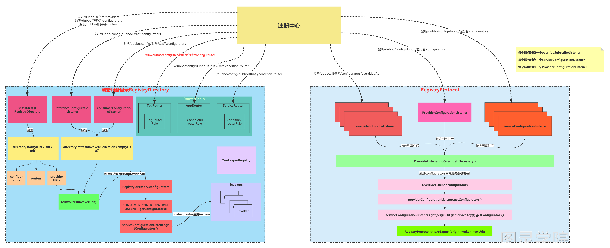

## Dubbo服务引入源码解析

[toc]

当Spring启动过程中，会去给@Reference注解标准了的属性去进行赋值，赋值的对象为ReferenceBean中的get()方法返回的对象，这个对象是一个代理对象。

对于ReferenceBean，它表示应用想要引入的服务的信息，在执行get()方法时会做如下几步：

1. 调用checkAndUpdateSubConfigs()，检查和更新参数，和服务提供者类似，把ReferenceBean里的属性值更新为优先级最高的参数值
2. 调用init()去生成代理对象ref，get()方法会返回这个ref
3. 在生成代理对象ref之前，先把消费者所引入服务设置的参数添加到一个map中，等会根据这个map中的参数去注册中心查找服务
4. 把消费者配置的所有注册中心获取出来
   1. 如果只有一个注册中心，那么直接调动Protocol的refer(interfaceCLass, urls,get(0))得到一个Invoker对象
   2. 如果有多个注册中心，则遍历每个注册中心，分别调用Protocol的refer(interfaceClass, url)得到一个Invoker对象添加到invokers中，然后把invokers调用CLUSTER.join(new StaticDirectory(u, invokers))封装所有invokers得到一个invoker
5. 把最终得到的invoker对象调用PROXY_FACTORY.getProxy(invoker)得到一个代理对象，并返回，这个代理对象就是ref
6. 总结：上文的Invoker对象，代表服务执行者，从注册中心refer下来的是一个服务执行者，合并invokers后得到的invoker也是一个服务执行者


Protocol.refer(interfaceClass, url)方法是怎么生成一个Invoker的：

1. 首先interfaceClass标识要引入的服务接口，url是注册中心的url(registry://)，该url中有一个refer参数，参数值为当前所引入服务的参数
2. 调用doRefer(cluster, registry, type, url)
3. 在doRefer方法中会生成一个RegistryDirectory
4. 然后获取新版本中的路由器链，并添加到RegistryDirectory中去
5. RegistryDirectory监听几个目录(注意，完成监听器的订阅绑定后，会自动触发一次取获取这些目录上的当数据)
6. 调用cluster.join(directory)得到一个invoker
7. 返回invoker(如果消费者引入了多个group中的服务，那么这里返回的是new MergeableClusterInvoker<T>(directory)否则返回是new FailoverClusterInvoker<T>(directory))
8. 但是，上面返回的两个Invoker都会被MockClusterInvoker包装，所以最终返回的是MockClusterInvoker


### 服务目录

消费端每个服务对应一个服务目录RegistryDirectory

一个服务目录中包含了：

1. serviceType：表示服务接口
2. serviceKey：表示引入的服务key，serviceclass+version+group
3. queryMap：表示引入的服务的参数配置
4. configurators：动态配置
5. routerChain：路由链
6. invokers：表示服务目录当前缓存的服务提供者Invoker
7. ConsumerConfigurationListener：监听本应用的动态配置
8. ReferenceConfigurationListener：监听所引入的服务的动态配置


在消费端有几个监听器：

1. ConsumerConfigurationListener：监听本应用的动态配置，当应用的动态配置发生了修改后，会调用RegistryDirecotry的refreshInvoker()方法，对应的路径为**/dubbo/config/duboo/dubbo-demo-consumer-application.configurators**
2. ReferenceConfigurationListener：监听所引入的服务的动态配置，当服务的动态配置放生了修改后，会调用RegistryDirectory的refreshInvoker()方法，对应的路径为**/dubbo/config.dubbo/com.obgnahzz.DemoService:1.1.1:g1.configurators**
3. RegistryDirectory：RegistryDirectory本身也是一个监听器，它会监听所引入的服务提供者、服务动态配置(老版本)、服务路由，路径为:
   1. **/dubbo/com.obgnahzz.DemoService/providers**
   2. **/dubbo/com.obgnahzz.DemoService/configurators**
   3. **/dubbo/com.obgnahzz.DemoService/routers**
4. 路由器Router：每个Router自己本身也是一个监听器，负责监听对应的路径
   1. AppRouter：应用路由，监听的路径为**/dubbo/config/dubbo/dubbo-demo-consumer-application.condition-router**
   2. ServiceRouter：服务路由，监听的路径为**/dubbo/config/dubbo/com.obgnahzz.DemoService:1.1.1:g1.condition-router**
   3. TagRouter：标签路由，标签路由和应用路由、服务路由有所区别，应用路由和服务路由都是在消费者启动，在构造路由链时会进行监听器的绑定，但是标签路由不是消费者启动的时候绑定监听器的，是在引入服务时，获取得到服务的提供者URL之后，才会去监听tag-router节点中的内容，监听的路径为**/dubbo/config/dubbo/dubbo-demo-provider-application.tag-router**


当ConsumerConfigurationListener接收到了消费者应用的动态配置数据变化后，会调用当前消费者应用中的所有RegistryDirectory的refershInvoker()方法，标识刷新消费者应用中引入的每个服务对应的Invoker

当ReferenceConfigurationListener接收到了某个服务的动态配置数据变化后，会调用该服务对应的RegistryDirectory的refreshInvoker()方法，标识刷新该服务对应的Invoker

当AppRouter和ServiceRouter接受到条件路由的数据变化后，就会更新Router内部的routerRule和conditionRouters属性。这两个属性在服务调用过程中会用到

当TagRouter接受到标签路由的数据变化后，就会更新TagRouter内部的tagRouterRule的属性，这个属性在服务调用过程中会用到

当RegistryDirectory接收到/dubbo/com.obgnahzz.DemoService/configurators节点数据变化后，会生成**configurators**

当RegistryDirectory接收到/dubbo/com.obgnahzz.DemoService/**routers**节点数据变化后，会生成Router并添加到**routerChain**中

当RegistryDirectory接收到/com.obgnahzz.DemoService/**providers**节点数据变化后，会调用refreshOverrideAndInvoker()方法。这个方法就是用来针对每个服务提供者来生成invoker的。

1. refreshOverrideAndInvoker方法中首先会调用overrideDirectoryUrl()方法利用Configurators重写目录地址，目录地址这样的：zookeeper://127.0.0.1:2181/org.apache.dubbo.registry.RegistryService?application=dubbo-demo-consumer-application&dubbo=2.0.2&group=g1&interface=com.obgnahzz.DemoService&lazy=false&methods=sayHello&pid=49964&register.ip=192.168.40.17&release=2.7.0&revision=1.1.1&side=consumer&sticky=false&timestamp=1591339005022&version=1.1.1，在注册中心URL基础上把当前引入服务的参数作为URL的Parameters，所以这个地址既包括了注册中心的信息，也包括了当前引入服务的信息
2. 利用老版本的configuratiors，Consumer应用的configurators，引入的服务的configurators去重写目录地址
3. 重写目录地址后，调用refreshInvoker(urls)方法去刷新Invoker
4. 在refreshInvoker(urls)方法中会把从注册中心获取到的providers节点下的服务URL，调用toInvokers(invokerUrl)方法得到Invoker
5. 先按Protocol进行过滤，并且调用DubboProtocol.refer方法得到Invoker
6. 将得到的invokers设置到RouterChain上，并且调用RouterChain上所有的routers的notify(invokers)方法，实际上这里只有TagRouter的notify方法有用
7. 再把属于同一个group中的invoker合并起来
8. 这样Invoker就生成好了



### DubboProtocol的服务引入(Refer)

DubboProtocol中并没有refer方法，是在它的父类AbstractProtocol中才有的refer方法

```java
@Override
public <T> Invoker<T> refer(Class<T> type, URL url) throws RpcException {
    // 异步转同步Invoker , type是接口，url是服务地址
    // DubboInvoker是异步的，而AsyncToSyncInvoker会封装为同步的
    return new AsyncToSyncInvoker<>(protocolBindingRefer(type, url));
}
```

调用protocolBindingRefer()方法得到一个Invoker后，会包装为一个AsyncToSyncInvoker然后最为refer方法的结果返回。

在DubboProtocol的protocolBindingRefer()方法中会new一个DubboInvoker，然后就返回了。

在构造DubboInvoker时，有一个非常重要的步骤，构造clients。DubboInvoker座位消费端服务的执行者，在调用服务时，是需要去发送Invocation请求的，而发送请求就需要client，之所有有多个client，是因为DubboProtocol支持多个。

假如在一个DubboInvoker中有多个Client，那么在使用这个DubboInvoker去调用服务时，就可以提高效率，比如一个服务接口有多个方法，那么在业务代码中，可能会不断的调用该接口中的方法，并且由于DubboProtocol底层会使用异步去发送请求，所以在每次需要发送请求时，就可以从clients轮询一个client去发送这个数据，从而提高效率。

1. 首先，一个DubboInvoker到底支持多少个Client？这个是可以配置的，参数为connections，按指定的数字调用initClient(url)得到ExchangeClient
2. initClinet(url)的实现逻辑为
   1. 获取client参数，表示是用netty还是mina等等
   2. 获取codec参数，表示数据的编码方式
   3. 获取heartbeat参数，表长连接的心跳时间，超过这个时间服务端没有收到数据则关闭socket，默认为1分钟
   4. 如果所指定的client没有对应的扩展点，则抛异常
   5. 获取lazy参数，默认为false，如果为ture，俺么则直接返回一个LazyConnectExchangeClient，表示真正在发送数据时才建立socket
   6. 否则调用Exchangers.connect(url, requestHandler)获取一个client
   7. 在connect()方法中调用HeaderExchanger的connect方法去建立socket连接并得到一个HeaderExchangeClient
   8. 在构造HeaderExchangeClient时需要先执行Transporters.connect()方法得到一个Client
   9. 会调用NettyRransporter的connect()方法去构造一个NeetyClient
   10. 在构造NettyCilent的过程中，会去初始化Netty的客户端，然后连接Server端，建立一个Socket连接


### 最复杂情况下的Invoker链

```java
@Reference(url = "dubbo://192.168.40.17:20881/com.obgnahzz.DemoService;registry://127.0.0.1:2181/org.apache.dubbo.registry.RegistryService?registry=zookeeper")
private DemoService demoService;
```

在@Reference注解上定义了url参数，有两个值

1. dubbo://192.168.40.17:20881/com.obgnahzz.DemoService
2. registry://127.0.0.1:2181/org.apache.dubbo.registry.RegistryService?registry=zookeeper

最终refer处理的invoker链路为：

- MockClusterInvoker

- - invoker=RegistryAwareClusterInvoker

- - - directory=StaticDirectory

- - - - 0=**ProtocolFilterWrapper$CallbackRegistrationInvoke子流程**
      - 1=MockClusterInvoker

- - - - - FailoverClusterInvoker

- - - - - - RegistryDirectory

- - - - - - - invokers=UnmodifiableRandomAccessList size=1

- - - - - - - - 0=RegistryDirectory$InvokerDelegate

- - - - - - - - - **ProtocolFilterWrapper$CallbackRegistrationInvoke子流程**


- **ProtocolFilterWrapper$CallbackRegistrationInvoke子流程**

- - filterInvoker=ProtocolFilterWrapper$1

- - - filter=ConsumerContextFilter
    - next=ProtocolFilterWrapper$1

- - - - filter=FutureFilter
      - next=ProtocolFilterWrapper$1

- - - - - filter=MonitorFilter
        - next=ListenerInvokerWrapper

- - - - - - invoker=AsyncToSyncInvoker

- - - - - - - invoker=DubboInvoker


### Invoker总结

**MockClusterInvoker**：完成Mock功能，由MockClusterWrapper生成，MockClusterWrapper是Cluster接口的包装类，通过Cluster.join()方法得到MockClusterInvoker

**FailoverClusterInvoker**：完成集群容错功能，是MockClusterInvoker的下级

**RegistryAwareClusterInvoker**：如果指定了多个注册中心，那么RegisteryAwareClusterInvoker完成选择默认的注册中心进行调用，如果没有指定默认的，则会遍历注册中心进行调用，如果该注册中心没有对应的服务则跳过

**DubboInvoker**：完成Dubbo协议底层发送数据

**ProtocolFilterWrapper$CallbackRegistrationInvoker**：完成对filter的调用，ProtocolFilterWrapper是Protocol接口的包装类，通过Protocol.refer()方法得到CallbackRegistrationInvoke

