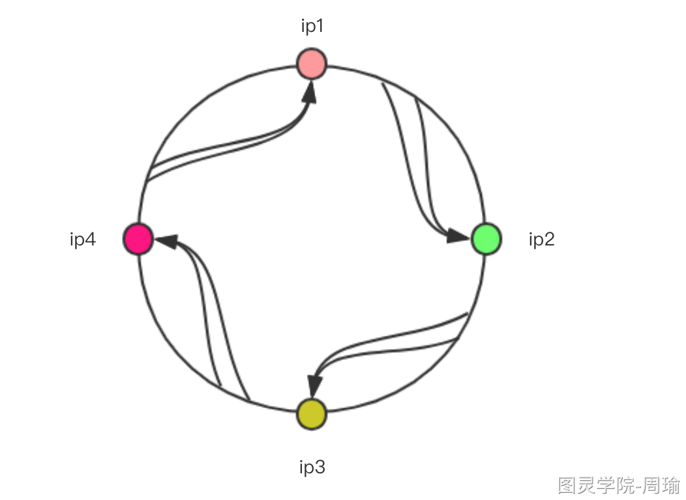
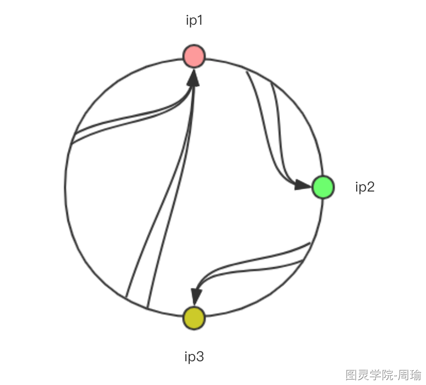
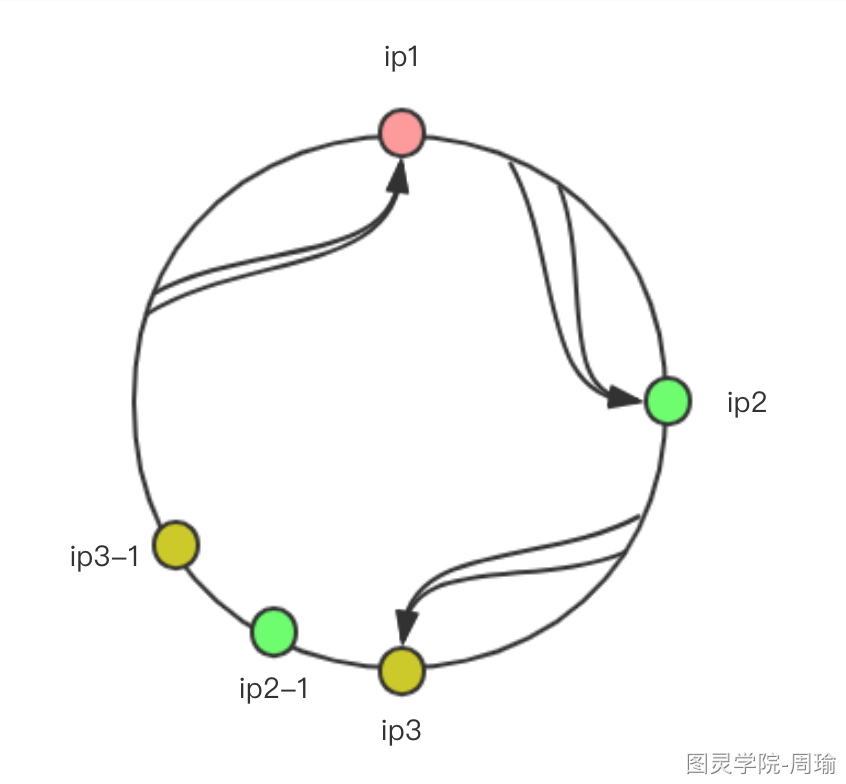
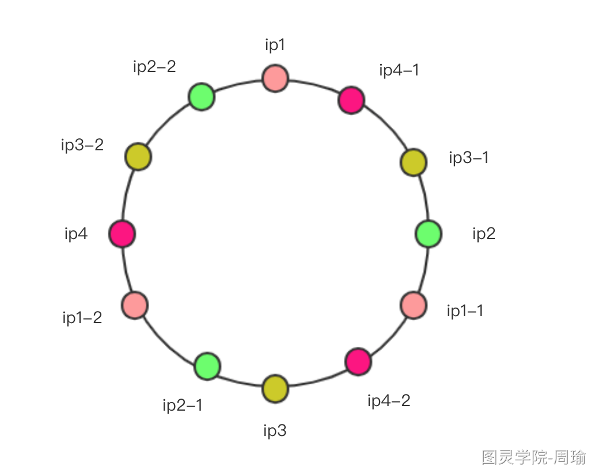

## Dubbo负载均衡原理解析

[toc]

### 负载均衡介绍

负载均衡(Load Balance)，指由多个服务器以对称的方式组成一个服务器集合，每台服务器都具有等价的地位，都可以单独对外提供服务而无序其他服务器的辅助。

通过某种负载分担技术，将外部发送来的请求均匀分配到对称结构中的某一台服务器上，而接收到请求的服务器独立的回应客户的请求。

负载均衡能够平均分配客户请求到服务器阵列，借此提供快速获取重要数据，解决大量并发访问服务问题，这种集群技术可以用最少的头次获得接近于大型主机的性能。

### 负载均衡方式

软件负载均衡：Nginx、LVS、HAProxy

硬件负载均衡：Array、F5

### 负载均衡算法

常见的负载均衡算法有：随机算法，加权轮询，一致性hash、最小活跃数算法。

**dubbo3.0新增了ShortestResponseLoadBalance**，基本算法与最小活跃数差不多。

```java
public class ServerIps {
    private static final List<String> LIST = Arrays.asList(
            "192.168.0.1",
            "192.168.0.2",
            "192.168.0.3",
            "192.168.0.4",
            "192.168.0.5",
            "192.168.0.6",
            "192.168.0.7",
            "192.168.0.8",
            "192.168.0.9",
            "192.168.0.10"
    );
}
```

#### 随机算法 - RandomLoadBalance

最简单的实现

```java
public class Random {
    public static String getServer() {
        // 生成一个随机数作为list的下标值
        java.util.Random random = new java.util.Random();
        int randomPos = random.nextInt(ServerIps.LIST.size());
        return ServerIps.LIST.get(randomPos);
    }
    public static void main(String[] args) {
        // 连续调用10次
        for (int i=0; i<10; i++) {
            System.out.println(getServer());
        }
    }
}
```

```shell
运行结果：
192.168.0.3
192.168.0.4
192.168.0.7
192.168.0.1
192.168.0.2
192.168.0.7
192.168.0.3
192.168.0.9
192.168.0.1
192.168.0.1
```

当调用次数比较少时，Random产生的随机数会比较集中，此时多数请求会落到同一台服务器上，只有在经理多次请求后，才能使调用请求进行”均匀分配”。调用量少这一点并没有什么关系，负载均衡机制不正是为了请求良多的情况吗，所以随机算法也是用的比较多的一种算法。

但是，上面的随机算法适用于每台机器的性能差不多的情况，实际上，生成中可能某些机器的性能更高一点，它可以处理更多的请求，所以我们对每天服务器设置一个权重。在ServerIps类增加服务器权重对应关系的Map，权重之和为50。

```java
public static final Map<String, Integer> WEIGHT_LIST = new HashMap<String, Integer>();
    static {
        // 权重之和为50
        WEIGHT_LIST.put("192.168.0.1", 1);
        WEIGHT_LIST.put("192.168.0.2", 8);
        WEIGHT_LIST.put("192.168.0.3", 3);
        WEIGHT_LIST.put("192.168.0.4", 6);
        WEIGHT_LIST.put("192.168.0.5", 5);
        WEIGHT_LIST.put("192.168.0.6", 5);
        WEIGHT_LIST.put("192.168.0.7", 4);
        WEIGHT_LIST.put("192.168.0.8", 7);
        WEIGHT_LIST.put("192.168.0.9", 2);
        WEIGHT_LIST.put("192.168.0.10", 9);
    }
```

那么现在随机算法应该改为**权重随机算法**，当调用量比较多的时候，服务器使用的分布应该接近对应的权重分布。

##### 权重随机算法

简单的实现思路是，把每个服务器按它所对应的服务器进行复制。

```java
public class WeightRandom {
    public static String getServer() {
        // 生成一个随机数作为list的下标值
        List<String> ips = new ArrayList<String>();
        for (String ip : ServerIps.WEIGHT_LIST.keySet()) {
            Integer weight = ServerIps.WEIGHT_LIST.get(ip);
            // 按权重进行复制
            for (int i=0; i<weight; i++) {
                ips.add(ip);
            }
        }
        java.util.Random random = new java.util.Random();
        int randomPos = random.nextInt(ips.size());
        return ips.get(randomPos);
    }
    public static void main(String[] args) {
        // 连续调用10次
        for (int i=0; i<10; i++) {
            System.out.println(getServer());
        }
    }
}
```

```shell
运行结果：
192.168.0.8
192.168.0.2
192.168.0.7
192.168.0.10
192.168.0.8
192.168.0.8
192.168.0.4
192.168.0.7
192.168.0.6
192.168.0.8
```

**这种实现方法在遇到权重之和特别大的时候就会比较消耗内存，因为需要对ip地址进行复制，权重之和越大那么上文中的ips就需要越多的内存，下面我们考虑另一种实现思路。**

假设我们有一组服务器 servers = [A, B, C]，他们对应的权重为 weights = [5, 3, 2]，权重总和为10。现在把这些权重值平铺在一维坐标值上，[0, 5) 区间属于服务器 A，[5, 8) 区间属于服务器 B，[8, 10) 区间属于服务器 C。接下来通过随机数生成器生成一个范围在 [0, 10) 之间的随机数，然后计算这个随机数会落到哪个区间上。比如数字3会落到服务器 A 对应的区间上，此时返回服务器 A 即可。权重越大的机器，在坐标轴上对应的区间范围就越大，因此随机数生成器生成的数字就会有更大的概率落到此区间内。只要随机数生成器产生的随机数分布性很好，在经过多次选择后，每个服务器被选中的次数比例接近其权重比例。比如，经过一万次选择后，服务器 A 被选中的次数大约为5000次，服务器 B 被选中的次数约为3000次，服务器 C 被选中的次数约为2000次。

假设现在随机数offset=7：

1. offset<5 is false，所以不在[0, 5)区间，将offset = offset - 5（offset=2）
2. offset<3 is true，所以处于[5, 8)区间，所以应该选用B服务器

实现如下：

```java
public class WeightRandomV2 {
    public static String getServer() {
        int totalWeight = 0;
        boolean sameWeight = true; // 如果所有权重都相等，那么随机一个ip就好了
        Object[] weights = ServerIps.WEIGHT_LIST.values().toArray();
        for (int i = 0; i < weights.length; i++) {
            Integer weight = (Integer) weights[i];
            totalWeight += weight;
            if (sameWeight && i > 0 && !weight.equals(weights[i - 1])) {
                sameWeight = false;
            }
        }
        java.util.Random random = new java.util.Random();
        int randomPos = random.nextInt(totalWeight);
        if (!sameWeight) {
            for (String ip : ServerIps.WEIGHT_LIST.keySet()) {
                Integer value = ServerIps.WEIGHT_LIST.get(ip);
                if (randomPos < value) {
                    return ip;
                }
                randomPos = randomPos - value;
            }
        }
        return (String) ServerIps.WEIGHT_LIST.keySet().toArray()[new java.util.Random().nextInt(ServerIps.WEIGHT_LIST.size())];
    }
    public static void main(String[] args) {
        // 连续调用10次
        for (int i = 0; i < 10; i++) {
            System.out.println(getServer());
        } 
    }
}
```

这就是另外一种权重随机算法思路。

#### 轮询算法 - RoundRobinLoadBalance

简单的轮询算法

```java
public class RoundRobin {
    // 当前循环的位置
    private static Integer pos = 0;
    public static String getServer() {
        String ip = null;
        // pos同步
        synchronized (pos) {
            if (pos >= ServerIps.LIST.size()) {
                pos = 0;
            }
            ip = ServerIps.LIST.get(pos);
            pos++;
        }
        return ip;
    }
    public static void main(String[] args) {
        // 连续调用10次
        for (int i = 0; i < 11; i++) {
            System.out.println(getServer());
        }
    }
}
```

```shell
运行结果：
192.168.0.1
192.168.0.2
192.168.0.3
192.168.0.4
192.168.0.5
192.168.0.6
192.168.0.7
192.168.0.8
192.168.0.9
192.168.0.10
192.168.0.1
```

这种算法很简单，也很**公平**，每台服务轮流进行服务，但是有的机器性能好，所以**能者多劳**，和随机算法一样，加上权重这个维度之后，其中一种时间方法就是**复制算法**，这种复制算法的缺点和随机算法的是一样的，比较消耗内存，那么自然就会有其他的实现方法方法。

这种算法需要加入一个概念：**调用编号**，比如第1次调用为1，第2次调用为2，第100次调用为100，调用编号是递增的，所以我们可以根据这个调用编号推算出服务器。

假设我们有三台服务器 servers = [A, B, C]，对应的权重为 weights = [ 2, 5, 1], 总权重为8，我们可以理解为有8台“服务器”，这是8台“不具有并发功能”，其中有2台为A，5台为B，1台为C，一次调用过来的时候，需要按顺序访问，比如有10次调用，那么服务器调用顺序为AABBBBBCAA，调用编号会越来越大，而服务器是固定的，所以需要把调用编号“缩小”，这里对调用编号进行**取余，除数为总权重和**，比如：

1. 1号调用，1%8=1；
2. 2号调用，2%8=2；
3. 3号调用，3%8=3；
4. 8号调用，8%8=0；
5. 9号调用，9%8=1；
6. 100号调用，100%8=4；
7. 我们发现调用编号可以被缩小为0-7之间的8个数字，问题是怎么根据这8个数字找到对应的服务器呢？和我们随机算法类似，这里也可以吧权重现象为坐标轴0--2--7--8
8. 1号调用，1%8=1，offset=1， offset <= 2 == ture，取A；
9. 2号调用，2%8=2；offset=2，offset <= 2 == true，取A；
10. 3号调用，3%8=3；offset=3，offset <= 2 == false，offset = offset - 2，offset = offset -2，offset = 6，offset <= 5 == fasle，offset = offset - 5，offset = 1，offset <= 1 == tur，取C；
11. 9号调用，9%8=1；// ...
12. 100号调用，100%8=4；//...

```java
public class Sequence {
    public static Integer num = 0;
    public static Integer getAndIncrement() {
        return ++num;
    }
}

public class WeightRoundRobin {
    private static Integer pos = 0;
    public static String getServer() {
        int totalWeight = 0;
        boolean sameWeight = true; // 如果所有权重都相等，那么随机一个ip就好了
        Object[] weights = ServerIps.WEIGHT_LIST.values().toArray();
        for (int i = 0; i < weights.length; i++) {
            Integer weight = (Integer) weights[i];
            totalWeight += weight;
            if (sameWeight && i > 0 && !weight.equals(weights[i - 1])) {
                sameWeight = false;
            }
        }
        Integer sequenceNum = Sequence.getAndIncrement();
        Integer offset = sequenceNum % totalWeight;
        offset = offset == 0 ?  totalWeight : offset;
        if (!sameWeight) {
            for (String ip : ServerIps.WEIGHT_LIST.keySet()) {
                Integer weight = ServerIps.WEIGHT_LIST.get(ip);
                if (offset <= weight) {
                    return ip;
                }
                offset = offset - weight;
            }
        }
        String ip = null;
        synchronized (pos) {
            if (pos >= ServerIps.LIST.size()) {
                pos = 0;
            }
            ip = ServerIps.LIST.get(pos);
            pos++;
        }
        return ip;
    }
    public static void main(String[] args) {
        // 连续调用11次
        for (int i = 0; i < 11; i++) {
            System.out.println(getServer());
        }
    }
}
```

结果：

```shell
运行结果：
192.168.0.1
192.168.0.2
192.168.0.2
192.168.0.2
192.168.0.2
192.168.0.2
192.168.0.2
192.168.0.2
192.168.0.2
192.168.0.3
192.168.0.3
```

但是这种算法有个缺点：一台服务器权重特别大的时候，他需要连续的处理请求，但是时间上我们想达到的效果是，对于100次请求，只要100*8/50=16次就够了，这16次不一定要连续的访问，比如假设我们有三台服务器server = [A，B，C]，对应的权重为weights = [5，1，1]，总欧诺个权重为7，那么上述的这个算法结果是AAAAABC，那么如果能够使一个结果呢：AABACAA，把B和C平均插入到5个A中间，这样是比较均衡的了。

那就要使用到**平滑加权轮询**。

##### 平滑加权轮询

思路：每个服务器对应两个权重，分别为weight和currentWeight。其中weight是固定的，currentWeight会动态调整，初始值为0。当有新的请求进来时，遍历服务器列表，让它的current加上自身权重。遍历完成后，找到最大的currentWeight，并将其减去权重综合，然后返回响应的服务器即可。

| 请求编号 | currentWeight 数组 (current_weight += weight) | 选择结果(max(currentWeight)) | 减去权重总和后的currentWeight 数组（max(currentWeight) -= sum(weight)) |
| -------- | --------------------------------------------- | ---------------------------- | ------------------------------------------------------------ |
| 1        | [5, 1, 1]                                     | A                            | [-2, 1, 1]                                                   |
| 2        | [3, 2, 2]                                     | A                            | [-4, 2, 2]                                                   |
| 3        | [1, 3, 3]                                     | B                            | [1, -4, 3]                                                   |
| 4        | [6, -3, 4]                                    | A                            | [-1, -3, 4]                                                  |
| 5        | [4, -2, 5]                                    | C                            | [4, -2, -2]                                                  |
| 6        | [9, -1, -1]                                   | A                            | [2, -1, -1]                                                  |
| 7        | [7, 0, 0]                                     | A                            | [0, 0, 0]                                                    |

如上，经过平滑性处理后，得到的服务器序列为[A，A，B，A，C，A，A]，相比之前的序列[A，A，A，A，A，B，C]，分布性要好一些。初始情况下currentWeight = [0，0，0]，第七个请求处理完后，currentWeight再次变为 [0，0，0]。

实现：

```java
// 增加一个Weight类，用来保存ip, weight（固定不变的原始权重）, currentweight（当前会变化的权重）
public class Weight {
    private String ip;
    private Integer weight;
    private Integer currentWeight;
    public Weight(String ip, Integer weight, Integer currentWeight) {
        this.ip = ip;
        this.weight = weight;
        this.currentWeight = currentWeight;
    }
    public String getIp() {
        return ip;
    }
    public void setIp(String ip) {
        this.ip = ip;
    }
    public Integer getWeight() {
        return weight;
    }
    public void setWeight(Integer weight) {
        this.weight = weight;
    }
    public Integer getCurrentWeight() {
        return currentWeight;
    }
    public void setCurrentWeight(Integer currentWeight) {
        this.currentWeight = currentWeight;
    }
}


public class WeightRoundRobinV2 {
    private static Map<String, Weight> weightMap = new HashMap<String, Weight>();
    public static String getServer() {
        // java8
        int totalWeight = ServerIps.WEIGHT_LIST.values().stream().reduce(0, (w1, w2) -> w1+w2);
        // 初始化weightMap，初始时将currentWeight赋值为weight
        if (weightMap.isEmpty()) {
            ServerIps.WEIGHT_LIST.forEach((key, value) -> {
                weightMap.put(key, new Weight(key, value, value));
            });
        }
        // 找出currentWeight最大值
        Weight maxCurrentWeight = null;
        for (Weight weight : weightMap.values()) {
            if (maxCurrentWeight == null || weight.getCurrentWeight() > maxCurrentWeight.getCurrentWeight()) {
                maxCurrentWeight = weight;
            }
        }
        // 将maxCurrentWeight减去总权重和
        maxCurrentWeight.setCurrentWeight(maxCurrentWeight.getCurrentWeight() - totalWeight);
        // 所有的ip的currentWeight统一加上原始权重
        for (Weight weight : weightMap.values()) {
           weight.setCurrentWeight(weight.getCurrentWeight() + weight.getWeight());
        }
        // 返回maxCurrentWeight所对应的ip
        return maxCurrentWeight.getIp();
    }
    public static void main(String[] args) {
        // 连续调用10次
        for (int i = 0; i < 10; i++) {
            System.out.println(getServer());
        }
    }
}

WEIGHT_LIST.put("A", 5);
        WEIGHT_LIST.put("B", 1);
        WEIGHT_LIST.put("C", 1);
```

结果：

```shell
运行结果：
A
A
B
A
C
A
A
A
A
B
```


#### 一致性哈希算法 - ConsistentHashLoadBalance

服务器集群收到一次请求调用时，可以根据请求的信息，比如客户端的IP地址，或请求路径与请求参数等信息进行哈希，可以得到一个哈希值，特别是对于相同ip地址，或请求路径和请求参数哈希出来的值是一样的，只要能再增加一个算法，能够把这个哈希值映射成一个服务端ip地址，就可以使相同的请求落到同一服务器上。

因为客户端发起的请求情况是无穷无尽的，所以对于哈希值也是无穷大的，所以我们不可能把所有的哈希值都进行映射到服务端ip上，所以需要用到**哈希环**。



* 哈希值如果需要ip1和ip2之间的，则应该选择ip2作为结果；
* 哈希值如果需要ip2和ip3之间的，则应该选择ip3作为结果；
* 哈希值如果需要ip3和ip4之间的，则应该选择ip4作为结果；
* 哈希值如果需要ip4和ip1之间的，则应该选择ip1作为结果；

如果ip4服务器出现问题，不存在了，则变更策略：



会发现ip3和ip1之间的范围是比较大的，会有更多请求落在ip1，这是**不公平的**，结果这个问题需要加入虚拟节点。




其中ip2-1，ip3-1就是虚拟节点，并不能处理节点，而是等同于对应的ip2和ip3服务器。

实际上，这只是处理这种不均衡性的一种思路，实际上就哈希环本身是均衡的，你也可以增加更多的虚拟节点来使这个环更加平滑。



这个彩环也是公平的，并且只有ip1，2，3，4是实际服务器ip，其他的都是虚拟ip。

对于我们的服务端ip地址，我们肯定知道总共有多少个，需要多少个虚拟节点也由我们自己控制，虚拟节点越多则流量约均衡，另外哈希算法也是很关键的，哈希算法越散列流量也将越均衡。

```java
public class ConsistentHash {
    private static SortedMap<Integer, String> virtualNodes = new TreeMap<>();
    private static final int VIRTUAL_NODES = 160;
    static {
        // 对每个真实节点添加虚拟节点，虚拟节点会根据哈希算法进行散列
        for (String ip : ServerIps.LIST) {
            for (int i = 0; i < VIRTUAL_NODES; i++) {
                int hash = getHash(ip+"VN"+i);
                virtualNodes.put(hash, ip);
            }
        }
    }
    private static String getServer(String client) {
        int hash = getHash(client);
        // 得到大于该Hash值的排好序的Map
        SortedMap<Integer, String> subMap = virtualNodes.tailMap(hash);
        // 大于该hash值的第一个元素的位置
        Integer nodeIndex = subMap.firstKey();
        // 如果不存在大于该hash值的元素，则返回根节点
        if (nodeIndex == null) {
            nodeIndex = virtualNodes.firstKey();
        }
        // 返回对应的虚拟节点名称
        return subMap.get(nodeIndex);
    }
    private static int getHash(String str) {
        final int p = 16777619;
        int hash = (int) 2166136261L;
        for (int i = 0; i < str.length(); i++)
            hash = (hash ^ str.charAt(i)) * p;
        hash += hash << 13;
        hash ^= hash >> 7;
        hash += hash << 3;
        hash ^= hash >> 17;
        hash += hash << 5;
        // 如果算出来的值为负数则取其绝对值
        if (hash < 0)
            hash = Math.abs(hash);
        return hash;
    }
    public static void main(String[] args) {
        // 连续调用10次,随机10个client
        for (int i = 0; i < 10; i++) {
            System.out.println(getServer("client" + i));
        }
    }
}
```


#### 最小活跃数算法 - LastActiveLoadBalance

活跃调用数量越小，表明该服务提供者效率越高，单位时间内可以处理更多的请求。此时应优先将请求分配给该提供者。在具体实现中，每个服务提供者对应一个活跃数。初始情况下，所有服务提供者活跃数均为0。每收到一个请求，活跃数+1，完成请求后将活跃数-1.在服务运行一段时间后，性能好的服务提供者处理请求的速度更快，因此活跃数下降的也越快，此时这样的服务提供者能够优先获取新的服务请求，这就是最小活跃数负载均衡算法的基本思想。除了最小活跃数，最小活跃数算法在实现上还引入了权重值。所以准确的来说，最小活跃数算法是基于权重加最小活跃数算法实现的。

因为活跃数是需要服务器请求处理相关逻辑配合的，一次调用开始时活跃数+1，结束时活跃数-1，所以这些应该是由消费者来进行计算。

```java
// 服务器当前的活跃数
    public static final Map<String, Integer> ACTIVITY_LIST = new LinkedHashMap<String, Integer>();
    static {
        ACTIVITY_LIST.put("192.168.0.1", 2);
        ACTIVITY_LIST.put("192.168.0.2", 0);
        ACTIVITY_LIST.put("192.168.0.3", 1);
        ACTIVITY_LIST.put("192.168.0.4", 3);
        ACTIVITY_LIST.put("192.168.0.5", 0);
        ACTIVITY_LIST.put("192.168.0.6", 1);
        ACTIVITY_LIST.put("192.168.0.7", 4);
        ACTIVITY_LIST.put("192.168.0.8", 2);
        ACTIVITY_LIST.put("192.168.0.9", 7);
        ACTIVITY_LIST.put("192.168.0.10", 3);
    }
```

```java
public class LeastActive {
    private static String getServer() {
        // 找出当前活跃数最小的服务器
        Optional<Integer> minValue = ServerIps.ACTIVITY_LIST.values().stream().min(Comparator.naturalOrder());
        if (minValue.isPresent()) {
            List<String> minActivityIps = new ArrayList<>();
            ServerIps.ACTIVITY_LIST.forEach((ip, activity) -> {
                if (activity.equals(minValue.get())) {
                    minActivityIps.add(ip);
                }
            });
            // 最小活跃数的ip有多个，则根据权重来选，权重大的优先
            if (minActivityIps.size() > 1) {
                // 过滤出对应的ip和权重
                Map<String, Integer> weightList = new LinkedHashMap<String, Integer>();
                ServerIps.WEIGHT_LIST.forEach((ip, weight) -> {
                    if (minActivityIps.contains(ip)) {
                        weightList.put(ip, ServerIps.WEIGHT_LIST.get(ip));
                    }
                });
                int totalWeight = 0;
                boolean sameWeight = true; // 如果所有权重都相等，那么随机一个ip就好了
                Object[] weights = weightList.values().toArray();
                for (int i = 0; i < weights.length; i++) {
                    Integer weight = (Integer) weights[i];
                    totalWeight += weight;
                    if (sameWeight && i > 0 && !weight.equals(weights[i - 1])) {
                        sameWeight = false;
                    }
                }
                java.util.Random random = new java.util.Random();
                int randomPos = random.nextInt(totalWeight);
                if (!sameWeight) {
                    for (String ip : weightList.keySet()) {
                        Integer value = weightList.get(ip);
                        if (randomPos < value) {
                            return ip;
                        }
                        randomPos = randomPos - value;
                    }
                }
                return (String) weightList.keySet().toArray()[new java.util.Random().nextInt(weightList.size())];
            } else {
                return minActivityIps.get(0);
            }
        } else {
            return (String) ServerIps.WEIGHT_LIST.keySet().toArray()[new java.util.Random().nextInt(ServerIps.WEIGHT_LIST.size())];
        }
    }
    public static void main(String[] args) {
        // 连续调用10次,随机10个client
        for (int i = 0; i < 10; i++) {
            System.out.println(getServer());
        }
    }
}
```

