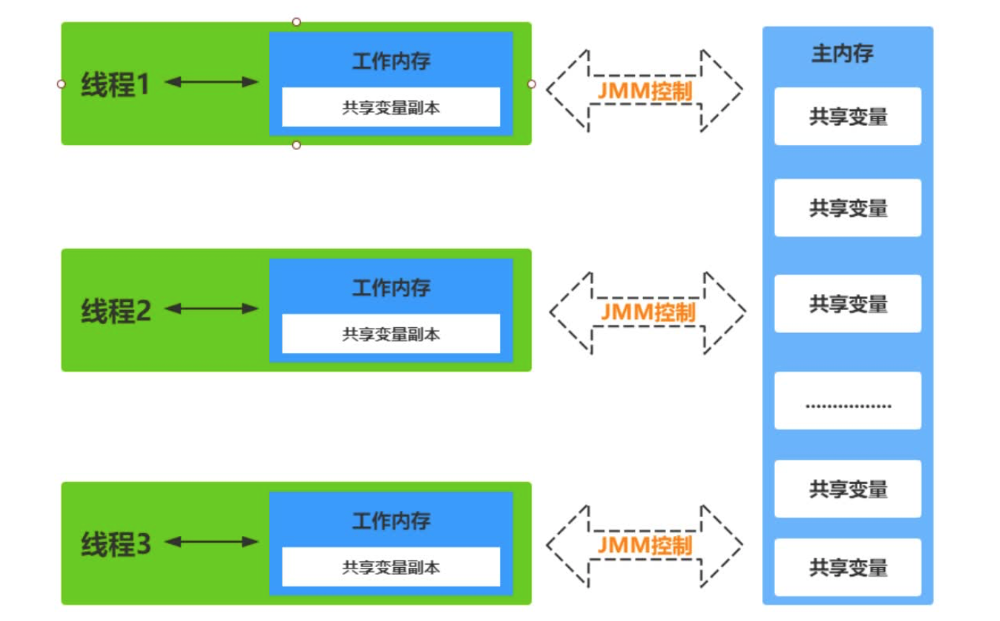
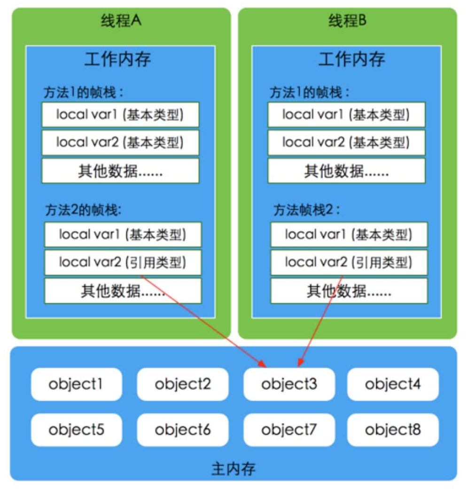
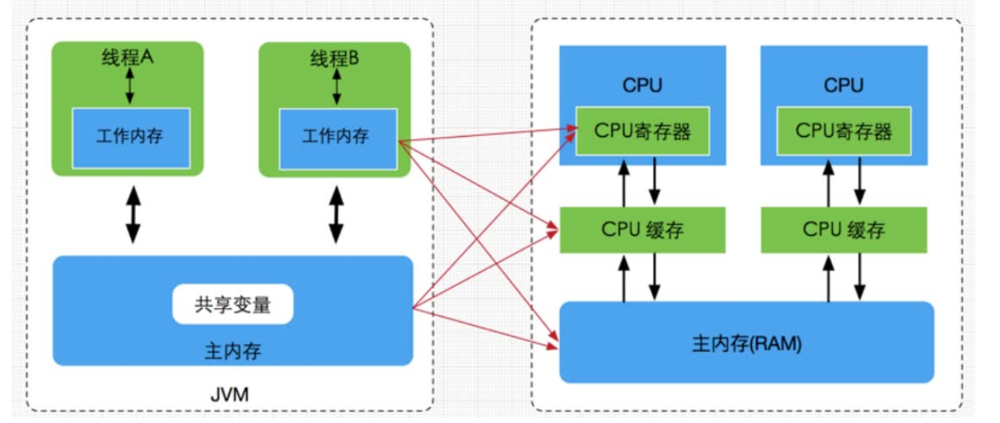
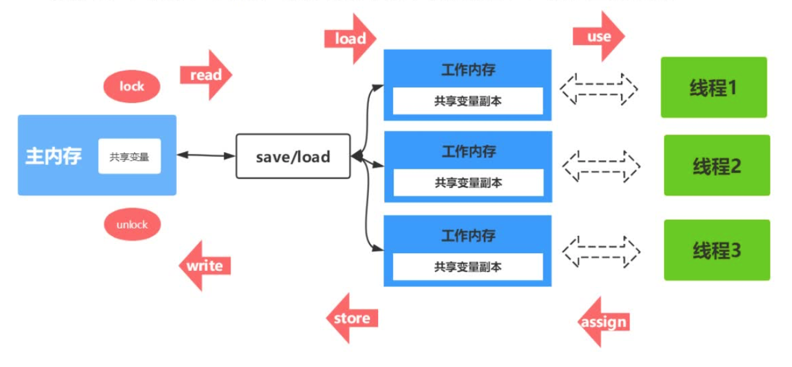

## 什么是JMM模型

​	JAVA内存模型(Java Memory Mode简称JMM)是一种抽象的概念，并不真实存在，它描述的是一组规则或规范，通过这组规范定义了程序中各个变量(包括实例字段，静态字段和构成数组对象的元素)的访问方式。JVM运行程序的实体是线程，而每个线程创建时JVM都会为其创建一个工作内存(栈控件)，用于存储线程私有的数据，而JAVA内存模型中规定所有的变量都存储在主内存，主内存是共享内存区域，所有线程都可以访问，但线程对变量的操作(读取赋值等)必须在工作内存中进行，首先要将变量从主内存拷贝到自己的工作内存空间，然后对变量进行操作，操作完成后再将变量写回主内存，不能直接操作主内存中的变量，工作内存中存储着主内存的变量副本拷贝，工作内存是每个线程的私有区域，因此不同的线程无法访问对方的工作内存，线程间的通讯(传值)必须通过主内存来完成。

#### JMM不同于JVM内存区域模型

​	JMM与JVM内存区域的划分是不同的概念层次，更恰当的说JMM描述的是一组规则，通过这组规则控制程序中各个变量在共享数据区域和私有数据区域的访问方式，**JMM是围绕原子性、有序性、可见性展开。**JMM与Java内存区域唯一相似点，都存在共享数据区域和私有数据区域，在JMM中主内存属于共享数据区域，从某个程度上讲应该包括了堆和方法区，而工作内存数据线程私有数据区域，从某个程度上将应该包括程序计数器、虚拟机栈以及本地方法栈。

**线程、工作内存、主内存工作交互图(基于JMM规范)：**



#### 主内存

​	主要存储的是Java实例对象，所有线程创建的实例对象都存放在主内存中，不管**实例对象是成员变量还是方法中的本地变量(局部变量)**，当然也包括了共享的类信息、常量、静态变量。由于是共享数据区域，多条线程对同一个变量进行访问可能会发生线程安全问题。

#### 工作内存

​	主要存储当前方法的所有本地变量信息(工作内存中存储着主内存中的变量副本拷贝)，每个线程只能访问自己的工作内存，即线程中的本地变量对其它线程是不可见的，计算是两个线程执行的是同一段代码，他们会各自在自己的工作内存中创建属于当前线程的本地变量，当然也包括了字节码行号指示器、相关native方法信息。由于工作内存是每个线程的私有数据，线程间无法相互访问工作内存，因此存储工作内存的数据不存在线程安全问题。

​	**根据JVM虚拟机规范**主内存与工作内存的数据存储类型以及操作方式，对于一个实例对象中的成员方法而言，如果方法中包含本地变量是基础类型(boolean、byte、short、char、int、long、float、double)，将直接存储在工作内存的栈帧结构中，但倘若本地变量引用类型，那么该变量的引用会存储在功能内存的栈帧中，而对象实例将存储在主内存(共享数据区域、堆)中。但对于实例对象的成员变量，不管它是基本数据类型或者包装类型还是引用类型，都会存储到堆区。至于static变量以及类本身相关信息将会存储在主内存中。在主内存中的实例对象可以被多线程共享，倘若两个线程同时调用同一个对象的同一个方法，那么两条线程会将要操作的数据拷贝一份到自己的工作内存中，执行完成操作后才刷新到主内存



#### JAVA内存模型与硬件内存架构的关系

​	通过对硬件内存架构、JAVA内存模型以及Java多线程 的实现原理的了解，我们应该会意识到，多线程的执行最终都会映射到硬件处理器上进行执行，但Java内存模型和硬件内存架构并不完全一致。对于硬件内存来错只有寄存器、缓存内存(L123)、主内存的概念、并没有工作内存(线程私有数据区域)和主内存(堆内存)之分，也就是说JAVA内存模型对内存的划分对硬件内存并没有任何影响，因为**JMM只是一个抽象的概念**，是一组规则，并不实际存在，不管是工作内存的数据还是主内存的数据，对于计算机硬件来说都会存储在计算器主内存中，当然也有可能存储到CPU缓存或寄存器中，因为总体上来说，JAVA内存模型和计算机硬件内存架构是一个互相交叉的关系，是一种抽象概念划分与真实物理硬件的分叉(**注意对于Java内存区域划分也是同样的道理**)。



#### JMM存在的必要性

​	在明白了Java内存区域划分、硬件内存架构、Java多线程的实现原理与JAVA内存模型的具体关系后，接着来谈谈JAVA内存模型存在的必要性。由于JVM运行程序的实体是线程，而每个线程创建时都会为其创建一个工作内存(栈控件)，用于存储线程私有的数据，线程与主内存中的变量操作必须通过工作内存间接完成，主要工程是将变量写回主内存，如果在两个线程同时对一个主内存中的实例对象的变量进行操作就有可能诱发线程安全问题。

#### 数据同步8大原子操作

1. **lock(锁定)**：作用于主内存的变量，把一个变量标记为一条线程独占状态
2. **unlock*(解锁)**：作用于主内存的变量，把一个处于锁定状态的变量释放出来，释放后的变量才可以被其他线程锁定
3. **read*(读取)**：作用于主内存的变量，把一个变量值从主内存传输到线程的工作内存中，以便随后的load动作使用
4. **load(载入)**：作用于工作内存的变量，它把read操作从主内存中得到的变量值放入工作线程中的变量副本中
5. **use(使用)**：作用于工作内存的变量，把工作内存中的变量值传递给执行引擎
6. **assign(赋值)**：作用于工作内存的变量，它把一个从执行引擎接受到的值赋给工作内存的变量
7. **store(存储)**：作用于工作内容寸的变量，把工作内存中的一个变量值传送到主内存中，以便随后的write的操作
8. **write(写入)**：作用于工作内存的变量，它把store操作从工作内存中的一个变量的值传送到主内存的变量中

如果要把一个变量从主内存中复制到工作内存中，就需要按顺序执行read和load操作，如果把变量从工作内存中同步到主内存中，就需要按顺序执行store和write操作。但JMM只要求上述操作必须按顺序执行，而没有保证必须是连续执行。



#### 同步规则分析

1. 不允许一个线程无原因(没有发生过任何assign操作)的把数据从工作内存同步回主内存中。
2. 一个新的变量只能在内存中诞生，不允许在工作内存中直接使用一个未被初始化(load或者assign)的变量。就是对一个变量实施use和store操作之前，必须先自行assign和load操作。
3. 一个变量在同一时刻只允许一条线程对其进行lock操作，但lock操作可以被同一线程重复执行多次，多次执行lock后，只有执行相同次数的unlock操作，变量才会被解锁。lock和unlock必须成对出现。
4. 如果对一个变量执行lock操作，将会清空工作内存中此变量的值，在执行引擎使用这个变量之前需要重新load或assign操作初始化变量的值。
5. 如果一个变量事先没有被lock操作输定，则不允许它执行unlock操作，也不允许去unlock一个被其他线程锁定的变量。
6. 对一个变量执行unlock操作之前，必须先把变量同步到主内存中(执行store和write操作).

#### 并发编程的可见性，原子性与有序性的问题

##### 原子性

​	原子性指的是一个操作是不是不可中断的，即使是在多线程环境下，一个操作一旦开始就不会被其他线程影响。

​	在java中，对基本数据类型的变量的读取和赋值操作是原子性操作，对于32位系统来说，long类型数据和double类型(对于基本数据类型，byts、short、int、float、boolean、char读写是原子操作)，他们的读写并非原子性的，也就是说如果存在两条线成对long类型或者double类型的数据进行读写是存在相互干扰的，因为对于32位虚拟机来说，每次原子读写是32位的，而long和double则是64位的存储单元，这样会导致一个线程在写时，操作完前32位的原子操作后，轮到B线程读取时候，恰好只读取到了后32位的数据，这样可能会读取到一个即非原值又不是线程修改的变量，它可能是“半个变量”的情况比较少见，至少目前的商用虚拟机中，几乎都把64位的数据的读写操作作为原子操作来执行，因此对于这个问题不必在意，知道这么回事即可。

```java
x = 10;	// 原子性(简单的读取、将数值赋值给变量)
y = x;	// 变量之间相互赋值，不是原子操作
x++;	// 对变量进行计算操作 实际上是3步 读取、+1、赋值
x = x + 1;	// 同上
```

##### 可见性

​	可见性指的是当一个线程修改了某个共享变量的值，其他线程是否能够马上得知这个修改的值。对于串行程序来说，可见性是不存在的，因为我们再任何一个操作中修改了某个变量的值，后续的操作中都能读取这个变量的值，并且是修改过的新值。

​	但在多线程中可就不一定了，由于线程对共享变量的操作都是线程拷贝到各自的工作内存进行操作后才写回到主内存中，这就可能存在一个线程A修改了烘箱变量x的值，还未写回主内存时，另外一个线程B又对主内存中同一个共享变量x进行操作，但此时A线程工作内存中共享变量x对线程B来说并不可见，这种工作内存与主内存同步延迟现象造成了可见性的问题，另外指令重排以及编译器优化也可能导致可见性问题，我们知道无论是编译器优化还是处理器优化的重排现象，在多线程情况下，确实会导致程勋轮序执行的问题，从而也就导致可见性的问题。

##### 有序性

​	有序性是指对于单线程的执行码，我们总是认为执行是按顺序依次执行的，这样的理解并没有毛病，毕竟对于单线程而言确实如此，但是对于多线程环境，则可能出现乱序现象，因为程序编译成机器指令后可能会出现指令重排现象，重排后的指令与原指令的顺序未必一致，要明白的是，在java程序中，倘若在本线程内，所有操作都视为有序行为，如果是多线程环境下，一个线程中观察另一个线程，所有操作都是无序的，前半句指的是单线程内保证串行语义执行的一致性，后半句则指指令重排现象和工作内存与主内存同步延迟现象。

#### 原子性问题

​	除了JVM自身提供的对基本数据类型读写操作的原子性外，可以通过**synchronized**和**Lock**实现原子性。因为synchronized和Lock能够保证一时刻只有一个线程访问该代码块。

#### 可见性问题

​	volatile关键字保证可见性。当一个共享变量被volatile修饰时，它会保证修改的值立即被其他的线程看到，即修改的值立即更新到主内存中，当其他线程需要读取时，它会去内存中读取新值。synchronized和Lock也可以保证可见性，因为它们可以保证任意时刻只有一个线程能够访问共享资源，并在其释放之前将修改的变量刷新到内存中。

#### 有序性问题

​	在Java里面，可以通过volatile关键字来保证一定的"有序性"。另外可以通过synchronized和Lock来保证有序性，很显然，synchronized和Lock保证每个时刻是有一个线程执行同步代码，相当于是让线程顺序执行同步代码，自然就保证了有序性。

​	**JAVA内存模型**：每个线程都有自己的工作内存。线程对变量的所有操作都必须在工作内存进行，而不能直接对主内存进行操作。并且每个线程不能访问其它线程的工作内存。JAVA内存模型具备一些先天的”有序性“，既不需要通过任何手段就能够得到保证的有序性，这个通畅也被成为happens-before原则。如果两个操作的执行次序无法从happens-before原则推到出来，那么它们就不能保证它的有序性，虚拟机可以随意对他们进行重排序。

​	**指令重排序**：java语言规范规定JVM线程内部维持顺序语义化。即只要程序的最终结果与它顺序化情况的结果相等，那么指令的执行顺序可以与代码顺序不一致，此过程叫指令的重排序。指令重排序的意义是什么？JVM能根据处理器特性(CPU多级缓存系统、多核处理器等)适当的对机器指令进行重排序，使机器指令能更符合CPU执行特性，最大程度的发挥机器性能。


#### as-if-serial语义

​	as-if-serial语义的意思是：不管怎么重排序(编译器和处理器)，(单线程)程序的执行结果不能被改变。编译器、runtime和处理器都必须遵守as-if-serial语义。

​	为了遵守as-if-serial语义，编译器和处理器不会对存在数据依赖关系的操作做重排序，因为这种重排序会改变执行结果。但是，如果操作之间不存在数据以来关系，这些操作就可能会被编译器和处理器重排序。

#### happens-before原则

​	只靠sychronized和volatile关键字来保证原子性、可见性及有序性，那么编写并发程序可能会显得十分麻烦，幸运的是，从JDK5开始，Java使用新的JSR-133内存模型，提供了**happens-before原则**来辅助保证程序执行的原子性、可见性以及有序性的问题，它是判断数据是否存在竞争、线程是否安全的依据，happens-before原则内容如下。

	1. 程序顺序原则，即在一个线程内必须保证语义的串行性，也就说按照代码顺序执行。
 	2. 锁规则，解锁(unlock)操作必然发生在后续的同一个锁的加锁(lock)之前，也就说，如果对于一个解锁锁后，再加锁，那么加锁的动作必须在解锁动作之后(同一个锁)。
 	3. volatile规则，volatitle变量的写，先发生于读，这保证了volatile变量的可见性，简单的理解就是，volatitle变量在每次被线程访问时，都强迫从主内存中读该变量的值，而当该变量发生变化时，又会强迫最新的值刷新到主内存，任何时刻，不同的线程总是能够看到该变量的最新值。
 	4. 线程启动规则，线程的start()方法先于它的每一个动作，即使线程A在执行线程B的start()方法之前修改了共享变量的值，那么当线程B执行start方法时，线程A对共享变量的修改对线程B课件
 	5. 传递性，A先于B，B先于C，那么A必然先于C。
 	6. 线程终止规则，线程的所有操作先于线程的终结，Thread.join()方法的作用是等待当前执行的线程终止。假设在线程B终止之前，修改了共享变量，线程A从线程B的join方法返回后，线程B对共享变量的修改将对线程A可见。
 	7. 线程终端规则，对想成interrupt()方法的调用先行发生于被终端线程的代码检测到中断时间的发生，可以通过Thread.interrupted()方法检检测线程是否中断。
 	8. 对象终结规则，对象的构造函数执行，结束先于finalize()方法。


## volatile内存语义

volatitle是Java虚拟机提供的轻量级同步机制。volatile关键字有如下两个作用

* 保证被volatile修饰的共享变量对所有线程总数可见的，也就是当一个线程修改了一个被volatile修饰的共享变量的值，新值总是可以被其他线程立即得知。
* 进制指令重排序优化。

### volatile的可见性

​	关于volatile的可见性作用，我们必须意识到被volatile修饰的变量对所有线程总数立即可见的，对volatile变量的所有写操作总是能反应到其他线程中

```java
public class VolatileVisibilitySample {
    volatile boolean initFlag = false;

    public void save() {
        this.initFlag = true;
        String threadName = Thread.currentThread().getName();
        System.out.println("Thread : " + threadName + " : 修改共享变量initFlag");
    }

    public void load() {
        String threadName = Thread.currentThread().getName();
        while (!initFlag) {
            // 线程在此处空跑，等待initFlag状态改变
        }
        System.out.println("Thread : " + threadName + " : 当前线程嗅探到initFlag的状态改变");
    }

    public static void main(String[] args) throws InterruptedException {
        VolatileVisibilitySample sample = new VolatileVisibilitySample();

        Thread threadA = new Thread(() -> {
            sample.save();
        }, "ThreadA");

        Thread threadB = new Thread(() -> {
            sample.load();
        }, "ThreadB");

        threadB.start();
        Thread.sleep(1000);
        threadA.start();
    }
}
```

线程A修改initFlag属性之后，线程B马上就能感知到。

### volatile无法保证原子性

```java
public class VolatileVisibility{
  public static volatile int i = 0;
  
  public static void increase(){
    i++;
  }
}
```

在并发场景下，i变量的任何改变都会立马反应到其他线程中，但是如此存在多条线程同时调用increase()方法的话，就会出现线程安全问题，毕竟i++操作并不具备原子性，该操作是先读取值，然后写回一个新值，相当于原来的值+1，分3步完成，该操作是先读取值，+1，然后再写回一个新值，如果第二个线程在第一个线程读取旧值和写回新值期间读取i的阈值，那么第二个线程就会与第一个线程一起看到同一个值，并执行相同的加1操作，这也就造成了线程安全失败，因此对于increase方法必须使用synchronized修饰，一遍保证线程安全，需要注意的是一旦使用synchronized修饰方法后，由于synchronized本身也具备与volatile相同的特性，即可见性，因此在这种情况下完全可以神曲volatitle修饰变量。

#### volatitle进制重排优化

​	volatitle关键字另一个作用就是禁止指令重排优化，从而避免多线程环境下程序出现乱序执行的现象。

#### 硬件层的内存屏障

Intel硬件提供了一些列的内存屏障，主要有：

1. lfence，是一种Load Barrier读屏障
2. sfence，是一种Store Barrier写屏障
3. mfence，是一种全能型的屏障，具备lfence和sfence的能力
4. Lock前缀，Lock不是一种内存屏障，但是它能完成类是内存屏障的功能。Lock会对CPU总线和高速缓存加锁，可以理解为CPU指令级的一种锁，他后面可以跟ADD，AND，BTC，BTR，BTS，CMPXCHG，CMPXCH8B，DEC，INC，NEG，NOT，OR，SBB，SUB，XOR，XADD，and XCHG等指令。

不同硬件实现内存屏障方式不同，Java内存模型屏蔽了这种底层硬件平台的诧异，由JVM来为不同平台生成相应的机器码。

内存屏障(内存栅栏)，是一个CPU指令，它的作用有两个，一是保证操作的执行顺序，二是保证某些变量的内存可见性(利用该特性实现volatile的内存可见性)。**由于编译器和处理都能执行指令重排优化**。如果在指令间插入一条Memory Barrier则会告诉编译器和CPU，不管什么指令都不能和这条Memory Barrier指令重排序，也就是说通过插入内存屏障禁止在内存屏障前后的指令执行重排序优化。Memory Barrier的另外一个作用是强制刷出各种CPU的缓存数据，因此任何CPU上的线程都能读到这些数据的最新版本。总之，volatitle变量正是通过内存屏障实现其在内存中的语义，即可见性和禁止重排序优化。

#### volatile内存语义的实现

​	前面提到过重排序分为编译器重排序和CPU重排序。为了实现volatile内存语义，JMM会分辨限制这两种类型的重排序类型。

​	为了实现volatile的内存语义，编译器在生成字节码时，会在指令排序列中插入内存屏障来禁止特定类型的处理器重排序。对于编译器来说，一个最优布置来最小化插入屏障的总数几乎不可能。为此，JMM采取保守策略。