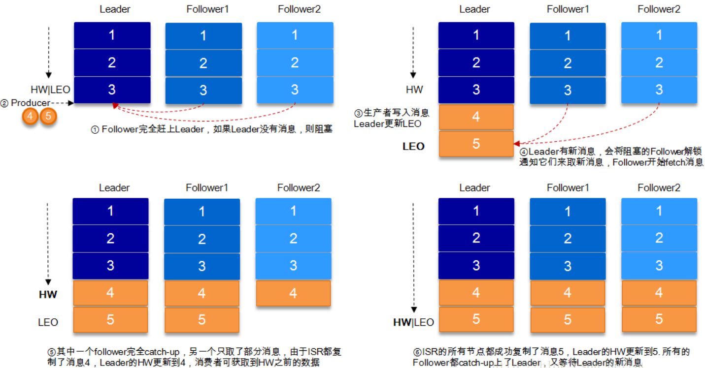

[toc]

### Kafka的使用场景

* 日志收集：一个公司可以用Kafka收集各种服务的log，通过Kafka以统一接口服务的方式开放给各种consumer，例如hadoop、Hbase、Solr等。
* 消息系统：解耦和生产者和消费者、缓存消息等。
* 用户活动追踪：Kafka经常被用来记录web用户或者app用户的各种活动，如浏览网页、搜索、点击等活动，这些活动信息被各个服务器发布到Kafka的topic中，然后订阅者通过这些topc来做实时监控分析，或者装载到hadoop、数据仓库中做离线分析和挖掘。
* 运营指标：Kafka也经常用来记录运营监控数据。包括手机各种分布式应用的数据，生产各种操作和几种反馈，比如报警和报告。

### Kafka基本概念

| 名称          | 解释                                                         |
| ------------- | ------------------------------------------------------------ |
| Broker        | 消息中间件处理节点，一个Kafka节点就是一个Broker，一个或者多个Broker可以组成一个Kafka集群。 |
| Topic         | Kafka根据Topic对消息进行归类，发布到Kafka集群的每条消息都需要指定一个Topic。 |
| Producer      | 消息生产者，向Broker发送消息的客户端。                       |
| Consumer      | 消息消费者，从Broker读取消息的客户端。                       |
| ConsumerGroup | 每个Consumer属于一个特性的ConsumerGroup，一条消息可以被多个不同的ConsumerGroup消费，但是一个ConsumerGroup只能有一个Consumer能够消费该消息。 |
| Partition     | 物理上的概念，一个Topic可以分为多少个Partition，每个Partition内部消息是有序的。 |

.png)

服务端(Broker)和客户端(Producer，Consumer)之间通信通过**TCP协议**来完成。

#### Producers

生产者讲消息发送到Topic中去，同时负责选择将message发送到topic的哪一个partition中。通过**round-robin**做简单的负载均衡。也可以根据消息中的某一个关键字来进行区分。通常第二种方式使用的更多。

#### Consumers

传统的消息传递模式有2中：队列(Queue)和(publish-subscribe)

* Queue模式：多个consumer从服务器中读取数据，消息只会到达一个consumer。
* publish-subscribe模式：消息会被广播给所有consumer。

Kafka基于这2种模式提供了一种consumer的抽象概念：**consumer group**。

* Queue模式：所有consumer都位于同一个consumer group下。
* publish-subscribe模式：所有的consumer都有着自己唯一的consumer group。


#### 消费顺序

一个partition同一时刻在一个consumer group中只能有一个consumer instace在消费，从而保证消费顺序。

**consumer group中consumer instance的数量不能比一个Topic中的partition的数量多，否则，多出来的consumer消费不到消息。**

Kafka只在partition的范围内保证消息消费的局部顺序性，不能再同一个topic中的多个partition中保证总的消费顺序性。

如果有在总体上保证消费顺序的需求，那么我们可以通过topic的partition数量设置为1，将consumer group中的consumer instance数量也设置为1，但是这样会影响性能，所以Kafka的顺序消费很少用。

### Kafka核心总控制器Controller

在Kafka集群中会有一个或者多个Broker，其中有一个Broker会被选举为控制器(Kafka Controller)，它负责管理整个集群中所有分区和副本的状态。

* 当某个分区的leader副本出现故障时，由控制器负责为该分区选举新的leader副本。
* 当检测到某个分区的ISR集群发生变化时，由控制器负责通知所有Broker更新其元数据信息。
* 当使用kafka-topics.sh脚本为某个topic增加分区数量时，同样还是由控制器负责让新分区被其他节点感知到。

#### Controller选举机制

在Kafka集群启动的时候，会自动选举一台Broker作为Contorller来管理整个集群，选举的过程是集群中每个Broker都会尝试在zookeeper上创建一个**/controller**临时节点，zookeeper会保证且仅有一个Broker能创建成功，这个Broker就会成为集群的总控制器controller。

当这个controller角色的Broker宕机了，此时zookeeper临时节点会小时，集群里其他的Broker会一直监听这个临时节点，发现临时节点小时了，就竞争再次创建临时节点，就是我们上面说的选举机制，zookeeper又会保证有一个Beoker成为新的controller。

具备控制器身份的Broker需要逼其他普通的Broker多一份职责，举起细节如下：

1. **监听Broker相关变化**。为zookeeper中的/brokers/ids/节点添加BrokerChangeListener，用来处理Broker增减的变化。
2. **监听Topic相关变化**。为zookeeper中的/brokers/topics/节点添加TopicChangeListener，用来处理Topic增减的变化；为zookeeper中的/admin/delete_topics/节点添加TopicDeleteListener，用来处理Topic删除的动作。
3. 从zookeeper中读取获取当前所有与Topic、Partition以及Broker有关的信息进行相应的管理。对于所有Topic所对应的zookeeper中的/brokers/topics/[topic]节点添加PartitionModificationsListener，用来监听Topic中的分区分配变化。
4. 更新集群的元数据信息，同步到其他普通的Broker节点中。

#### Partition副本选举Leader机制

controller感知到分区leader所在的Broker挂了(controller监听了很多zk节点可以感知到Broker存活)，controller会从ISR列表(参数unclen.leader.election.enable=false的前提下)里挑第一个Broker作为leader(第一个Broker最先放进ISR列表，可能是同步数据最多的副本)，如果参数unclean.leader.election.enable为true，代表在ISR列表里所有副本都挂了的时候可以在ISR以外的部分中选leader，这种设置，可以提供可用行，但是选出来的新leader有可能数据少很多。

副本进入ISR列表有两个条件：

1. 副本节点不能产生分区，必须能与zookeeper保持会话以及跟lader副本网络连通。
2. 副本能复制leader上所有写操作，兵器不能落后太多。(与leader副本同步滞后的部分，是由replica.lag.time.max.ms配置决定的，超过这个时间都没有跟leader同步过一次的副本会被移除ISR列表)

#### 消费者消费消息的offset记录机制

每个consumer会定期将自己消费分区的offset提交给Kafka内部topic：**__consumer_offsets**，提交过去的时候，**key是consumerGroupId+topic+分区号，value就是当前offset的值，**Kafka会定期清理topic里的消息，最后就保留最新的那条数据。

因为__consumer_offsets可能会接受高并发的请求，Kafka默认给其**分配50个分区**(可以通过offsets.topic.num.partitions设置)，这样可以通过加机器的方式抗大并发。

通过如下公式可以选出consumer消费的offset要提交到__consumer_offsets的哪个分区

公式：**hash(consumerGroupId) % __consumer_offsets主题的分区数**

#### 消费者Rebalance机制

rebalance就是说如果消费组里的消费数量有变化或者消费分区数有变化，Kafka会重新分配消费者消费分区的关系。比如consumer group中某个消费者挂了，此时会自动把分配给他的分区交给其他的消费者，如果他又重启了，那么又会把一些分区重新交给他。

**注意:**relalance只针对subscribe这种不指定分区消费的情况，如果通过assign这种消费方式指定了分区，kafka不会进行rebanlance。

如下情况可能会触发消费者rebalance：

1. 消费组里的consumer增加或减少
2. 动态给topic增加了分区
3. 消费组订阅了更多的topic

rebalance过程中，消费者无法从Kafka消费消息，这对Kafka的TPS会有影响，如果Kafka集群内节点较多，比如数百个，那重新平衡可能会耗时极多，所以应尽量避免在系统高峰期的重新平衡发生。

#### 消费者Rebalance分区分配策略

主要有三种rebalance的策略：range、round-robin、sticky。

Kafka提供了消费者客户端参数partition.assignment.strategy来设置消费者与订阅主题之间的分区分配策略。**默认情况为range分配策略。**

假设一个Topic有10个分区(0~9)，现在有三个consumer消费：

* **range策略：**就是按照分区序号排序，假设n = 分区数 / 消费者数量 = 3，m = 分区数 % 消费者数量 = 1，那么前m个消费者每个分配n + 1个分区，后面的(消费者数量 - m )个消费者每个分配n分区。

* **round-robin策略：**就是轮询分配，比如分区0、3、6、9给一个consumer，分区1、4、7给一个consumer，分区2、5、8给一个consumer。

* **sticky策略：**初始时分配策略与round-robin类似，但是在rebalance的时候，需要保证如下两个原则。

  * 分区的分配要尽可能均匀。
  * 分区的分配尽可能与上次分配的保持相同。

  当两者发生冲突时，第一个目标优先于第二个目标。这样可以最大程度维持原来的分区分配策略。

#### Rebalance过程如下

当有消费者加入消费组时，消费者、消费组及组协调器之间会经历以下几个阶段。


##### 第一阶段：选择组协调器

**组协调器GroupCoordinator：**每个consumer group都会选择一个broker座位自己的组协调器coordinator，负责监控这个消费组里的所有消费者心跳，以及判断时候宕机，然后开启消费者rebalance。

consumer group中的每个consumer启动时会向Kafka集群中的某个节点发送FindCoordinatorRequest请求来查找对应的组协调器GroupCoordinator，并跟其建立网络连接。

**组协调器选择方式：**

consumer消费的offset要提交到__consumer_offsets的哪个分区，这个分区leader对应的Broker就是这个consumer group的coordinator。

##### 第二阶段：加入消费组JOIN GROUP

在成功找到消费组所对应的GroupCoordinator之后进入加入消费组的阶段，在此阶段的消费者会向GroupCoordinator发送JoinGroupRequest请求，并处理响应。然后GroupCoordinator从一个consumer group中选择第一个加入group的consumer作为leader(**消费组协调器**)，把consumer group情况发送给这个leader，借这个leader会负责制定分区方案。

##### 第三阶段(SYNC GROUP)

consumer leader通过给GroupCoordinator发送SyncGroupRequest，接着GroupCoordinator就把分区方案下发给各个consumer，他们会根据指定分区的leader broker进行网络连接以及消息消费。

#### Producer发布消息机制剖析

##### 写入方式

Producer采用push模式将消息发布到Broker，每条消息都被append到partition中，属于顺序写磁盘(顺序写磁盘效率比随机写内存药膏，保证Kafka吞吐率)。

##### 消息路由

Producer发送消息到Broker时，会根据分区算法选择将其存储到哪一个partition。

其路由机制为：

1. 指定partition，则直接使用。
2. 未指定partition但指定key，通过对key的value进行hash选出一个partition。
3. partition和key都未指定，使用轮询选出一个partition。

##### 写入流程


1. Producer先从zookeeper的/brokers/.../state节点找到该partition的leader。
2. Producer将消息发送给该leader。
3. leader将消息写入本地log。
4. followers从leader pull消息，写入本地log后向leader发送ACS。
5. leader收到**所有ISR中**的replica的ACK后，增加HW(high watermark，最后commit的offset)并向producer发送ACK。

#### HW于LEO详解

HW俗称高水位，HighWatermark的缩写，去一个partition对应的**ISR中最小的LEO(log-end-offset)作为HW，**consumer最多只能消费到HW所在的位置。另外每个replica都有HW，leader和follower各自负责更新自己的HW的状态。对于leader新写入的消息，consumer不能立刻消费，leader会等待该消息被所有ISR中的relicas同步后更新HW，此时消息才能被consumer消费。这样就保证了如果leader所在的broker失效，该消息仍然可以从新选举的leader中获取。对于来自内部broker的读取请求，没有HW的限制。



**由此可见，Kafka的复制机制既不是完全的同步复制，也不是单纯的异步复制。事实上，同步复制要求所有能工作的follower都复制完，这条消息才会被commit，这种复制方式极大的影响了吞吐率。而异步复制方式下，follower异步的从leader复制数据，数据只要被leader写入log就被认为已经commit，这种情况下follower都还没有复制完，落后于leader时，突然leader宕机，则会丢失数据。而Kafka的这种使用ISR的方式则很好的均衡的确保数据不丢失以及吞吐率。在回顾下消息发送端对发出消息持久化机制参数acs的设置，我们结合HW和LEO来看下acks=1的情况**

**结合HW和LEO看下acks=1的情况**


#### 日志分段存储

Kafka一个分区的消息数据对应存储在一个文件夹下，以Topic名称 + 分区号命名，消息在分区内是分段(segment)存储，每个段的消息都存储在不一样的log文件里，这种特性方便old segment file快速被删除，Kafka规定了一个段位的log文件最大为1G，做这个限制目的是为了方便把log文件加载到内存去操作。

```shell
# 部分消息的offset索引文件，kafka每次往分区发4K(可配置)消息就会记录一条当前消息的offset到index文件，
# 如果要定位消息的offset会先在这个文件里快速定位，再去log文件里找具体消息
00000000000000000000.index
# 消息存储文件，主要存offset和消息体
00000000000000000000.log
# 消息的发送时间索引文件，kafka每次往分区发4K(可配置)消息就会记录一条当前消息的发送时间戳与对应的offset到timeindex文件，
# 如果需要按照时间来定位消息的offset，会先在这个文件里查找
00000000000000000000.timeindex

00000000000005367851.index
00000000000005367851.log
00000000000005367851.timeindex

00000000000009936472.index
00000000000009936472.log
00000000000009936472.timeindex
```

这个9936472之类的数字，就是代表了这个日志段文件里包含的起的Offset，也就说明这个分区至少都写入了接近1000W条数据了。

Kafka Broker有一个参数，log.segment.bytes，限制了每个日志段文件大小，最大就是1GB。

一个日志段文件满了，就自动开一个新的日志段文件来写入，避免单个文件过大，影响文件的读写性能，这个过程叫做log rolling，正在被写入的那个日志段文件，叫做active log segment。

#### zookeeper节点数据图


