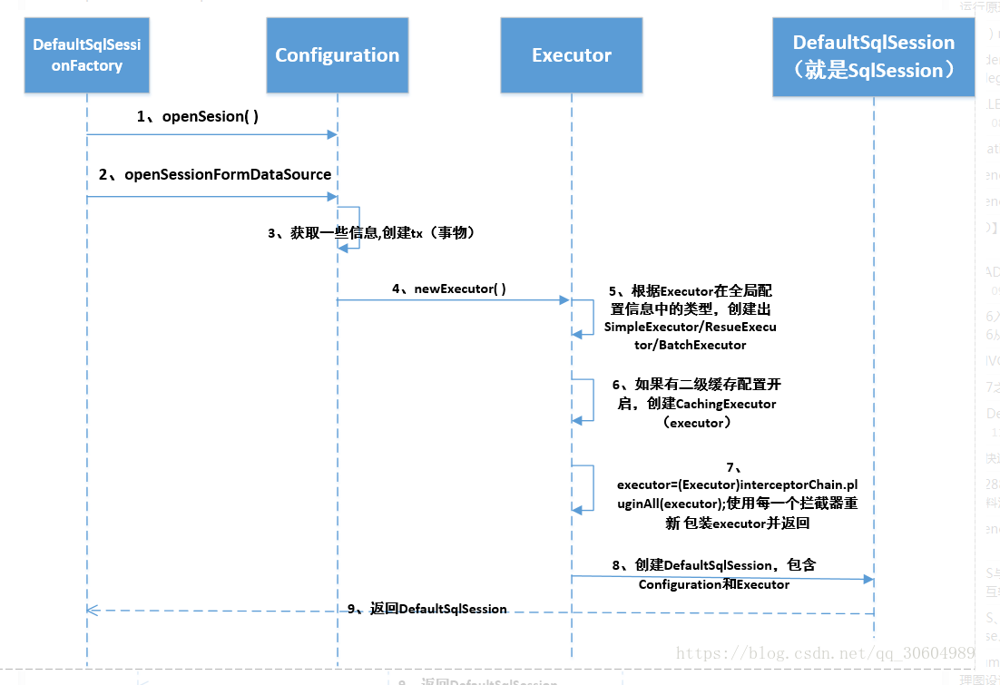
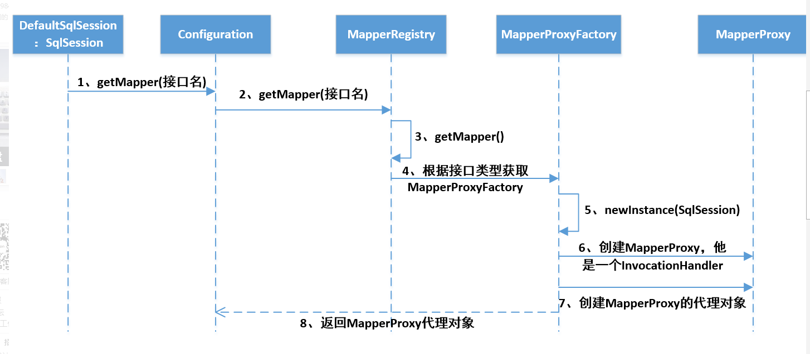
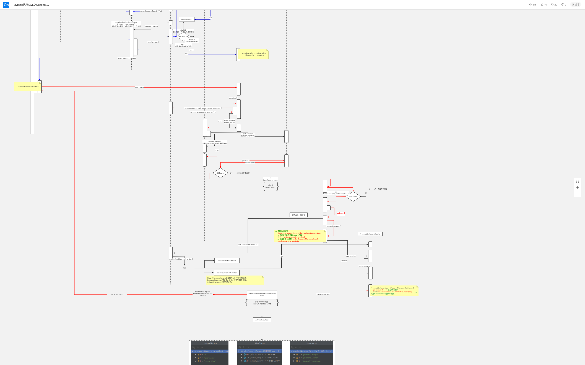
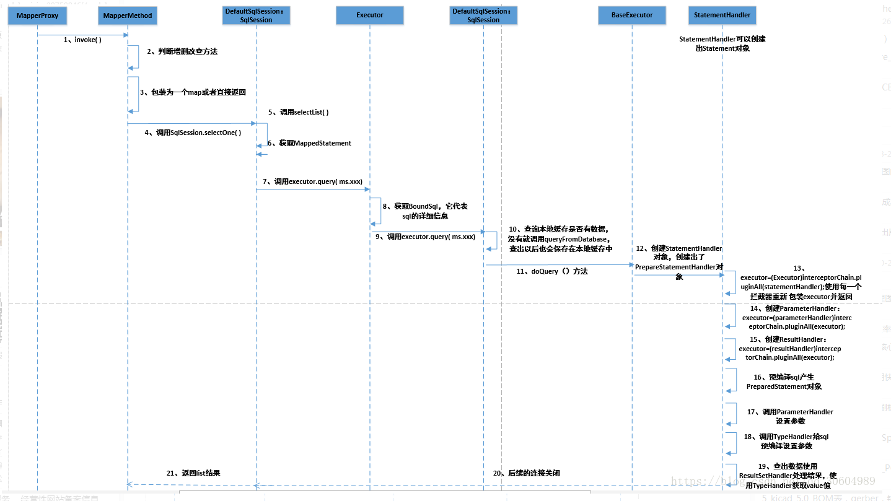

## MyBatis执行SQL的流程分析

[toc]


```java
public class App {
    public static void main(String[] args) {
        String resource = "mybatis-config.xml";
        Reader reader;
        try {
            //将XML配置文件构建为Configuration配置类
            reader = Resources.getResourceAsReader(resource);
            // 通过加载配置文件流构建一个SqlSessionFactory  DefaultSqlSessionFactory
            SqlSessionFactory sqlMapper = new SqlSessionFactoryBuilder().build(reader);
            // 数据源 执行器  DefaultSqlSession
            SqlSession session = sqlMapper.openSession();
            try {
                // 执行查询 底层执行jdbc
                //User user = (User)session.selectOne("com.tuling.mapper.selectById", 1);

                UserMapper mapper = session.getMapper(UserMapper.class);
                System.out.println(mapper.getClass());
                User user = mapper.selectById(1L);
                System.out.println(user.getUserName());
            } catch (Exception e) {
                e.printStackTrace();
            }finally {
                session.close();
            }
        } catch (IOException e) {
            e.printStackTrace();
        }
    }
}
```

之前提到拿到sqlSession之后就能进行各种CRUD操作了，所以我们就从sqlSession.getMapper这个方法开始分析。

### openSession的过程

```java
private SqlSession openSessionFromDataSource(ExecutorType execType, TransactionIsolationLevel level, boolean autoCommit) {
    Transaction tx = null;
    try {
      final Environment environment = configuration.getEnvironment();
      final TransactionFactory transactionFactory = getTransactionFactoryFromEnvironment(environment);
      tx = transactionFactory.newTransaction(environment.getDataSource(), level, autoCommit);
      //获取执行器，这边获得的执行器已经代理拦截器的功能（见下面代码）
      final Executor executor = configuration.newExecutor(tx, execType);
      //根据获取的执行器创建SqlSession
      return new DefaultSqlSession(configuration, executor, autoCommit);
    } catch (Exception e) {
      closeTransaction(tx); // may have fetched a connection so lets call close()
      throw ExceptionFactory.wrapException("Error opening session.  Cause: " + e, e);
    } finally {
      ErrorContext.instance().reset();
    }
  }

//interceptorChain生成代理类，具体参见Plugin这个类的方法
public Executor newExecutor(Transaction transaction, ExecutorType executorType) {
    executorType = executorType == null ? defaultExecutorType : executorType;
    executorType = executorType == null ? ExecutorType.SIMPLE : executorType;
    Executor executor;
    if (ExecutorType.BATCH == executorType) {
      executor = new BatchExecutor(this, transaction);
    } else if (ExecutorType.REUSE == executorType) {
      executor = new ReuseExecutor(this, transaction);
    } else {
      executor = new SimpleExecutor(this, transaction);
    }
    if (cacheEnabled) {
      executor = new CachingExecutor(executor);
    }
    executor = (Executor) interceptorChain.pluginAll(executor);
    return executor;
 }
```

Executor分成两大类，一类是CacheExecutor，另一类是普通Executor。

普通Executor又分为三种基本的Executor执行器，SimpleExecutor、ReuseExecutor、BatchExecutor。

* SimpleExecutor：每执行一次update或select，就开启一个Statement对象，用完立刻关闭Statement对象。
* ReuseExecutor：执行update或select，以SQL作为key查找Statement对象，存在就使用，不存在就新建，用完后不关闭Statement对象，而是放置于Map<String,Statement>内，供下一次使用。
* BatchExecutor：执行update(没有select，JDBC批处理不支持select)，将所有SQL都添加到批处理中(addBatch())，等待统一执行(executeBatch())，它缓存了多个Statement对象，每个Statement对象都是addBatch()完毕后，等待逐一执行executeBatch()批处理。与JDBC批处理相同。

**作用范围**：Executor的这些特点，都严格限制在SqlSession生命周期范围内。

CacheExecutor其实是封装了普通Executor，和普通的区别是在查询前先会查询缓存中是否存在结果，如果存在就使用缓存中的结果，如果不存在还是使用普通Executor进行查询，再将查询出来的结果存入缓存。



**简单总结：**

* 拿到SqlSessionFac对象后，会调用SqlSessionFactory的openSession方法，这个方法会创建一个SQL执行器(Executor)，这个SQL执行器会代理你配置的拦截器方法。
* 获得上面的SQL执行器后，会创建一个SqlSession(默认使用DefaultSqlSession)，这个SqlSession中也包含了Configuration对象，所以通过SqlSession也能拿到全局配置。
* 获得SqlSession对象后就能执行各种CRUD方法了。

### 获取Mapper的流程

进入sqlSeesion.getMapper方法，会发现调的是Configuration对象的getMapper方法

```java
public <T> T getMapper(Class<T> type, SqlSession sqlSession) {
    //mapperRegistry实质上是一个Map，里面注册了启动过程中解析的各种Mapper.xml
    //mapperRegistry的key是接口的Class类型
    //mapperRegistry的Value是MapperProxyFactory,用于生成对应的MapperProxy（动态代理类）
    return mapperRegistry.getMapper(type, sqlSession);
}
```

getMapper方法

```java
public <T> T getMapper(Class<T> type, SqlSession sqlSession) {
    final MapperProxyFactory<T> mapperProxyFactory = (MapperProxyFactory<T>) knownMappers.get(type);
    //如果配置文件中没有配置相关Mapper,直接抛异常
    if (mapperProxyFactory == null) {
      throw new BindingException("Type " + type + " is not known to the MapperRegistry.");
    }
    try {
      //关键方法
      return mapperProxyFactory.newInstance(sqlSession);
    } catch (Exception e) {
      throw new BindingException("Error getting mapper instance. Cause: " + e, e);
    }
 }
```

MapperProxyFactory的newInstance方法

```java
public class MapperProxyFactory<T> {

  private final Class<T> mapperInterface;
  private final Map<Method, MapperMethod> methodCache = new ConcurrentHashMap<Method, MapperMethod>();

  public MapperProxyFactory(Class<T> mapperInterface) {
    this.mapperInterface = mapperInterface;
  }

  public Class<T> getMapperInterface() {
    return mapperInterface;
  }

  public Map<Method, MapperMethod> getMethodCache() {
    return methodCache;
  }

  //生成Mapper接口的动态代理类MapperProxy，MapperProxy实现了InvocationHandler 接口
  @SuppressWarnings("unchecked")
  protected T newInstance(MapperProxy<T> mapperProxy) {
    return (T) Proxy.newProxyInstance(mapperInterface.getClassLoader(), new Class[] { mapperInterface }, mapperProxy);
  }
  
  public T newInstance(SqlSession sqlSession) {
    final MapperProxy<T> mapperProxy = new MapperProxy<T>(sqlSession, mapperInterface, methodCache);
    return newInstance(mapperProxy);
  }

}
```



### Mapper方法的执行过程

下面是动态代理类MapperProxy，调用Mapper接口的所有方法都会先通过这个代理类invoke方法(由于MyBatis中的Mapper接口没有实现类，所以MapperProxy这个代理对象中没有委托类，也就是说MapperPorxy干了代理类和委托类两件事)。

```java
//MapperProxy代理类
public class MapperProxy<T> implements InvocationHandler, Serializable {

  private static final long serialVersionUID = -6424540398559729838L;
  private final SqlSession sqlSession;
  private final Class<T> mapperInterface;
  private final Map<Method, MapperMethod> methodCache;

  public MapperProxy(SqlSession sqlSession, Class<T> mapperInterface, Map<Method, MapperMethod> methodCache) {
    this.sqlSession = sqlSession;
    this.mapperInterface = mapperInterface;
    this.methodCache = methodCache;
  }

  @Override
  public Object invoke(Object proxy, Method method, Object[] args) throws Throwable {
    try {
      if (Object.class.equals(method.getDeclaringClass())) {
        return method.invoke(this, args);
      } else if (isDefaultMethod(method)) {
        return invokeDefaultMethod(proxy, method, args);
      }
    } catch (Throwable t) {
      throw ExceptionUtil.unwrapThrowable(t);
    }
    //获取MapperMethod，并调用MapperMethod
    final MapperMethod mapperMethod = cachedMapperMethod(method);
    return mapperMethod.execute(sqlSession, args);
  }
```

MapperProxy的invoke方法主要干的工作就是创建MapperMethod对象或者是从缓存中获取MapperMethod对象。获取到这个对象后执行execute方法。

所以这边需要进入MapperMethod的execute方法：这个方法判断你当前执行的方法是CRUD哪一种，并通过SqlSession执行相应的操作。

execute方法

```java
public Object execute(SqlSession sqlSession, Object[] args) {
    Object result;
    //判断是CRUD那种方法
    switch (command.getType()) {
      case INSERT: {
    	Object param = method.convertArgsToSqlCommandParam(args);
        result = rowCountResult(sqlSession.insert(command.getName(), param));
        break;
      }
      case UPDATE: {
        Object param = method.convertArgsToSqlCommandParam(args);
        result = rowCountResult(sqlSession.update(command.getName(), param));
        break;
      }
      case DELETE: {
        Object param = method.convertArgsToSqlCommandParam(args);
        result = rowCountResult(sqlSession.delete(command.getName(), param));
        break;
      }
      case SELECT:
        if (method.returnsVoid() && method.hasResultHandler()) {
          executeWithResultHandler(sqlSession, args);
          result = null;
        } else if (method.returnsMany()) {
          result = executeForMany(sqlSession, args);
        } else if (method.returnsMap()) {
          result = executeForMap(sqlSession, args);
        } else if (method.returnsCursor()) {
          result = executeForCursor(sqlSession, args);
        } else {
          Object param = method.convertArgsToSqlCommandParam(args);
          result = sqlSession.selectOne(command.getName(), param);
        }
        break;
      case FLUSH:
        result = sqlSession.flushStatements();
        break;
      default:
        throw new BindingException("Unknown execution method for: " + command.getName());
    }
    if (result == null && method.getReturnType().isPrimitive() && !method.returnsVoid()) {
      throw new BindingException("Mapper method '" + command.getName() 
          + " attempted to return null from a method with a primitive return type (" + method.getReturnType() + ").");
    }
    return result;
 }
```

> https://www.processon.com/view/link/5efc23966376891e81f2a37e



sqlSession.selectOne方法会调用到DefaultSqlSession的selectList方法。这个方法获取了MappedStatement对象，并最终调用了Executor的query方法。

```java
public <E> List<E> selectList(String statement, Object parameter, RowBounds rowBounds) {
    try {
      MappedStatement ms = configuration.getMappedStatement(statement);
      return executor.query(ms, wrapCollection(parameter), rowBounds, Executor.NO_RESULT_HANDLER);
    } catch (Exception e) {
      throw ExceptionFactory.wrapException("Error querying database.  Cause: " + e, e);
    } finally {
      ErrorContext.instance().reset();
    }
}
```

然后，通过一层一层的调用，最终会来到doQuery方法。

SimpleExecutor.doQuery

```java
public <E> List<E> doQuery(MappedStatement ms, Object parameter, RowBounds rowBounds, ResultHandler resultHandler, BoundSql boundSql) throws SQLException {
    Statement stmt = null;
    try {
      Configuration configuration = ms.getConfiguration();
      //内部封装了ParameterHandler和ResultSetHandler
      StatementHandler handler = configuration.newStatementHandler(wrapper, ms, parameter, rowBounds, resultHandler, boundSql);
      stmt = prepareStatement(handler, ms.getStatementLog());
      //StatementHandler封装了Statement, 让 StatementHandler 去处理
      return handler.<E>query(stmt, resultHandler);
    } finally {
      closeStatement(stmt);
    }
}
```

PreparedStatementHandler

```java
public <E> List<E> query(Statement statement, ResultHandler resultHandler) throws SQLException {
     //到此，原形毕露， PreparedStatement, 这个大家都已经滚瓜烂熟了吧
    PreparedStatement ps = (PreparedStatement) statement;
    ps.execute();
    //结果交给了ResultSetHandler 去处理,处理完之后返回给客户端
    return resultSetHandler.<E> handleResultSets(ps);
}
```




### 简单总结

* SqlSessionFactoryBuilder解析配置文件，包括属性配置、别名配置、拦截器配置、环境(数据源和事务管理器)、Mapper配置等；解析玩这些配置后悔生成一个Configuration对象，这个对象中包含了MyBatis需要的所有配置，然后会用这个Configuration对象创建一个SqlSessionFactory对象 ，这个对象中包含了Configuration对象。
* 获得上面的Sql执行器后，会创建一个SqlSession(默认使用DefaultSqlSession)，这个SqlSession中也包含了Configration对象和上面创建的Executor对象，所以通过SqlSession也能拿到全局配置。
* 调用SqlSession的getMapper方法，获取Mapper的接口动态代理对象MapperProxy，调用Mapper接口的所有方法都会调用MapperProxy的invoke方法(动态代理机制)。
* 最后会进入Executor组件的query方法，这个方法中会创建一个StatementHandler对象，这个对象中同时会封装ParameterHandler和ResultSetHandler对象。调用StatementHandler预编译参数以及设置参数值，使用ParameterHandler来给SQL设置参数。
  * Executor组件有两个直接实现类，BaseExecutor和CachingExecutor。CachingExecutor静态代理了BaseExecutor。Executor组件封装了Transction组件，Transction组件又封装了DataSource组件。
* 调用StatementHandler的CRUD方法获得结果，ResultSetHandler对结果进行封装转换，请求结束。
* Executor、StatementHandler、ParameterHandler、ResultSetHandler，Mybatis的插件会对上面的四个组件进行动态代理。


### 重要类

* MapperRegister：本质上是一个Map，其中key是Mapper接口的全限定名，value是MapperProxFacotry；
* MapperProxyFactory：这个类是MapperRegistry中存的value值，在通过sqlSession获取Mapper时，其实先通过的是这个工厂，然后通过这个工厂创建Mapper的动态代理类；
* MapperProxy：实现了InvocationHandler接口，Mapper的冬天代理接口方法的调用都会到达这个类的invoke方法；
* MapperMethod：判断你执行的方法是属于CURD中的哪一种，并通过SqlSession执行相应的操作；
* Executor：Mybatis执行器，是Mybatis的调度核心，负责SQL语句的生成和查询缓存的维护；
* StatementHandler：封装了JDBC Statement操作，负责对JDBC statement的操作；
* ParameterHandler：负责对用户传递的参数转换成JDBC Statement所需要的参数；
* ResultSetHandler：负责将JDBC返回的ResultSet结果集对象转存成List类型的结合；
* TypeHandler：负责JAVA数据类型和JDBC数据类型之间的映射和转换
* MappedStatement：维护了一条<select|update|delete|insert>节点的封装；
* SqlSource：负责根据用户传递的parameterObject，动态生成SQL语句，将信息封装到BoundSql对象中并返回；
* BoundSql：标识动态生成的SQL语句以及相应的参数信息；
* Configuration：MyBatis所有的配置信息都维护在Configuration对象之中。