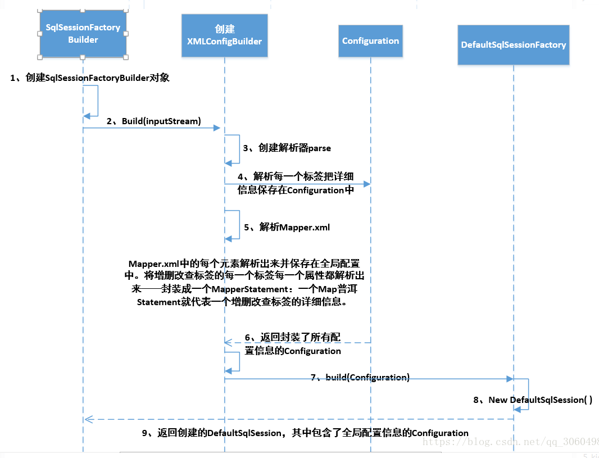

## MyBatis解析全局配置文件

[toc]

### 传统JDBC和Mybatis相比弊病

传统JDBC

```java
@Test
public  void test() throws SQLException {
    Connection conn=null;
    PreparedStatement pstmt=null;
    try {
        // 1.加载驱动
        Class.forName("com.mysql.jdbc.Driver");

        // 2.创建连接
        conn= DriverManager.
                getConnection("jdbc:mysql://localhost:3306/mybatis_example", "root", "123456");


        // SQL语句
        String sql="select id,user_name,create_time from t_user where id=?";

        // 获得sql执行者
        pstmt=conn.prepareStatement(sql);
        pstmt.setInt(1,1);

        // 执行查询
        //ResultSet rs= pstmt.executeQuery();
        pstmt.execute();
        ResultSet rs= pstmt.getResultSet();

        rs.next();
        User user =new User();
        user.setId(rs.getLong("id"));
        user.setUserName(rs.getString("user_name"));
        user.setCreateTime(rs.getDate("create_time"));
        System.out.println(user.toString());
    } catch (Exception e) {
        e.printStackTrace();
    }
    finally{
        // 关闭资源
        try {
            if(conn!=null){
                conn.close();
            }
            if(pstmt!=null){
                pstmt.close();
            }
        } catch (SQLException e) {
            e.printStackTrace();
        }
    }
}
```

#### 传统JDBC的问题如下

1. 数据连接创建，释放频率造成资源的浪费，从而影响系统性能，使用数据库连接池可以解决问题。
2. SQL语句在代码中硬编码，造成代码的不易维护，实际应用中SQL的变化可能较大，SQL代码和JAVA代码没有分离开来维护不方便。
3. 使用preparedStatement向有占位符传递参数存在硬编码问题，因为SQL中的where子句的条件不确定，同样是修改不方便。
4. 对结果集解析麻烦，SQL变化导致解析代码变化，且解析前需要遍历。

#### MyBatis对传统的JDBC的解决方案

1. 数据连接创建，释放频率造成资源的浪费，从而影响系统性能，使用数据库连接池可以解决问题。

   解决：在配置文件中配置数据连接池，使用连接池管理数据库连接。

2. SQL语句在代码中硬编码，造成代码的不易维护，实际应用中SQL的变化可能较大，SQL代码和JAVA代码没有分离开来维护不方便。

   解决：将SQL语句配置在Mapper.xml文件中与JAVA代码分离。

3. 使用preparedStatement向有占位符传递参数存在硬编码问题，因为SQL中的where子句的条件不确定，同样是修改不方便。

   解决：MyBatis自动将JAVA对象映射至SQL语句，通过statement中的parameterType定义输入参数的类型。

4. 对结果集解析麻烦，SQL变化导致解析代码变化，且解析前需要遍历。

   解决：MyBatis自动将SQL执行结果映射至JAVA对象，通过statement中的resultType定义输出结果的类型。

### MyBatis简单介绍

MyBatis是一个持久层ORM框架，使用简单，学习成本较低。可以执行自己手写的SQL语句，比较灵活。但是MyBatis的自动化程度不高，移植性也不高，有时从一个数据库迁移到另一个数据的时候需要自己修改配置，所以称为只有半自动的ORM框架。


```java
public class App {
    public static void main(String[] args) {
        String resource = "mybatis-config.xml";
        Reader reader;
        try {
            //将XML配置文件构建为Configuration配置类
            reader = Resources.getResourceAsReader(resource);
            // 通过加载配置文件流构建一个SqlSessionFactory  DefaultSqlSessionFactory
            SqlSessionFactory sqlMapper = new SqlSessionFactoryBuilder().build(reader);
            // 数据源 执行器  DefaultSqlSession
            SqlSession session = sqlMapper.openSession();
            try {
                // 执行查询 底层执行jdbc
                //User user = (User)session.selectOne("com.tuling.mapper.selectById", 1);

                UserMapper mapper = session.getMapper(UserMapper.class);
                System.out.println(mapper.getClass());
                User user = mapper.selectById(1L);
                System.out.println(user.getUserName());
            } catch (Exception e) {
                e.printStackTrace();
            }finally {
                session.close();
            }
        } catch (IOException e) {
            e.printStackTrace();
        }
    }
}
```

**简单总结**

* 从配置文件得到SessionFactory
* 从SessionFactory得到SqlSession
* 通过SqlSession进行CRUD和事务的操作
* 执行完相关操作之后关闭Session

### 启动流程分析

```java
String resource = "mybatis-config.xml";
//将XML配置文件构建为Configuration配置类
reader = Resources.getResourceAsReader(resource);
// 通过加载配置文件流构建一个SqlSessionFactory  DefaultSqlSessionFactory
SqlSessionFactory sqlMapper = new SqlSessionFactoryBuilder().build(reader);
```

通过上面的代码可以看到，创建SqlSessionFactory的代码在SqlSessionFactoryBuilder中

```java
//整个过程就是将配置文件解析成Configration对象，然后创建SqlSessionFactory的过程
//Configuration是SqlSessionFactory的一个内部属性
public SqlSessionFactory build(InputStream inputStream, String environment, Properties properties) {
    try {
      XMLConfigBuilder parser = new XMLConfigBuilder(inputStream, environment, properties);
      return build(parser.parse());
    } catch (Exception e) {
      throw ExceptionFactory.wrapException("Error building SqlSession.", e);
    } finally {
      ErrorContext.instance().reset();
      try {
        inputStream.close();
      } catch (IOException e) {
        // Intentionally ignore. Prefer previous error.
      }
    }
  }
    
  public SqlSessionFactory build(Configuration config) {
    return new DefaultSqlSessionFactory(config);
  }
```

配置文件示例

```xml
<?xml version="1.0" encoding="UTF-8" ?>
<!DOCTYPE configuration
        PUBLIC "-//mybatis.org//DTD Config 3.0//EN"
        "http://mybatis.org/dtd/mybatis-3-config.dtd">
<configuration>
    <!--SqlSessionFactoryBuilder中配置的配置文件的优先级最高；config.properties配置文件的优先级次之；properties标签中的配置优先级最低 -->
    <properties resource="org/mybatis/example/config.properties">
      <property name="username" value="rott"/>
      <property name="password" value="123456"/>
    </properties>

    <!--一些重要的全局配置-->
    <settings>
    <setting name="cacheEnabled" value="true"/>
    <!--<setting name="lazyLoadingEnabled" value="true"/>-->
    <!--<setting name="multipleResultSetsEnabled" value="true"/>-->
    <!--<setting name="useColumnLabel" value="true"/>-->
    <!--<setting name="useGeneratedKeys" value="false"/>-->
    <!--<setting name="autoMappingBehavior" value="PARTIAL"/>-->
    <!--<setting name="autoMappingUnknownColumnBehavior" value="WARNING"/>-->
    <!--<setting name="defaultExecutorType" value="SIMPLE"/>-->
    <!--<setting name="defaultStatementTimeout" value="25"/>-->
    <!--<setting name="defaultFetchSize" value="100"/>-->
    <!--<setting name="safeRowBoundsEnabled" value="false"/>-->
    <!--<setting name="mapUnderscoreToCamelCase" value="false"/>-->
    <!--<setting name="localCacheScope" value="STATEMENT"/>-->
    <!--<setting name="jdbcTypeForNull" value="OTHER"/>-->
    <!--<setting name="lazyLoadTriggerMethods" value="equals,clone,hashCode,toString"/>-->
    <!--<setting name="logImpl" value="STDOUT_LOGGING" />-->
    </settings>

    <typeAliases>

    </typeAliases>

    <plugins>
        <plugin interceptor="com.github.pagehelper.PageInterceptor">
            <!--默认值为 false，当该参数设置为 true 时，如果 pageSize=0 或者 RowBounds.limit = 0 就会查询出全部的结果-->
            <!--如果某些查询数据量非常大，不应该允许查出所有数据-->
            <property name="pageSizeZero" value="true"/>
        </plugin>
    </plugins>

    <environments default="development">
        <environment id="development">
            <transactionManager type="JDBC"/>
            <dataSource type="POOLED">
                <property name="driver" value="com.mysql.jdbc.Driver"/>
                <property name="url" value="jdbc:mysql://10.59.97.10:3308/test"/>
                <property name="username" value="root"/>
                <property name="password" value="123456"/>
            </dataSource>
        </environment>
    </environments>

    <databaseIdProvider type="DB_VENDOR">
        <property name="MySQL" value="mysql" />
        <property name="Oracle" value="oracle" />
    </databaseIdProvider>

    <mappers>
        <!--这边可以使用package和resource两种方式加载mapper-->
        <!--<package name="包名"/>-->
        <mapper resource="./mappers/UserMapper.xml"/>
    </mappers>

</configuration>
```

解析配置文件的核心方法

```java
private void parseConfiguration(XNode root) {
    try {
      //issue #117 read properties first
      //解析properties标签，并set到Configration对象中
      //在properties配置属性后，在Mybatis的配置文件中就可以使用${key}的形式使用了。
      propertiesElement(root.evalNode("properties"));
      
      //解析setting标签的配置
      Properties settings = settingsAsProperties(root.evalNode("settings"));
      //添加vfs的自定义实现，这个功能不怎么用
      loadCustomVfs(settings);
        
      //配置类的别名，配置后就可以用别名来替代全限定名
      //mybatis默认设置了很多别名，参考附录部分
      typeAliasesElement(root.evalNode("typeAliases"));
        
      //解析拦截器和拦截器的属性，set到Configration的interceptorChain中
      //MyBatis 允许你在已映射语句执行过程中的某一点进行拦截调用。默认情况下，MyBatis 允许使用插件来拦截的方法调用包括：
      //Executor (update, query, flushStatements, commit, rollback, getTransaction, close, isClosed)
        //ParameterHandler (getParameterObject, setParameters)
        //ResultSetHandler (handleResultSets, handleOutputParameters)
        //StatementHandler (prepare, parameterize, batch, update, query)
      pluginElement(root.evalNode("plugins"));
      
      //Mybatis创建对象是会使用objectFactory来创建对象，一般情况下不会自己配置这个objectFactory，使用系统默认的objectFactory就好了
      objectFactoryElement(root.evalNode("objectFactory"));
      objectWrapperFactoryElement(root.evalNode("objectWrapperFactory"));
      reflectorFactoryElement(root.evalNode("reflectorFactory"));
       
      //设置在setting标签中配置的配置
      settingsElement(settings);
   
      //解析环境信息，包括事物管理器和数据源，SqlSessionFactoryBuilder在解析时需要指定环境id，如果不指定的话，会选择默认的环境；
      //最后将这些信息set到Configration的Environment属性里面
      environmentsElement(root.evalNode("environments"));
        
      //
      databaseIdProviderElement(root.evalNode("databaseIdProvider"));
        
      //无论是 MyBatis 在预处理语句（PreparedStatement）中设置一个参数时，还是从结果集中取出一个值时， 都会用类型处理器将获取的值以合适的方式转换成 Java 类型。解析typeHandler。
      typeHandlerElement(root.evalNode("typeHandlers"));
      //解析Mapper
      mapperElement(root.evalNode("mappers"));
    } catch (Exception e) {
      throw new BuilderException("Error parsing SQL Mapper Configuration. Cause: " + e, e);
    }
}
```



解析流程结束后悔成成一个Configuration对象，包含所有的配置信息，然后会创建一个SqlSessionFactory对象，这个对象包含了Configuration对象。

**简单总结**

* SqlSessionFactoryBuilder解析配置文件，包括属性配置，别名配置、拦截器配置、环境(数据源和事务管理器)、Mapper配置等；解析完这些配置后会生成一个Configuration对象，这个对象中包含了MyBatis需要的所有配置，然后会用这个Configuration对象创建一个SqlSessionFactory对象，这个对象中包含了Configuration对象。
