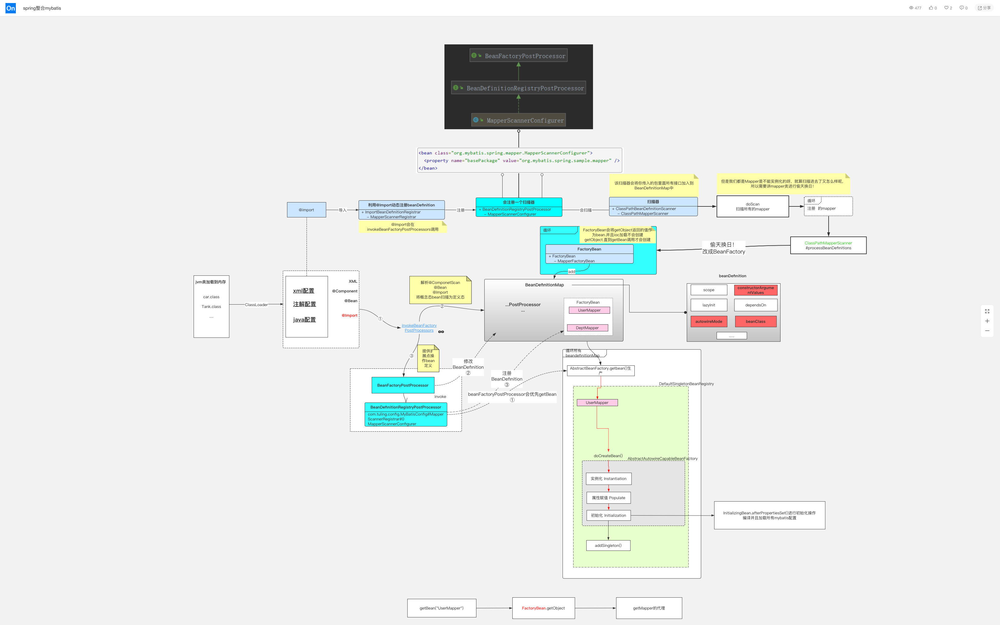

## Spring整合MyBatis原理

[toc]

### SqlSessionFactoryBean

```java
public class SqlSessionFactoryBean implements FactoryBean<SqlSessionFactory>, InitializingBean, ApplicationListener<ApplicationEvent{
}
```

实现FactoryBean接口的getObject方法：

```java
  /**
   * 
   * 将SqlSessionFactory对象注入spring容器
   * {@inheritDoc}
   */
  @Override
  public SqlSessionFactory getObject() throws Exception {
    if (this.sqlSessionFactory == null) {
      afterPropertiesSet();
    }

    return this.sqlSessionFactory;
  }
```

SqlSeesionFactoryBean实现InitalizingBean接口，需要实现其afterPropertiesSet()

```java
 /**
 * {@inheritDoc}
 */
/**
 * 方法实现说明:我们自己配置文件中配置了SqlSessionFactoryBean,我们发现配置了 该类实现了FactoryBean接口, 也实现了bean的生命周期回调接口InitializingBean
 */
@Override
public void afterPropertiesSet() throws Exception {
  notNull(dataSource, "Property 'dataSource' is required");
  notNull(sqlSessionFactoryBuilder, "Property 'sqlSessionFactoryBuilder' is required");
  state((configuration == null && configLocation == null) || !(configuration != null && configLocation != null),
      "Property 'configuration' and 'configLocation' can not specified with together");

  /**
   * 通过sqlSessionFactoryBuilder来构建我们的sqlSessionFactory
   */
  this.sqlSessionFactory = buildSqlSessionFactory();
}
```

核心的是buildSqlSessionFactory

```java

/**
 * 方法实现说明:构建我们的sqlSessionFactory的实例
 */
protected SqlSessionFactory buildSqlSessionFactory() throws Exception {

  // 声明一个Configuration对象用于保存mybatis的所有的配置信息
  final Configuration targetConfiguration;

  XMLConfigBuilder xmlConfigBuilder = null;
  // 初始化 configuration 对象，和设置其 configuration.variables 属性
  /**
   * 判断当前的SqlSessionFactoryBean是否在配置@Bean的时候 factoryBean.setConfiguration();
   *
   */
  if (this.configuration != null) {
    /**
     * 把配置的SqlSessionFactoryBean配置的configuration 赋值给targetConfiguration
     */
    targetConfiguration = this.configuration;
    if (targetConfiguration.getVariables() == null) {
      targetConfiguration.setVariables(this.configurationProperties);
    } else if (this.configurationProperties != null) {
      targetConfiguration.getVariables().putAll(this.configurationProperties);
    }
  }
  /**
   * 对configLocation进行非空判断，由于我们配置了SqlSessionFactoryBean的configLocation属性设置
   *
   * @Bean public SqlSessionFactoryBean sqlSessionFactory( ) throws IOException { SqlSessionFactoryBean factoryBean
   *       =new SqlSessionFactoryBean(); factoryBean.setDataSource(dataSource()); factoryBean.setConfigLocation(new
   *       ClassPathResource("mybatis/mybatis-config.xml")); factoryBean.setMapperLocations(new
   *       PathMatchingResourcePatternResolver().getResources("classpath:mybatis/mapper/*.xml")); return factoryBean;
   *       }
   */

  else if (this.configLocation != null) {
    /**
     * 创建我们xml配置构建器对象,对mybatis/mybatis-config.xml配置文件进行解析 在这里以及把我们的mybaits-config.xml解析出要给document对象
     */
    xmlConfigBuilder = new XMLConfigBuilder(this.configLocation.getInputStream(), null, this.configurationProperties);
    /**
     * 因为我们在创建XMLConfigBuilder的时候已经把我们的Configuration对象创建出来了
     */
    targetConfiguration = xmlConfigBuilder.getConfiguration();
  } else {
    LOGGER.debug(
        () -> "Property 'configuration' or 'configLocation' not specified, using default MyBatis Configuration");
    targetConfiguration = new Configuration();
    /**
     * 判断configurationProperties不为空,那么就调用targetConfiguration.set方法 把configurationProperties注入到Configuration对象中
     */
    Optional.ofNullable(this.configurationProperties).ifPresent(targetConfiguration::setVariables);
  }

  /**
   * objectFactory不为空,那么就调用targetConfiguration.set方法 把objectFactory注入到Configuration对象中
   */
  Optional.ofNullable(this.objectFactory).ifPresent(targetConfiguration::setObjectFactory);
  /**
   * objectWrapperFactory不为空,那么就调用targetConfiguration.set方法把 ObjectWrapperFactory注入到Configuration对象中
   */
  Optional.ofNullable(this.objectWrapperFactory).ifPresent(targetConfiguration::setObjectWrapperFactory);

  /**
   * vfs不为空,那么就调用targetConfiguration.set方法把 vfs注入到Configuration对象中
   */
  Optional.ofNullable(this.vfs).ifPresent(targetConfiguration::setVfsImpl);

  /**
   * typeAliasesPackage配置情况分为二种 1) 在mybaits-config.xml中配置了(mybatis的方式) <typeAliases>
   * <package name="com.tuling.entity"></package> </typeAliases>
   * 2)在配置我们的SqlSessionFactoryBean的时候配置了(Spring整合mybatis的方式)
   *
   * @Bean public SqlSessionFactoryBean sqlSessionFactory( ) throws IOException { SqlSessionFactoryBean factoryBean =
   *       new SqlSessionFactoryBean(); factoryBean.setDataSource(dataSource()); // 设置 MyBatis 配置文件路径
   *       factoryBean.setConfigLocation(new ClassPathResource("mybatis/mybatis-config.xml")); // 设置 SQL 映射文件路径
   *       factoryBean.setMapperLocations(new
   *       PathMatchingResourcePatternResolver().getResources("classpath:mybatis/mapper/*.xml"));
   *
   *       factoryBean.setTypeAliasesPackage("com.tuling.entity"); return factoryBean; }
   *
   *
   *       那么在Dept 就不需要写成com.tuling.entity了 <select id="findOne" parameterType="Integer" resultType="Dept"> select *
   *       from dept where id = #{id} </select>
   *
   *       若我们在配置SqlSessionFactoryBean接口的时候配置了typeAliasesPackage 那么
   *       这里才不会为空,同理,我们可以通过SqlSessionFactoryBean的typeAliasesSuperType 来控制哪些类的别名不支持
   */
  if (hasLength(this.typeAliasesPackage)) {

    /**
     * 第一步:扫描我们typeAliasesPackage 包路径下的所有的实体类的class类型 第二步:进行过滤,然后注册到Configuration的别名映射器中
     */
    scanClasses(this.typeAliasesPackage, this.typeAliasesSuperType).stream()
        .filter(clazz -> !clazz.isAnonymousClass()).filter(clazz -> !clazz.isInterface())
        .filter(clazz -> !clazz.isMemberClass()).forEach(targetConfiguration.getTypeAliasRegistry()::registerAlias);
  }

  /**
   * 判断我们SqlSessionFactory是否配置了typeAliases(class类型) 一般typeAliasesPackage配置好了 就没有必要配置typeAliases
   * 注册到Configuration的别名映射器中
   */
  if (!isEmpty(this.typeAliases)) {
    Stream.of(this.typeAliases).forEach(typeAlias -> {
      targetConfiguration.getTypeAliasRegistry().registerAlias(typeAlias);
      LOGGER.debug(() -> "Registered type alias: '" + typeAlias + "'");
    });
  }

  /**
   * 把我们自定义的插件注册到我们的mybatis的配置类上 系统默认的插件 Executor (update, query, flushStatements, commit, rollback, getTransaction,
   * close, isClosed) ParameterHandler (getParameterObject, setParameters) ResultSetHandler (handleResultSets,
   * handleOutputParameters) StatementHandler (prepare, parameterize, batch, update, query)
   */
  if (!isEmpty(this.plugins)) {
    Stream.of(this.plugins).forEach(plugin -> {
      targetConfiguration.addInterceptor(plugin);
      LOGGER.debug(() -> "Registered plugin: '" + plugin + "'");
    });
  }

  /**
   * 扫描我们自定义的类型处理器(用来处理我们的java类型和数据库类型的转化) 并且注册到我们的 targetConfiguration(批量注册)
   */
  if (hasLength(this.typeHandlersPackage)) {
    scanClasses(this.typeHandlersPackage, TypeHandler.class).stream().filter(clazz -> !clazz.isAnonymousClass())
        .filter(clazz -> !clazz.isInterface()).filter(clazz -> !Modifier.isAbstract(clazz.getModifiers()))
        .forEach(targetConfiguration.getTypeHandlerRegistry()::register);
  }

  /**
   * 通过配置<TypeHandlers></TypeHandlers>的形式来注册我们的类型处理器对象
   */
  if (!isEmpty(this.typeHandlers)) {
    Stream.of(this.typeHandlers).forEach(typeHandler -> {
      targetConfiguration.getTypeHandlerRegistry().register(typeHandler);
      LOGGER.debug(() -> "Registered type handler: '" + typeHandler + "'");
    });
  }

  /**
   * MyBatis 从 3.2 开始支持可插拔的脚本语言， 因此你可以在插入一种语言的驱动（language driver）之后来写基于这种语言的动态 SQL 查询
   * 具体用法:博客地址:https://www.jianshu.com/p/5c368c621b89
   */
  if (!isEmpty(this.scriptingLanguageDrivers)) {
    Stream.of(this.scriptingLanguageDrivers).forEach(languageDriver -> {
      targetConfiguration.getLanguageRegistry().register(languageDriver);
      LOGGER.debug(() -> "Registered scripting language driver: '" + languageDriver + "'");
    });
  }
  Optional.ofNullable(this.defaultScriptingLanguageDriver)
      .ifPresent(targetConfiguration::setDefaultScriptingLanguage);

  /**
   * 设置数据库厂商
   */
  if (this.databaseIdProvider != null) {// fix #64 set databaseId before parse mapper xmls
    try {
      targetConfiguration.setDatabaseId(this.databaseIdProvider.getDatabaseId(this.dataSource));
    } catch (SQLException e) {
      throw new NestedIOException("Failed getting a databaseId", e);
    }
  }

  /**
   * 若二级缓存不为空,注册二级缓存
   */
  Optional.ofNullable(this.cache).ifPresent(targetConfiguration::addCache);

  if (xmlConfigBuilder != null) {
    try {
      /**
       * 真正的解析我们的配置(mybatis-config.xml)的document对象
       */
      xmlConfigBuilder.parse();
      LOGGER.debug(() -> "Parsed configuration file: '" + this.configLocation + "'");
    } catch (Exception ex) {
      throw new NestedIOException("Failed to parse config resource: " + this.configLocation, ex);
    } finally {
      ErrorContext.instance().reset();
    }
  }

  /**
   * 为我们的configuration设置一个环境变量
   */
  targetConfiguration.setEnvironment(new Environment(this.environment,
      this.transactionFactory == null ? new SpringManagedTransactionFactory() : this.transactionFactory,
      this.dataSource));

  /**
   * 循环我们的mapper.xml文件
   */
  if (this.mapperLocations != null) {
    if (this.mapperLocations.length == 0) {
      LOGGER.warn(() -> "Property 'mapperLocations' was specified but matching resources are not found.");
    } else {
      for (Resource mapperLocation : this.mapperLocations) {
        if (mapperLocation == null) {
          continue;
        }
        try {
          /**
           * 真正的循环我们的mapper.xml文件
           */
          XMLMapperBuilder xmlMapperBuilder = new XMLMapperBuilder(mapperLocation.getInputStream(),
              targetConfiguration, mapperLocation.toString(), targetConfiguration.getSqlFragments());
          xmlMapperBuilder.parse();
        } catch (Exception e) {
          throw new NestedIOException("Failed to parse mapping resource: '" + mapperLocation + "'", e);
        } finally {
          ErrorContext.instance().reset();
        }
        LOGGER.debug(() -> "Parsed mapper file: '" + mapperLocation + "'");
      }
    }
  } else {
    LOGGER.debug(() -> "Property 'mapperLocations' was not specified.");
  }

  /**
   * 通过建造者模式构建我们的SqlSessionFactory对象 默认是DefaultSqlSessionFactory
   */
  return this.sqlSessionFactoryBuilder.build(targetConfiguration);
}
```

SQLSessionFactoryBean主要通过对applicationContext.xml解析完成时对Configuration的实例化以及对完成映射配置文件*Mapper.xml的解析。

关键点：

1. XMLConfigBuilder：在mybatis中主要负责解析mybatis-config.xml
   1. 解析完成后，如果我们自己设置了则使用我的设置进行覆盖
2. XMLMapperBuilder：负责映射配置文件
3. targetConfiguration.setEnvironment：这里注意一下，事务工厂会使用一个新的new SpringManagedTransactionFactory()而不是Mybatis之前的ManagedTransactionFactory，这个SpringManagedTransctionFactory会使用Spring事务中的dataSource，从而达到事务集成。


### Spring是怎么管理Mapper接口动态代理的



