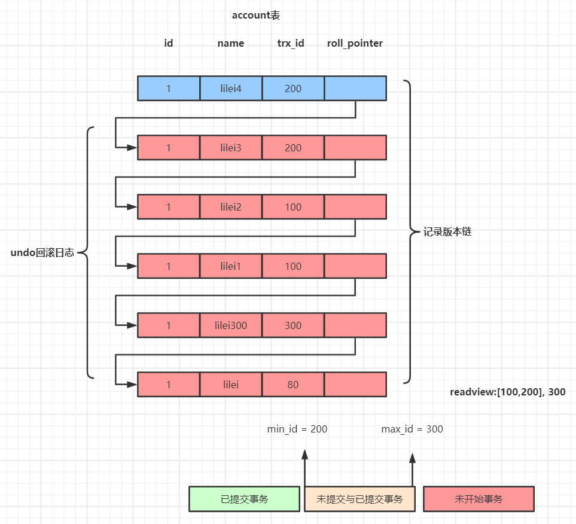

[toc]

## MVCC

### MVCC多版本并发控制机制

可重复度隔离级别下是通过MVCC(**Multi-Version Concurrentcy Control**)机制来保证的，对一行数据的读和写两个操作默认是不会通过加锁互斥来保证隔离性，避免了频繁加锁互斥，而在串行化隔离级别为了保证较高的隔离性是通过将所有操作加锁互斥来实现的。

MySQL在读已提交和可重复读隔离级别下都实现了MVCC机制。

#### undo日志版本链与read view机制详解

undo日志版本链是指一行数据被多个事务依次修改后，在每个事务修改完后，MySQL会保留修改前的数据undo回滚日志，并且用两个隐藏字段trx_id和roll_pointer把这些undo日志串联起来形成一个历史版本链。

在**可重复读隔离级别**，当事务开启，执行任何查询SQL时会生成当前事务的**一致性事务read-view**，该视图在事务结束之前都不会变化(**如果是读已提交隔离级别在每次执行查询SQL时都会重新生成**)，这个视图由执行查询时所有未提交事务id数组(数组里最小的id为min_id)，和已创建的最大事务id(max_id)组成，事务里的任何SQL查询结果需要从对应版本链里的最新数据开始逐条跟read-view做比较从而得到最终快照结果。

#### 版本链对比规则

1. 如果row的trx_id落在绿色部分(trx_id < min_id)，表示这个版本是已提交的事务生成的，这个数据是可见的；
2. 如果row的trx_id落在红色部分(trx_id > max_id)，表示这个版本是由将来启动的事务生成的，是不可见的(若row的trx_id就是当前自己的事务是可见的)；
3. 如果row的trx_id落在黄色部分(min_id <= trx_id <= max_id)，那就包括两种情况
   1. 如果row的trx_id在视图数组中，表示这个版本是由还没提交的事务生成的，不可见(若row的trx_id就是当前自己的事务是可见的)；
   2. 如果row的trx_id不在视图数组中，表示这个版本是已经提交了的事务生成的，可见

对于删除的情况可以认为是update的特殊情况，会将版本链上最新的数据复制一份，然后将trx_id修改成删除操作的trx_id，同时在该条记录的头信息(record header)里的(delete_flag)标记位写上true，来表示当前记录已经被删除，在查询时按照上面的规则查到对应的记录如果delete_flag的标记位为ture，意味着记录已经被删除，则不返回数据。

**注意**：begin/start transaction命令并不是一个事务的起点，在执行到它们之后的第一个修改操作InnoDB表的语句，事务才真正启动，才会向MySQL申请事务id，MySQL内部是严格按照事务的启动顺序来分配事务id的。

**个人理解**

* 可重复读：取生成read-view前最后一次commit的trx_id，不管后续其他事务commit都不影响当前事务的read-view
* 读已提交：每次select都会生成最新的read-view，取最新的trx_id结果

## InnoDB引擎执行SQL的BufferPool缓存机制

**为什么MySQL不能直接更新磁盘上的数据而且设置这么一套复杂的机制来执行SQL？**

因为来一个请求就直接对磁盘文件进行随机读写，然后更新磁盘文件里的数据性能可能非常差。

因为磁盘随机读写的性能是非常差，所以直接更新磁盘文件是不能让数据库抗住非常高并发的。

MySQL这套机制看起来复杂，但是它可以保证每个请求都是**更新内存BufferPool**，然后顺序写日志文件，同事还能保证各种异常情况下的数据一致性。

更新内存的性能是极高的，然后顺序写磁盘上的日志文件的性能也是非常高的，要远远高于随机读写磁盘文件。

正是通过这套机制，才能让我们的MySQL数据库在较高配置的机器上每秒可以抗下几千的读写请求。