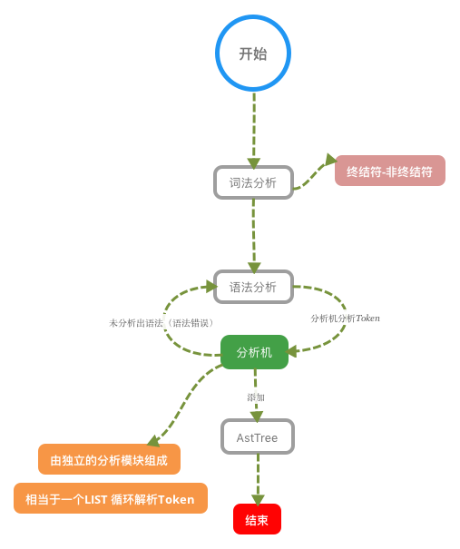
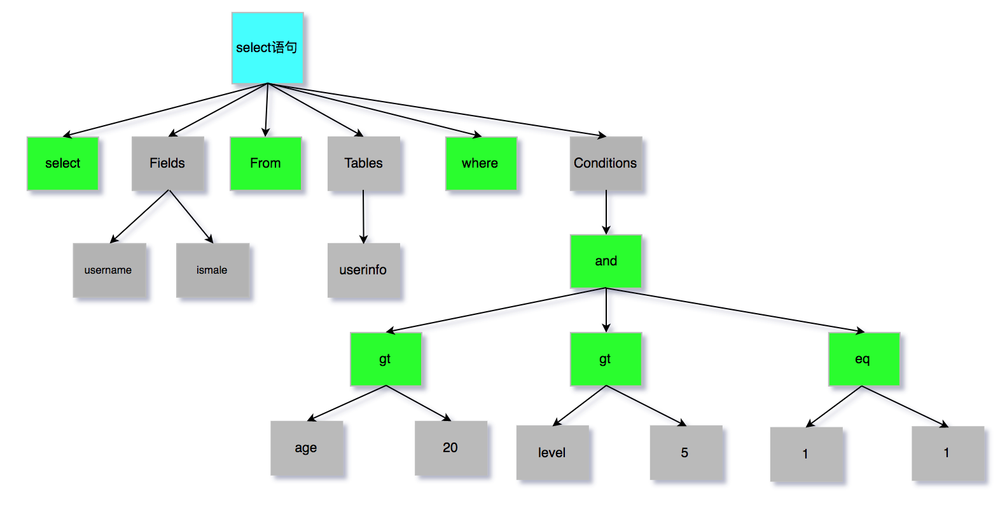

[toc]

## MySQL内部组件结构


MySQL可以分为Server层和存储引擎层两部分。

#### Server层

主要包括连接器、查询缓存、分析器、优化器、执行器等。涵盖MySQL额大多数核心服务功能，以及所有的内置函数，所有跨存储引擎的功能都在这一层实现，比如存储过程、触发器、视图等。

#### Store层

存储引擎层负责数据的存储和提取。其架构模式是插件式的，支持InnoDB、MyISAM、Memory等多个存储引擎。现在最常用的存储引擎是InnoDB，它从MySQL5.5.5版本开始成了默认的存储引擎。也就是说如果create table时不指定存储引擎的话默认的就是InnoDB。

### 连接器

1. MySQL使用长链接，最长时间8小时。

   ```sql
   show global variables like 'wait_timeout';
   ```

   

2. 展示连接状态

   ```sql
   show processlist;
   ```

### 查询缓存

MySQL拿到一个查询请求后，会先查询缓存看看，之前是不是执行过这条语句。之前执行过的语句及其结果可能会议key-value的形式被直接缓存在内存中。key是查询的语句，value是查询的结果。如果你的查询能够直接在这个缓存中找到key，那么这个value会被直接返回给客户端。

如果语句不在缓存中，就会继续后面的执行阶段。执行完成后，执行结果会被存入查询缓存中。如果查询命中缓存，MySQL不需要执行后面的复杂操作而是直接返回结果。

```properties
my.cnf

# 0：表关闭
# 1：开启
# 2：DEMAND(SQL语句中带有SQL_CACHE关键词的时候才缓存)
query_cache_type=2
```

```sql
show status like '%Qcache';
```

| Variable name           | Value   |
| ----------------------- | ------- |
| Qcache_free_blocks      | 1       |
| Qcache_free_memory      | 1031832 |
| Qcache_hits             | 0       |
| Qcache_inserts          | 0       |
| Qcache_lowmem_prunes    | 0       |
| Qcache_not_cached       | 1280    |
| Qcache_queries_in_cache | 0       |
| Qcache_total_blocks     | 1       |

* Qcache_free_blocks：标识查询缓存中目前还有多少剩余blocks，如果该值显示较大则说明查询缓存中的内存碎片过多了。
* Qcache_free_memory：查询缓存的内存大小，通过这个参数可以很清晰的知道当前系统的查询内存是否够用。
* Qcache_hits：表示有多少次命中缓存。
* Qcache_inserts：标识多少次未命中然后插入。
* Qcache_lowmem_prunes：该参数记录有多少条查询因为内存不足而被移除查询缓存。
* Qcache_not_cached：标识因为query_cache_type的设置而没有被缓存的查询数量
* Qcache_queries_in_cache：当前缓存中缓存的查询数量
* Qcache_total_blocks：当前缓存的blocks数量

**鸡肋功能，MySQL8已经不再提供缓存功能。**

### 分析器

#### 词法分析器原理

词法分析器分成6个主要步骤完成对sql语句的分析

>1、词法分析
>
>2、语法分析
>
>3、语义分析
>
>4、构造执行树
>
>5、生成执行计划
>
>6、计划的执行



SQL语句的分析分为词法分析与语法分析，mysql的词法分析由MySQLLex[MySQL自己实现的]完成，语法分析由Bison生成。

> https://en.wikipedia.org/wiki/LR_parser

经过bison语法分析之后，会生成对应语法树。



### 优化器

经过了分析器，MySQL就知道了你要干什么。在开始执行之前，还要经过优化器处理。

优化器是在表里有多个索引的时候，决定使用哪个索引；或者在一个语句有多关联(join)的时候，决定各个表的连接顺序。

### 执行器

比如我们这个例子中的表 test 中，ID 字段没有索引，那么执行器的执行流程是这样的：

1. 调用 InnoDB 引擎接口取这个表的第一行，判断 ID 值是不是 10，如果不是则跳过，如果是则将这行存在结果集中；
2. 调用引擎接口取“下一行”，重复相同的判断逻辑，直到取到这个表的最后一行。
3. 执行器将上述遍历过程中所有满足条件的行组成的记录集作为结果集返回给客户端。

### bin-log 归档

binlog是Server层实现的二进制日志，它会记录我们的cud操作。

1. binlog在MySQL的Server层实现(引擎功用)
2. binlog为逻辑日志，记录的是一条语句的原始逻辑
3. binlog不限大小，追加写入，不会覆盖以前的日志

```properties
# 配置开启binlog
log-bin=/usr/local/mysql/data/binlog/mysql-bin

# 表示没1次执行写入就与硬盘同步，会影响性能
# 为0时表示事务提交时MySQL不做刷盘操作，由系统决定
sync-binlog=1

# binlog格式
# 有三种statement，row，mixed
binglog-format=ROW

# 5.7以及更高版本需要配置本项，需要保证唯一
server-id=1
```

**binlog命令**

```sql
# 查看bin-log是否开启
show variables like '%log_bin%';

# 会多一个最新的bin-log日志
flush logs;

# 查看最后一个bin-log日志的相关信息
show master status;

# 清空所有的bin-log日志
reset master;
```

**查看binlog内容**

```shell
# 查看binlog内容
/usr/local/mysql/bin/mysqlbinlog --no-defaults /usr/local/mysql/data/binlog/mysql-bin.000001 
```

binlog里的内容不具备可读性。

可以从终点信息入手，如begin，commit这种关键词信息。可以理解为begin-commit之间的信息是一个完成的事务逻辑，然后再根据位置position判断恢复即可。

**数据归档操作**

```shell
# 从bin-log恢复数据
# 恢复全部数据
/usr/local/mysql/bin/mysqlbinlog --no-defaults /usr/local/mysql/data/binlog/mysql-bin.000001 |mysql -uroot -p tuling(数据库名)

# 恢复指定位置数据
/usr/local/mysql/bin/mysqlbinlog --no-defaults --start-position="408" --stop-position="731"  /usr/local/mysql/data/binlog/mysql-bin.000001 |mysql -uroot -p tuling(数据库)

# 恢复指定时间段数据
/usr/local/mysql/bin/mysqlbinlog --no-defaults /usr/local/mysql/data/binlog/mysql-bin.000001 --stop-date= "2018-03-02 12:00:00"  --start-date= "2019-03-02 11:55:00"|mysql -uroot -p test(数据库)
```

