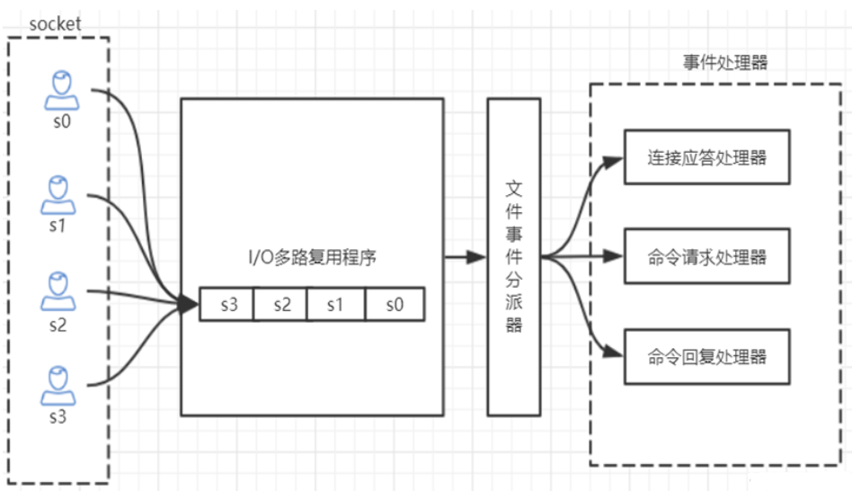

[toc]

## Redis的单线程和高性能

### Redis是单线程吗？

Redis的单线程主要是指Redis的网络IO和键值对读写是由一个线程来完成的，这也是Redis对外提供键值存储服务的主要流程。但是Redis的其他功能，比如持久化、异步删除、集群数据同步等，其实是由额外的线程执行的。

### Redis单线程为什么还能这么快？

因为它所有的数据都在**内存**中，所有的运算都是内存级别的运算，而且单线程避免了多线程的切换性能损耗问题。

### Redis单线程如何处理那么多的并发客户端连接？

Redis的**IO多路复用**：redis利用epoll来实现IO多路复用，将连接信息和时间放到队列中，依次放到文件事件分派器，时间分派器将事件分发给事件处理器。



```shell
# 查看redis支持的最大连接数，在redis.conf文件中可以修改
127.0.0.1:6379> CONFIG GET maxclients
```

### info命令

```shell
Server						#服务器运行的环境参数
Clients						#客户端相关系信息
Menmory						#服务器运行内存统计数据
Persistence				#持久化信息
Stats							#通用统计数据
Replication				#主从复制相关信息
CPU								#CPU使用情况
Cluster						#集群信息
KeySpace					#键值对统计量信息
```

```shell
connected_clients:2                  # 正在连接的客户端数量

instantaneous_ops_per_sec:789        # 每秒执行多少次指令

used_memory:929864                   # Redis分配的内存总量(byte)，包含redis进程内部的开销和数据占用的内存
used_memory_human:908.07K            # Redis分配的内存总量(Kb，human会展示出单位)
used_memory_rss_human:2.28M          # 向操作系统申请的内存大小(Mb)（这个值一般是大于used_memory的，因为Redis的内存分配策略会产生内存碎片）
used_memory_peak:929864              # redis的内存消耗峰值(byte)
used_memory_peak_human:908.07K       # redis的内存消耗峰值(KB)

maxmemory:0                         # 配置中设置的最大可使用内存值(byte),默认0,不限制
maxmemory_human:0B                  # 配置中设置的最大可使用内存值
maxmemory_policy:noeviction         # 当达到maxmemory时的淘汰策略
```

