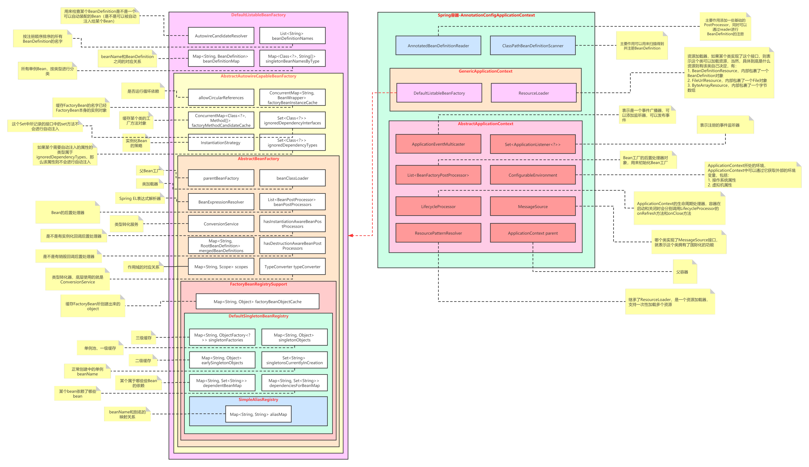

[toc]

## BeanFactoryPostProcessor

叫做BeanFactory的后置处理器，和Bean的后置处理器对比理解。

BeanPostProcessor是用来对Bean进行处理的，

BeanFactoryPostProcessor是用来对BeanFactory进行处理的。


## 如何理解refresh()？

```java
/**
     * Load or refresh the persistent representation of the configuration,
     * which might an XML file, properties file, or relational database schema.
     * <p>As this is a startup method, it should destroy already created singletons
     * if it fails, to avoid dangling resources. In other words, after invocation
     * of that method, either all or no singletons at all should be instantiated.
     * @throws BeansException if the bean factory could not be initialized
     * @throws IllegalStateException if already initialized and multiple refresh
     * attempts are not supported
     */
    void refresh() throws BeansException, IllegalStateException;
```

这是ConfigurableApplicationContext接口上refresh()方法的注释，意思是：加载或刷新持久化的配置，可能是XML文件、属性文件或关系数据库中存储的。由于这是一个启动方法，如果失败，它应该销毁已经创建的单例，以避免暂用资源。换句话说，在调用该方法之后，应该实例化所有的单例，或者根本不实例化单例 。

有个理念需要注意：**ApplicationContext关闭之后不代表JVM也关闭了，ApplicationContext是属于JVM的，说白了ApplicationContext也是JVM中的一个对象。**

在Spring的设计中，也提供可以刷新的ApplicationContext和不可以刷新的ApplicationContext。比如：

```java
AbstractRefreshableApplicationContext extends AbstractApplicationContext
```

就是可以刷新的

```java
GenericApplicationContext extends AbstractApplicationContext
```

就是不可以刷新的。

AnnotationConfigApplicationContext继承的是GenericApplicationContext，所以它是不能刷新的。

AnnotationConfigWebApplicationContext继承的是AbstractRefreshableWebApplicationContext，所以它是可以刷的。

上面说的**不能刷新是指不能重复刷新，只能调用一次refresh方法，第二次时会报错。**


## refresh做了哪些事情？



下面以AnnotationConfigApplicationContext为例子，来介绍refresh的底层原理。

1. 在调用AnnotationConfigApplicationContext的构造方法之前，会调用父类GenericApplicationContext的无参构造方法，会构造一个BeanFactory，为**DefaultListableBeanFactory**。
2. 构造AnnotatedBeanDefinitionReader（**主要作用添加一些基础的PostProcessor，同时可以通过reader进行BeanDefinition的注册**），同时对BeanFactory进行设置和添加**PostProcessor**（后置处理器）

1. 1. 设置dependencyComparator：AnnotationAwareOrderComparator，它是一个Comparator，是用来进行排序的，会获取某个对象上的**Order注解**或者通过实现**Ordered接口**所定义的值进行排序，在日常开发中可以利用这个类来进行排序。
   2. 设置autowireCandidateResolver：ContextAnnotationAutowireCandidateResolver，用来解析某个Bean能不能进行自动注入，比如某个Bean的autowireCandidate属性是否等于true
   3. 向BeanFactory中添加**ConfigurationClassPostProcessor**对应的BeanDefinition，它是一个BeanDefinitionRegistryPostProcessor，并且实现了PriorityOrdered接口
   4. 向BeanFactory中添加**AutowiredAnnotationBeanPostProcessor**对应的BeanDefinition，它是一个InstantiationAwareBeanPostProcessorAdapter，MergedBeanDefinitionPostProcessor
   5. 向BeanFactory中添加CommonAnnotationBeanPostProcessor对应的BeanDefinition，它是一个InstantiationAwareBeanPostProcessor，InitDestroyAnnotationBeanPostProcessor
   6. 向BeanFactory中添加EventListenerMethodProcessor对应的BeanDefinition，它是一个BeanFactoryPostProcessor，SmartInitializingSingleton
   7. 向BeanFactory中添加DefaultEventListenerFactory对应的BeanDefinition，它是一个EventListenerFactory

1. 构造ClassPathBeanDefinitionScanner（**主要作用可以用来扫描得到并注册BeanDefinition**），同时进行设置：

1. 1. 设置**this.includeFilters = AnnotationTypeFilter(****Component****.class)**
   2. 设置environment
   3. 设置resourceLoader

1. 利用reader注册AppConfig为BeanDefinition，类型为AnnotatedGenericBeanDefinition
2. **接下来就是调用refresh方法**
3. prepareRefresh()：

1. 1. 记录启动时间
   2. 可以允许子容器设置一些内容到Environment中
   3. 验证Environment中是否包括了必须要有的属性

1. obtainFreshBeanFactory()：进行BeanFactory的refresh，在这里会去调用子类的refreshBeanFactory方法，具体子类是怎么刷新的得看子类，然后再调用子类的getBeanFactory方法，重新得到一个BeanFactory
2. prepareBeanFactory(beanFactory)：

1. 1. 设置beanFactory的类加载器
   2. 设置表达式解析器：StandardBeanExpressionResolver，用来解析Spring中的表达式
   3. 添加PropertyEditorRegistrar：ResourceEditorRegistrar，PropertyEditor类型转化器注册器，用来注册一些默认的PropertyEditor
   4. 添加一个Bean的后置处理器：ApplicationContextAwareProcessor，是一个BeanPostProcessor，用来执行EnvironmentAware、ApplicationEventPublisherAware等回调方法
   5. 添加**ignoredDependencyInterface**：可以向这个属性中添加一些接口，如果某个类实现了这个接口，并且这个类中的某些set方法在接口中也存在，那么这个set方法在自动注入的时候是不会执行的，比如EnvironmentAware这个接口，如果某个类实现了这个接口，那么就必须实现它的setEnvironment方法，而这是一个set方法，和Spring中的autowire是冲突的，那么Spring在自动注入时是不会调用setEnvironment方法的，而是等到回调Aware接口时再来调用（注意，这个功能仅限于xml的autowire，@Autowired注解是忽略这个属性的）

1. 1. 1. EnvironmentAware
      2. EmbeddedValueResolverAware
      3. ResourceLoaderAware
      4. ApplicationEventPublisherAware
      5. MessageSourceAware
      6. ApplicationContextAware
      7. 另外其实在构造BeanFactory的时候就已经提前添加了另外三个：
      8. BeanNameAware
      9. BeanClassLoaderAware
      10. BeanFactoryAware

1. 1. 添加**resolvableDependencies**：在byType进行依赖注入时，会先从这个属性中根据类型找bean

1. 1. 1. BeanFactory.class：当前BeanFactory对象
      2. ResourceLoader.class：当前ApplicationContext对象
      3. ApplicationEventPublisher.class：当前ApplicationContext对象
      4. ApplicationContext.class：当前ApplicationContext对象

1. 1. 添加一个Bean的后置处理器：ApplicationListenerDetector，是一个BeanPostProcessor，用来判断某个Bean是不是ApplicationListener，如果是则把这个Bean添加到ApplicationContext中去，注意一个ApplicationListener只能是单例的
   2. 添加一个Bean的后置处理器：LoadTimeWeaverAwareProcessor，是一个BeanPostProcessor，用来判断某个Bean是不是实现了LoadTimeWeaverAware接口，如果实现了则把ApplicationContext中的loadTimeWeaver回调setLoadTimeWeaver方法设置给该Bean。
   3. 添加一些单例bean到单例池：

1. 1. 1. "environment"：Environment对象
      2. "systemProperties"：System.getProperties()返回的Map对象
      3. "systemEnvironment"：System.getenv()返回的Map对象

1. postProcessBeanFactory(beanFactory) ： 提供给AbstractApplicationContext的子类进行扩展，具体的子类，可以继续向BeanFactory中再添加一些东西
2. invokeBeanFactoryPostProcessors(beanFactory)：**执行BeanFactoryPostProcessor**

1. 1. 此时在BeanFactory中会存在一个BeanFactoryPostProcessor：**ConfigurationClassPostProcessor**，它也是一个**BeanDefinitionRegistryPostProcessor**
   2. **第一阶段**
   3. 从BeanFactory中找到类型为BeanDefinitionRegistryPostProcessor的beanName，也就是**ConfigurationClassPostProcessor**， 然后调用BeanFactory的getBean方法得到实例对象
   4. 执行**ConfigurationClassPostProcessor的****postProcessBeanDefinitionRegistry()**方法:

1. 1. 1. 解析AppConfig类
      2. 扫描得到BeanDefinition并注册
      3. 解析@Import，@Bean等注解得到BeanDefinition并注册
      4. 详细的看另外的笔记，专门分析了**ConfigurationClassPostProcessor是如何工作的**
      5. 在这里，我们只需要知道在这一步会去得到BeanDefinition，而这些BeanDefinition中可能存在BeanFactoryPostProcessor和BeanDefinitionRegistryPostProcessor，所以执行完ConfigurationClassPostProcessor的postProcessBeanDefinitionRegistry()方法后，还需要继续执行其他BeanDefinitionRegistryPostProcessor的postProcessBeanDefinitionRegistry()方法

1. 1. 执行其他BeanDefinitionRegistryPostProcessor的**postProcessBeanDefinitionRegistry()**方法
   2. 执行所有BeanDefinitionRegistryPostProcessor的**postProcessBeanFactory()**方法
   3. **第二阶段**
   4. 从BeanFactory中找到类型为BeanFactoryPostProcessor的beanName，而这些BeanFactoryPostProcessor包括了上面的BeanDefinitionRegistryPostProcessor
   5. 执行还没有执行过的BeanFactoryPostProcessor的**postProcessBeanFactory()**方法

1. 到此，所有的BeanFactoryPostProcessor的逻辑都执行完了，主要做的事情就是得到BeanDefinition并注册到BeanFactory中
2. registerBeanPostProcessors(beanFactory)：因为上面的步骤完成了扫描，这个过程中程序员可能自己定义了一些BeanPostProcessor，在这一步就会把BeanFactory中所有的BeanPostProcessor找出来并实例化得到一个对象，并添加到BeanFactory中去（属性**beanPostProcessors**），最后再重新添加一个ApplicationListenerDetector对象（之前其实就添加了过，这里是为了把ApplicationListenerDetector移动到最后）
3. initMessageSource()：如果BeanFactory中存在一个叫做"**messageSource**"的BeanDefinition，那么就会把这个Bean对象创建出来并赋值给ApplicationContext的messageSource属性，让ApplicationContext拥有**国际化**的功能
4. initApplicationEventMulticaster()：如果BeanFactory中存在一个叫做"**applicationEventMulticaster**"的BeanDefinition，那么就会把这个Bean对象创建出来并赋值给ApplicationContext的applicationEventMulticaster属性，让ApplicationContext拥有**事件发布**的功能
5. onRefresh()：提供给AbstractApplicationContext的子类进行扩展，没用
6. registerListeners()：从BeanFactory中获取ApplicationListener类型的beanName，然后添加到ApplicationContext中的事件广播器**applicationEventMulticaster**中去，到这一步因为FactoryBean还没有调用getObject()方法生成Bean对象，所以这里要在根据类型找一下ApplicationListener，记录一下对应的beanName
7. finishBeanFactoryInitialization(beanFactory)：完成BeanFactory的初始化，主要就是**实例化非懒加载的单例Bean**，单独的笔记去讲。
8. finishRefresh()：BeanFactory的初始化完后，就到了Spring启动的最后一步了

1. 1. 设置ApplicationContext的lifecycleProcessor，默认情况下设置的是DefaultLifecycleProcessor
   2. 调用lifecycleProcessor的onRefresh()方法，如果是DefaultLifecycleProcessor，那么会获取所有类型为Lifecycle的Bean对象，然后调用它的start()方法，这就是ApplicationContext的生命周期扩展机制
   3. 发布**ContextRefreshedEvent**事件