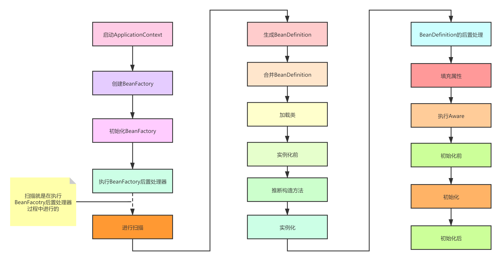

## Bean的生成过程

### 1. 生成BeanDefinition

Spring启动的时候会进行扫描，会先调用

```java
Resource[] resources = getResourcePatternResolver().getResources(packageSearchPath);
```

拿到所指定的包路径下的所有文件资源（***.class文件）

然后会遍历每个Resource，为每个Resource生成一个MetadataReader对象，这个对象拥有三个功能：

1. 获取对应的Resource资源
2. 获取Resource对应的class的元数据信息，包括类的名字、是不是接口、是不是一个注解、是不是抽象类、有没有父类，父类的名字，所实现的所有接口的名字，内部类的类名等等。
3. 获取Resource对应的class上的注解信息，当前类上有哪些注解，当前类中有哪些方法上有注解

在生成MetadataReader对象时，会利用**ASM**技术解析class文件，得到类的元数据集信息合注解信息，在这个过程中也会利用ClassLoader去加载注解类（**ClassUtils.getDefaultClassLoader()所获得的类加载器**），但是不会加载本类。

有了MetadataReader对象，就相当于有了当前类的所有信息，但是当前类并没有加载，也是可以理解的，真正在用到这个类的时候才加载。

然后利用MetadataReader对象生成一个ScannedGenericBeanDefinition对象，**注意此时的BeanDefinition对象中的beanClass属性存储的是当前类的名字，而不是class对象**。（beanClass属性的类型是Object，它即可以存储类的名字，也可以存储class对象）


### 2. 合并BeanDefinition

如果某个BeanDefinition存在父BeanDefinition，那么则要进行合并


### 3. 加载类

有了BeanDefinition之后，后续就会基于BeanDefinition去创建Bean，而创建Bean就必须实例化对象，而实例化就必须先加载当前BeanDefinition所对应的class，在AbstractAutowireCapableBeanFactory类的createBean()方法中，一开始就会调用：

```java
Class<?> resolvedClass = resolveBeanClass(mbd, beanName);
```

这行代码就是去加载类，该方法是这么实现的：

```java
if (mbd.hasBeanClass()) {
    return mbd.getBeanClass();
}
if (System.getSecurityManager() != null) {
    return AccessController.doPrivileged((PrivilegedExceptionAction<Class<?>>) () ->
        doResolveBeanClass(mbd, typesToMatch), getAccessControlContext());
    }
else {
    return doResolveBeanClass(mbd, typesToMatch);
}
```

```java
public boolean hasBeanClass() {
    return (this.beanClass instanceof Class);
}
```

如果beanClass属性的类型是Class，那么就直接返回，如果不是，则会根据类名进行加载（doResolveBeanClass方法所做的事情）

会利用BeanFactory所设置的类加载器来加载类，如果没有设置，则默认使用**ClassUtils.getDefaultClassLoader()**所返回的类加载器来加载。


#### **ClassUtils.getDefaultClassLoader()**

1. 优先获取当前线程中的ClassLoader

2. 如果为空，则获取加载ClassUtils类的类加载器（正常情况下，就是AppClassLoader，但是如果是在Tomcat中运行，那么则会是Tomcat中为每个应用所创建的WebappClassLoader）

3. 如果为空，那么则是bootstrap类加载器加载的ClassUtils类，那则获取系统类加载器进行加载

   

### 4. 实例化前

允许第三方可以不按照Spring的正常流程来创建一个Bean，可以利用InstantiationAwareBeanPostProcessor的postProcessBeforeInstantiation方法来提前返回一个Bean对象，直接结束Bean的生命周期


### 5. 推断构造方法

```java
/**
 * 推断候选构造器
 * @param beanClass
 * @param beanName
 * @return
 * @throws BeanCreationException
 */
@Override
@Nullable
public Constructor<?>[] determineCandidateConstructors(Class<?> beanClass, final String beanName)
		throws BeanCreationException {
	// Let's check for lookup methods here...
	// 检查是否被@Lookup注解
	if (!this.lookupMethodsChecked.contains(beanName)) {
		if (AnnotationUtils.isCandidateClass(beanClass, Lookup.class)) {
			try {
				Class<?> targetClass = beanClass;
				do {
					ReflectionUtils.doWithLocalMethods(targetClass, method -> {
						Lookup lookup = method.getAnnotation(Lookup.class);
						if (lookup != null) {
							Assert.state(this.beanFactory != null, "No BeanFactory available");
							LookupOverride override = new LookupOverride(method, lookup.value());
							try {
								RootBeanDefinition mbd = (RootBeanDefinition)
										this.beanFactory.getMergedBeanDefinition(beanName);
								mbd.getMethodOverrides().addOverride(override);
							}
							catch (NoSuchBeanDefinitionException ex) {
								throw new BeanCreationException(beanName,
										"Cannot apply @Lookup to beans without corresponding bean definition");
							}
						}
					});
					targetClass = targetClass.getSuperclass();
				}
				while (targetClass != null && targetClass != Object.class);

			}
			catch (IllegalStateException ex) {
				throw new BeanCreationException(beanName, "Lookup method resolution failed", ex);
			}
		}
		this.lookupMethodsChecked.add(beanName);
	}

	// Quick check on the concurrent map first, with minimal locking.
	// 首先从构造器缓存中找其构造器，第一次肯定是找不到的
	Constructor<?>[] candidateConstructors = this.candidateConstructorsCache.get(beanClass);
	if (candidateConstructors == null) {
		// Fully synchronized resolution now...
		synchronized (this.candidateConstructorsCache) {
			candidateConstructors = this.candidateConstructorsCache.get(beanClass);
			if (candidateConstructors == null) {
				Constructor<?>[] rawCandidates;
				try {
					// 通过一个native方法private native Constructor<T>[] getDeclaredConstructors0(boolean publicOnly);
					// 获取代理类的构造器
					rawCandidates = beanClass.getDeclaredConstructors();
				}
				catch (Throwable ex) {
					throw new BeanCreationException(beanName,
							"Resolution of declared constructors on bean Class [" + beanClass.getName() +
							"] from ClassLoader [" + beanClass.getClassLoader() + "] failed", ex);
				}
				List<Constructor<?>> candidates = new ArrayList<>(rawCandidates.length);
				Constructor<?> requiredConstructor = null;
				Constructor<?> defaultConstructor = null;
				// beanClass是Kotlin类时才起作用，否则findPrimaryConstructor会返回null
				Constructor<?> primaryConstructor = BeanUtils.findPrimaryConstructor(beanClass);
				int nonSyntheticConstructors = 0;
				for (Constructor<?> candidate : rawCandidates) {
					// 判断合成类
					if (!candidate.isSynthetic()) {
						nonSyntheticConstructors++;
					}
					else if (primaryConstructor != null) {
						continue;
					}
					MergedAnnotation<?> ann = findAutowiredAnnotation(candidate);
					if (ann == null) {
						// 如果beanClass被代理了则返回其父类
						Class<?> userClass = ClassUtils.getUserClass(beanClass);
						// 这里处理代理类的原始类（目标类）
						if (userClass != beanClass) {
							// 说明被代理了
							try {
								// 找到参数匹配的构造器，包括参数个数和参数类型
								Constructor<?> superCtor =
										userClass.getDeclaredConstructor(candidate.getParameterTypes());
								ann = findAutowiredAnnotation(superCtor);
							}
							catch (NoSuchMethodException ex) {
								// Simply proceed, no equivalent superclass constructor found...
							}
						}
					}
					if (ann != null) {
						if (requiredConstructor != null) {
							throw new BeanCreationException(beanName,
									"Invalid autowire-marked constructor: " + candidate +
									". Found constructor with 'required' Autowired annotation already: " +
									requiredConstructor);
						}
						boolean required = determineRequiredStatus(ann);
						if (required) {
							if (!candidates.isEmpty()) {
								throw new BeanCreationException(beanName,
										"Invalid autowire-marked constructors: " + candidates +
										". Found constructor with 'required' Autowired annotation: " +
										candidate);
							}
							requiredConstructor = candidate;
						}
						candidates.add(candidate);
					}
					else if (candidate.getParameterCount() == 0) {
						defaultConstructor = candidate;
					}
				}
				if (!candidates.isEmpty()) {
					// Add default constructor to list of optional constructors, as fallback.
					if (requiredConstructor == null) {
						if (defaultConstructor != null) {
							candidates.add(defaultConstructor);
						}
						else if (candidates.size() == 1 && logger.isInfoEnabled()) {
							logger.info("Inconsistent constructor declaration on bean with name '" + beanName +
									"': single autowire-marked constructor flagged as optional - " +
									"this constructor is effectively required since there is no " +
									"default constructor to fall back to: " + candidates.get(0));
						}
					}
					candidateConstructors = candidates.toArray(new Constructor<?>[0]);
				}
				else if (rawCandidates.length == 1 && rawCandidates[0].getParameterCount() > 0) {
					candidateConstructors = new Constructor<?>[] {rawCandidates[0]};
				}
				else if (nonSyntheticConstructors == 2 && primaryConstructor != null &&
						defaultConstructor != null && !primaryConstructor.equals(defaultConstructor)) {
					candidateConstructors = new Constructor<?>[] {primaryConstructor, defaultConstructor};
				}
				else if (nonSyntheticConstructors == 1 && primaryConstructor != null) {
					candidateConstructors = new Constructor<?>[] {primaryConstructor};
				}
				else {
					candidateConstructors = new Constructor<?>[0];
				}
				this.candidateConstructorsCache.put(beanClass, candidateConstructors);
			}
		}
	}
	return (candidateConstructors.length > 0 ? candidateConstructors : null);
}
```

.png)

### 6. 实例化

构造方法反射得到一个实例


### 7. BeanDefinition的后置处理

```java
for (BeanPostProcessor bp : getBeanPostProcessors()) {
    if (bp instanceof MergedBeanDefinitionPostProcessor) {
        MergedBeanDefinitionPostProcessor bdp = (MergedBeanDefinitionPostProcessor) bp;
        bdp.postProcessMergedBeanDefinition(mbd, beanType, beanName);
    }
}
```

这里可以处理BeanDefinition，但是此时实例对象已经生成好了，所以修改beanClass已经没用了，但是可以修改PropertyValues，比如：

```java
@Component
public class LubanMergedBeanDefinitionPostProcessor implements MergedBeanDefinitionPostProcessor {

    @Override
    public void postProcessMergedBeanDefinition(RootBeanDefinition beanDefinition, Class<?> beanType, String beanName) {
        if (beanName.equals("userService")) {
            beanDefinition.setBeanClass(User.class); // 没用
            beanDefinition.getPropertyValues().add("name","xxx");
        }
    }
}
```


### 8. 填充属性

```java

protected void populateBean(String beanName, RootBeanDefinition mbd, @Nullable BeanWrapper bw) {
		// 不存在实例化对象
		if (bw == null) {
			// BeanDefinition拥有参数，但是没有被实例化，抛出异常
			if (mbd.hasPropertyValues()) {
				throw new BeanCreationException(
						mbd.getResourceDescription(), beanName, "Cannot apply property values to null instance");
			}
			// BeanDefinition没有参数，证明是NullBean
			else {
				// Skip property population phase for null instance.
				return;
			}
		}
 
		// 在设置属性之前给 InstantiationAwareBeanPostProcessors 最后一次改变 bean 的机会
		// Give any InstantiationAwareBeanPostProcessors the opportunity to modify the
		// state of the bean before properties are set. This can be used, for example,
		// to support styles of field injection.
		boolean continueWithPropertyPopulation = true;
 
		// bean不是合成的，并且持有InstantiationAwareBeanPostProcessor
		if (!mbd.isSynthetic() && hasInstantiationAwareBeanPostProcessors()) {
			// 循环BeanPostProcessor
			for (BeanPostProcessor bp : getBeanPostProcessors()) {
				// 类型判断
				if (bp instanceof InstantiationAwareBeanPostProcessor) {
					InstantiationAwareBeanPostProcessor ibp = (InstantiationAwareBeanPostProcessor) bp;
					// 返回值为是否继续填充 bean
					// postProcessAfterInstantiation：如果应该在 bean上面设置属性则返回 true，否则返回 false
					// 一般情况下，应该是返回true 。
					// 返回 false 的话，将会阻止在此 Bean 实例上调用任何后续的 InstantiationAwareBeanPostProcessor 实例。
					if (!ibp.postProcessAfterInstantiation(bw.getWrappedInstance(), beanName)) {
						continueWithPropertyPopulation = false;
						break;
					}
				}
			}
		}
		// 如果后续处理器发出停止填充命令，则终止后续操作
		if (!continueWithPropertyPopulation) {
			return;
		}
 
		// bean的属性值
		PropertyValues pvs = (mbd.hasPropertyValues() ? mbd.getPropertyValues() : null);
 
		// 自动注入
		if (mbd.getResolvedAutowireMode() == AUTOWIRE_BY_NAME || mbd.getResolvedAutowireMode() == AUTOWIRE_BY_TYPE) {
			// 将 PropertyValues 封装成 MutablePropertyValues 对象
			// MutablePropertyValues 允许对属性进行简单的操作，并提供构造函数以支持Map的深度复制和构造。
			MutablePropertyValues newPvs = new MutablePropertyValues(pvs);
			// Add property values based on autowire by name if applicable.
			// 根据名称自动注入
			if (mbd.getResolvedAutowireMode() == AUTOWIRE_BY_NAME) {
				autowireByName(beanName, mbd, bw, newPvs);
			}
			// Add property values based on autowire by type if applicable.
			// 根据类型自动注入
			if (mbd.getResolvedAutowireMode() == AUTOWIRE_BY_TYPE) {
				autowireByType(beanName, mbd, bw, newPvs);
			}
			pvs = newPvs;
		}
 
		// 是否已经注册了 InstantiationAwareBeanPostProcessors
		boolean hasInstAwareBpps = hasInstantiationAwareBeanPostProcessors();
		// 是否进行 依赖检查
		boolean needsDepCheck = (mbd.getDependencyCheck() != AbstractBeanDefinition.DEPENDENCY_CHECK_NONE);
 
		PropertyDescriptor[] filteredPds = null;
		if (hasInstAwareBpps) {
			if (pvs == null) {
				pvs = mbd.getPropertyValues();
			}
			for (BeanPostProcessor bp : getBeanPostProcessors()) {
				if (bp instanceof InstantiationAwareBeanPostProcessor) {
					InstantiationAwareBeanPostProcessor ibp = (InstantiationAwareBeanPostProcessor) bp;
					// 对所有需要依赖检查的属性进行后处理
					PropertyValues pvsToUse = ibp.postProcessProperties(pvs, bw.getWrappedInstance(), beanName);
					if (pvsToUse == null) {
						// 从 bw 对象中提取 PropertyDescriptor 结果集
						// PropertyDescriptor：可以通过一对存取方法提取一个属性
						if (filteredPds == null) {
							filteredPds = filterPropertyDescriptorsForDependencyCheck(bw, mbd.allowCaching);
						}
						pvsToUse = ibp.postProcessPropertyValues(pvs, filteredPds, bw.getWrappedInstance(), beanName);
						if (pvsToUse == null) {
							return;
						}
					}
					pvs = pvsToUse;
				}
			}
		}
		// 依赖检查
		if (needsDepCheck) {
			if (filteredPds == null) {
				filteredPds = filterPropertyDescriptorsForDependencyCheck(bw, mbd.allowCaching);
			}
			// 依赖检查，对应 depends-on 属性
			checkDependencies(beanName, mbd, filteredPds, pvs);
		}
 
		if (pvs != null) {
			// 属性应用到bean上
			applyPropertyValues(beanName, mbd, bw, pvs);
		}
	}
```

#### 核心方法

+ getResolvedAutowireMode 检测自动注入
+ autowireByName 根据名称注入
+ autowireByType 根据类型注入
+ applyPropertyValues 赋值属性的操作

##### getResolvedAutowireMode 自动注入

```java

public int getResolvedAutowireMode() {
		// 自动检测模式，获得对应的检测模式
		if (this.autowireMode == AUTOWIRE_AUTODETECT) {
			// Work out whether to apply setter autowiring or constructor autowiring.
			// If it has a no-arg constructor it's deemed to be setter autowiring,
			// otherwise we'll try constructor autowiring.
			Constructor<?>[] constructors = getBeanClass().getConstructors();
			for (Constructor<?> constructor : constructors) {
				if (constructor.getParameterCount() == 0) {
					return AUTOWIRE_BY_TYPE;
				}
			}
			return AUTOWIRE_CONSTRUCTOR;
		}
		else {
			return this.autowireMode;
		}
}
```

##### autowireByName

```java

protected void autowireByName(
			String beanName, AbstractBeanDefinition mbd, BeanWrapper bw, MutablePropertyValues pvs) {
		// 对 Bean 对象中非简单属性
		String[] propertyNames = unsatisfiedNonSimpleProperties(mbd, bw);
		// 遍历 propertyName 数组
		for (String propertyName : propertyNames) {
			if (containsBean(propertyName)) {
				// 如果容器中包含指定的名称，将此名称注入到属性中
				Object bean = getBean(propertyName);
				pvs.add(propertyName, bean);
				// 属性依赖注入
				registerDependentBean(propertyName, beanName);
				if (logger.isTraceEnabled()) {
					logger.trace("Added autowiring by name from bean name '" + beanName +
							"' via property '" + propertyName + "' to bean named '" + propertyName + "'");
				}
			}
			else {
				if (logger.isTraceEnabled()) {
					logger.trace("Not autowiring property '" + propertyName + "' of bean '" + beanName +
							"' by name: no matching bean found");
				}
			}
		}
	}
```

##### autowireByType

```java
protected void autowireByType(
			String beanName, AbstractBeanDefinition mbd, BeanWrapper bw, MutablePropertyValues pvs) {
 
		// 获取 TypeConverter 实例
		// 使用自定义的 TypeConverter，用于取代默认的 PropertyEditor 机制
		TypeConverter converter = getCustomTypeConverter();
		if (converter == null) {
			converter = bw;
		}
 
		Set<String> autowiredBeanNames = new LinkedHashSet<>(4);
		// 获取非简单属性
		String[] propertyNames = unsatisfiedNonSimpleProperties(mbd, bw);
		for (String propertyName : propertyNames) {
			try {
				// 获得用来注入属性的 PropertyDescriptor
				PropertyDescriptor pd = bw.getPropertyDescriptor(propertyName);
				// Don't try autowiring by type for type Object: never makes sense,
				// even if it technically is a unsatisfied, non-simple property.
				// 不要尝试装配object类型
				if (Object.class != pd.getPropertyType()) {
					// 获得所有写入参数的方法 set方法
					MethodParameter methodParam = BeanUtils.getWriteMethodParameter(pd);
					// Do not allow eager init for type matching in case of a prioritized post-processor.
					boolean eager = !PriorityOrdered.class.isInstance(bw.getWrappedInstance());
					DependencyDescriptor desc = new AutowireByTypeDependencyDescriptor(methodParam, eager);
					// 解析指定 beanName 的属性所匹配的值，并把解析到的属性名称存储在 autowiredBeanNames 中
					// 当属性存在过个封装 bean 时将会找到所有匹配的 bean 并将其注入
					Object autowiredArgument = resolveDependency(desc, beanName, autowiredBeanNames, converter);
					if (autowiredArgument != null) {
						pvs.add(propertyName, autowiredArgument);
					}
					// 循环autowiredBeanNames
					for (String autowiredBeanName : autowiredBeanNames) {
						// 依赖注入
						registerDependentBean(autowiredBeanName, beanName);
						if (logger.isTraceEnabled()) {
							logger.trace("Autowiring by type from bean name '" + beanName + "' via property '" +
									propertyName + "' to bean named '" + autowiredBeanName + "'");
						}
					}
					// 清空数组
					autowiredBeanNames.clear();
				}
			}
			catch (BeansException ex) {
				throw new UnsatisfiedDependencyException(mbd.getResourceDescription(), beanName, propertyName, ex);
			}
		}
	}
```


### 9. 执行Aware

1. ((BeanNameAware) bean).setBeanName(beanName);
2. ((BeanClassLoaderAware) bean).setBeanClassLoader(bcl);
3. ((BeanFactoryAware) bean).setBeanFactory(AbstractAutowireCapableBeanFactory.**this**);


### 10. 初始化前

```java
for (BeanPostProcessor processor : getBeanPostProcessors()) {
    Object current = processor.postProcessBeforeInitialization(result, beanName);
    if (current == null) {
        return result;
    }
    result = current;
}
```


### 11. 初始化

1. ((InitializingBean) bean).afterPropertiesSet();
2. 执行BeanDefinition中指定的初始化方法


### 12. 初始化后

```java
for (BeanPostProcessor processor : getBeanPostProcessors()) {
    Object current = processor.postProcessAfterInitialization(result, beanName);
    if (current == null) {
        return result;
    }
    result = current;
}
```


## Bean的销毁过程

### 1. 容器关闭

### 2. 发布ContextClosedEvent事件

### 3. 调用LifecycleProcessor的onClose方法

### 4. 销毁单例Bean

1. 找出所有DisposableBean(实现了DisposableBean接口的Bean)
2. 遍历每个DisposableBean
3. 找出依赖了当前DisposableBean的其他Bean，将这些Bean从单例池中移除掉
4. 调用DisposableBean的destroy()方法
5. 找到当前DisposableBean所包含的inner beans，将这些Bean从单例池中移除掉 (inner bean参考https://docs.spring.io/spring-framework/docs/current/spring-framework-reference/core.html#beans-inner-beans)


这里涉及到一个设计模式：**适配器模式**

在销毁时，Spring会找出实现了DisposableBean接口的Bean。

但是我们在定义一个Bean时，如果这个Bean实现了DisposableBean接口，或者实现了AutoCloseable接口，或者在BeanDefinition中指定了destroyMethodName，那么这个Bean都属于“DisposableBean”，这些Bean在容器关闭时都要调用相应的销毁方法。

所以，这里就需要进行适配，将实现了DisposableBean接口、或者AutoCloseable接口等适配成实现了DisposableBean接口，所以就用到了DisposableBeanAdapter。

会把实现了AutoCloseable接口的类封装成DisposableBeanAdapter，而DisposableBeanAdapter实现了DisposableBean接口。