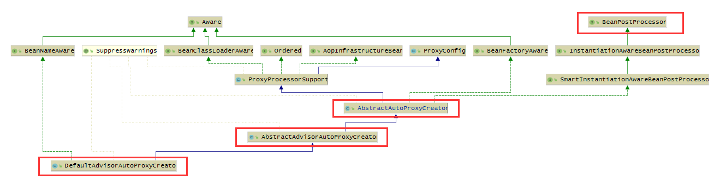
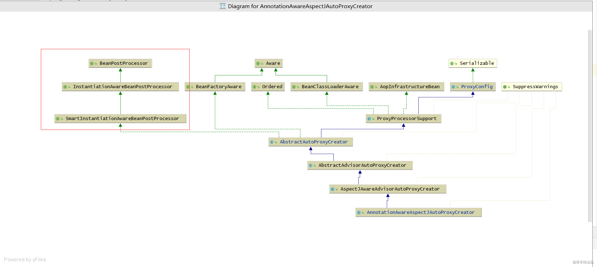
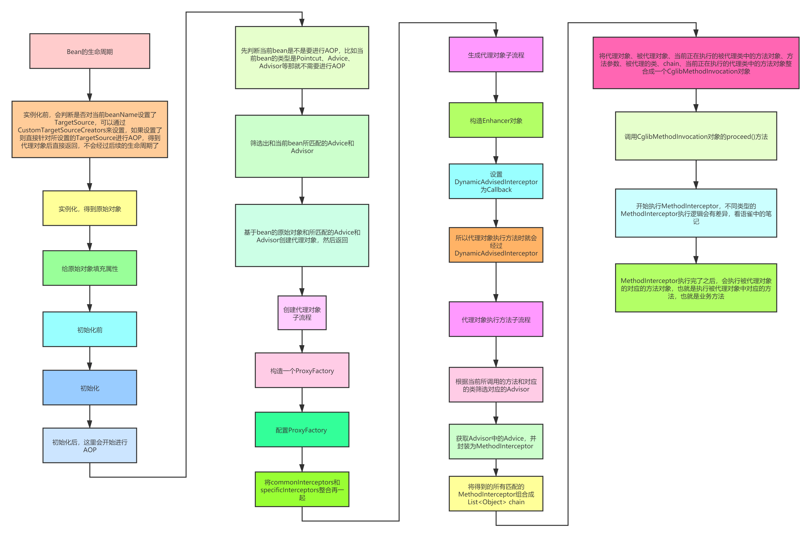

## AOP中的几个概念


### Advisor 和 Advice


Advice，我们通常都会把他翻译为通知，其实很不好理解，其实他还有另外一个意思，就是“建议”，我觉得把Advice理解为“建议”会更好。


比如，我们已经完成了一个功能，这时客户跟我们说，我建议在这个功能之前可以再增加一些逻辑，再之后再增加一些逻辑。


在Spring中，Advice分为：

1. 前置Advice：MethodBeforeAdvice
2. 后置Advice：AfterReturningAdvice
3. 环绕Advice：MethodInterceptor
4. 异常Advice：ThrowsAdvice


在利用Spring AOP去生成一个代理对象时，我们可以设置这个代理对象的Advice。


而对于Advice来说，它只表示了“建议”，它没有表示这个“建议”可以用在哪些方面。


就好比，我们已经完成了一个功能，客户给这个功能提了一个建议，但是这个建议也许也能用到其他功能上。


这时，就出现了Advisor，表示一个Advice可以应用在哪些地方，而“哪些地方”就是Pointcut（切点）。


### Pointcut

切点，表示我想让哪些地方加上我的代理逻辑。


比如某个方法，

比如某些方法，

比如某些方法名前缀为“find”的方法，

比如某个类下的所有方法，等等。


在Pointcut中，有一个MethodMatcher，表示方法匹配器。


## 使用ProxyFactory通过编程创建AOP代理


定义一个MyAdvisor

```java
public class MyAdvisor implements PointcutAdvisor {

    @Override
    public Pointcut getPointcut() {
        NameMatchMethodPointcut methodPointcut = new NameMatchMethodPointcut();
        methodPointcut.addMethodName("test");
        return methodPointcut;
    }

    @Override
    public Advice getAdvice() {
        MethodBeforeAdvice methodBeforeAdvice = new MethodBeforeAdvice() {
            @Override
            public void before(Method method, Object[] args, Object target) throws Throwable {
                System.out.println("执行方法前"+method.getName());
            }
        };

        return methodBeforeAdvice;
    }

    @Override
    public boolean isPerInstance() {
        return false;
    }
}
```


定义一个UserService

```java
public class UserService {

    public void test() {
        System.out.println("111");
    }
}
```


```java
ProxyFactory factory = new ProxyFactory();
factory.setTarget(new UserService());
factory.addAdvisor(new MyAdvisor());
UserService userService = (UserService) factory.getProxy();
userService.test();
```

### ProxyFactory的工作原理


ProxyFactory就是一个代理对象生产工厂，在生成代理对象之前需要对代理工厂进行配置。


ProxyFactory在生成代理对象之前需要决定到底是使用JDK动态代理还是CGLIB技术：


```java
// config就是ProxyFactory对象

// optimize为true,或proxyTargetClass为true,或用户没有给ProxyFactory对象添加interface
if (config.isOptimize() || config.isProxyTargetClass() || hasNoUserSuppliedProxyInterfaces(config)) {
    Class<?> targetClass = config.getTargetClass();
    if (targetClass == null) {
        throw new AopConfigException("TargetSource cannot determine target class: " +
                "Either an interface or a target is required for proxy creation.");
    }
    // targetClass是接口，直接使用Jdk动态代理
    if (targetClass.isInterface() || Proxy.isProxyClass(targetClass)) {
        return new JdkDynamicAopProxy(config);
    }
    // 使用Cglib
    return new ObjenesisCglibAopProxy(config);
}
else {
    // 使用Jdk动态代理
    return new JdkDynamicAopProxy(config);
}
```

### JdkDynamicAopProxy创建代理对象过程

1. 获取生成代理对象所需要实现的接口集合

1. 1. 获取通过ProxyFactory.addInterface()所添加的接口，如果没有通过ProxyFactory.addInterface()添加接口，那么则看ProxyFactory.setTargetClass()所设置的targetClass是不是一个接口，把接口添加到结果集合中
   2. 同时把SpringProxy、Advised、DecoratingProxy这几个接口也添加到结果集合中去

1. 确定好要代理的集合之后，就利用Proxy.newProxyInstance()生成一个代理对象


### JdkDynamicAopProxy创建的代理对象执行过程

1. 如果通过ProxyFactory.setExposeProxy()把exposeProxy设置为了true，那么则把代理对象设置到一个ThreadLocal（currentProxy）中去。
2. 获取通过ProxyFactory所设置的target，如果设置的是targetClass，那么target将为null
3. 根据当前所调用的方法对象寻找ProxyFactory中所添加的并匹配的Advisor，并且把Advisor封装为MethodInterceptor返回，得到MethodInterceptor链叫做chain
4. 如果chain为空，则直接执行target对应的当前方法，如果target为null会报错
5. 如果chain不为空，则会依次执行chain中的MethodInterceptor

1. 1. 如果当前MethodInterceptor是MethodBeforeAdviceInterceptor，那么则先执行Advisor中所advice的before()方法，然后执行下一个MethodInterceptor
   2. 如果当前MethodInterceptor是AfterReturningAdviceInterceptor，那么则先执行下一个MethodInterceptor，拿到返回值之后，再执行Advisor中所advice的afterReturning()方法


### ObjenesisCglibAopProxy创建代理对象过程

1. 创建Enhancer
2. 设置Enhancer的superClass为通过ProxyFactory.setTarget()所设置的对象的类
3. 设置Enhancer的interfaces为通过ProxyFactory.addInterface()所添加的接口，以及SpringProxy、Advised接口
4. 设置Enhancer的Callbacks为DynamicAdvisedInterceptor
5. 最后通过Enhancer创建一个代理对象


### ObjenesisCglibAopProxy创建的代理对象执行过程

执行过程主要就看DynamicAdvisedInterceptor中的实现，执行逻辑和JdkDynamicAopProxy中是一样的。


## 使用“自动代理（autoproxy）”功能


"自动代理"表示，只需要在Spring中添加某个Bean，这个Bean是一个BeanPostProcessor，那么Spring在每创建一个Bean时，都会经过这个BeanPostProcessor的判断，去判断当前正在创建的这个Bean是不是需要进行AOP。


我们可以在项目中定义很多个Advisor，定义方式有两种：

1. 通过实现PointcutAdvisor接口
2. 通过@Aspect、@Pointcut、@Before等注解


在创建某个Bean时，会根据当前这个Bean的信息，比如对应的类，以及当前Bean中的方法信息，去和定义的所有Advisor进行匹配，如果匹配到了其中某些Advisor，那么就会把这些Advisor给找出来，并且添加到ProxyFactory中去，在利用ProxyFactory去生成代理对象


### BeanNameAutoProxyCreator


```java
@Bean
public BeanNameAutoProxyCreator creator(){
    BeanNameAutoProxyCreator beanNameAutoProxyCreator = new BeanNameAutoProxyCreator();
    beanNameAutoProxyCreator.setBeanNames("userService");  
    beanNameAutoProxyCreator.setInterceptorNames("myAdvisor");
    return beanNameAutoProxyCreator;
}
```

定义的这个bean，相当于一个“自动代理”器，有了这个Bean之后，可以自动的对setBeanNames中所对应的bean进行代理，代理逻辑为所设置的interceptorNames


### **DefaultAdvisorAutoProxyCreator**


**DefaultAdvisorAutoProxyCreator**这个更加强大，只要添加了这个Bean，它就会自动识别所有的Advisor中的PointCut进行代理





**AbstractAutoProxyCreator**实现了SmartInstantiationAwareBeanPostProcessor接口，是一个BeanPostProcessor

1. 在某个Bean**实例化之前**，查看该AbstractAutoProxyCreator中是不是设置了CustomTargetSource，如果设置了就查看当前Bean是不是需要创建一个TargetSource，如果需要就会创建一个TargetSource对象，然后进行AOP创建一个代理对象，并返回该代理对象
2. 如果某个Bean出现了循环依赖，那么会利用getEarlyBeanReference()方法提前进行AOP
3. 在某个Bean**初始化之后**，会调用wrapIfNecessary()方法进行AOP
4. 在这个类中提供了一个抽象方法：getAdvicesAndAdvisorsForBean()，表示对于某个Bean匹配了哪些Advices和Advisors


**AbstractAdvisorAutoProxyCreator**继承了AbstractAutoProxyCreator，AbstractAdvisorAutoProxyCreator中实现了getAdvicesAndAdvisorsForBean()方法，实现逻辑为：

1. 调用findEligibleAdvisors()

1. 1. 调用findCandidateAdvisors，得到所有Advisor类型的Bean
   2. 按当前正在进行Bean的生命周期的Bean进行过滤


## @EnableAspectJAutoProxy

这个注解主要是添加了一个AnnotationAwareAspectJAutoProxyCreator类型的BeanDefinition




**AspectJAwareAdvisorAutoProxyCreator**继承了AbstractAdvisorAutoProxyCreator，重写了shouldSkip(Class<?> beanClass, String beanName)方法，表示某个bean需不需要进行AOP，在shouldSkip()方法中：

1. 拿到所有的Advisor
2. 遍历所有的Advisor，如果当前bean是AspectJPointcutAdvisor，那么则跳过


**AnnotationAwareAspectJAutoProxyCreator**继承了AspectJAwareAdvisorAutoProxyCreator，重写了findCandidateAdvisors()方法，它即可以找到Advisor类型的bean，也能把所有@Aspect注解标注的类扫描出来并生成Advisor


## 注解和源码对应关系

1. @Before对应的是AspectJMethodBeforeAdvice，直接实现MethodBeforeAdvice，在进行动态代理时会把AspectJMethodBeforeAdvice转成MethodBeforeAdviceInterceptor，也就转变成了MethodBeforeAdviceInterceptor

1. 1. 先执行advice对应的方法
   2. 再执行MethodInvocation的proceed()，会执行下一个Interceptor，如果没有下一个Interceptor了，会执行target对应的方法

1. @After对应的是AspectJAfterAdvice，直接实现了MethodInterceptor

1. 1. 先执行MethodInvocation的proceed()，会执行下一个Interceptor，如果没有下一个Interceptor了，会执行target对应的方法
   2. 再执行advice对应的方法

1. @Around对应的是AspectJAroundAdvice，直接实现了MethodInterceptor

1. 1. 直接执行advice对应的方法

1. @AfterThrowing对应的是AspectJAfterThrowingAdvice，直接实现了MethodInterceptor

1. 1. 先执行MethodInvocation的proceed()，会执行下一个Interceptor，如果没有下一个Interceptor了，会执行target对应的方法
   2. 如果上面抛了Throwable，那么则会执行advice对应的方法

1. @AfterReturning对应的是AspectJAfterReturningAdvice，实现了AfterReturningAdvice，在进行动态代理时会把AspectJAfterReturningAdvice转成AfterReturningAdviceInterceptor，也就转变成了MethodInterceptor

1. 1. 先执行MethodInvocation的proceed()，会执行下一个Interceptor，如果没有下一个Interceptor了，会执行target对应的方法
   2. 执行上面的方法后得到最终的方法的返回值
   3. 再执行Advice对应的方法


## Spring中AOP原理流程图



## Introduction

https://www.cnblogs.com/powerwu/articles/5170861.html