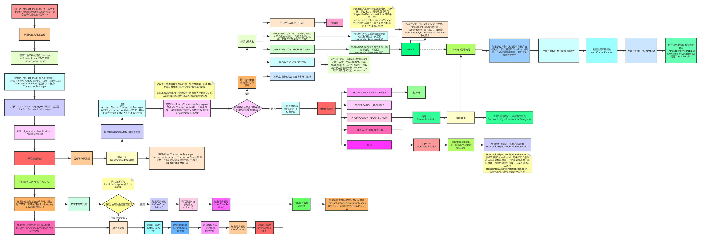
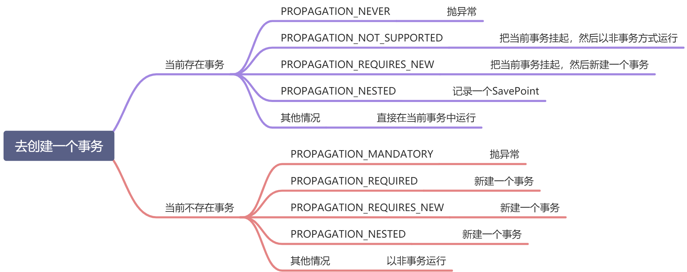

@EnableTransactionManagement注解注入了两个bean：

1. AutoProxyRegistrar
2. ProxyTransactionManagementConfiguration


## AutoProxyRegistrar

AutoProxyRegistrar主要的作用就是注册了一个InfrastructureAdvisorAutoProxyCreator的Bean。

而InfrastructureAdvisorAutoProxyCreator继承了AbstractAdvisorAutoProxyCreator，所以这个类的主要作用就是**开启自动代理**的作用。


## ProxyTransactionManagementConfiguration


ProxyTransactionManagementConfiguration中定义了三个bean：

1. BeanFactoryTransactionAttributeSourceAdvisor：一个PointcutAdvisor
2. AnnotationTransactionAttributeSource：就是Pointcut
3. TransactionInterceptor：就是代理逻辑Advice


```java
BeanFactoryTransactionAttributeSourceAdvisor advisor = new BeanFactoryTransactionAttributeSourceAdvisor();
advisor.setTransactionAttributeSource(transactionAttributeSource); 
advisor.setAdvice(transactionInterceptor);
```

BeanFactoryTransactionAttributeSourceAdvisor是一个Advisor，在构造BeanFactoryTransactionAttributeSourceAdvisor这个bean时，需要另外两Bean。


BeanFactoryTransactionAttributeSourceAdvisor中是这么定义PointCut的：

```java
private final TransactionAttributeSourcePointcut pointcut = new TransactionAttributeSourcePointcut() {
    @Override
    @Nullable
    protected TransactionAttributeSource getTransactionAttributeSource() {
        return transactionAttributeSource;
    }
};
```

构造了一个PointCut, TransactionAttributeSource的实现对象为AnnotationTransactionAttributeSource，在PointCut匹配类时，会利用AnnotationTransactionAttributeSource去检查类上是否有@Transactional注解，在PointCut匹配方法时，会利用AnnotationTransactionAttributeSource去检查方法上是否有@Transactional注解。


所以ProxyTransactionManagementConfiguration的作用就是向Spring容器中添加了一个Advisor，有了Advisor，那么Spring在构造bean时就会查看当前bean是不是匹配所设置的PointCut（也就是beanClass上是否有@Transactional注解或beanClass中某个方法上是否有@Transactional注解），如果匹配，则利用所设置的Advise（也就是TransactionInterceptor）进行AOP，生成代理对象。


## TransactionInterceptor执行流程




## 简单版流程

1. 生成test事务状态对象
2. test事务doBegin，获取并将数据库连接2825设置到test事务状态对象中
3. 把test事务信息设置到事务同步管理器中
4. 执行test业务逻辑方法（可以获取到test事务的信息）

1. 1. 生成a事务状态对象，并且可以获取到当前线程中已经存在的数据库连接2825
   2. 判断出来当前线程中已经存在事务
   3. 如果需要新开始事务，就先挂起数据库连接2825，挂起就是把test事务信息从事务同步管理器中转移到挂起资源对象中，并把当前a事务状态对象中的数据库连接设置为null
   4. a事务doBegin，新生成一个数据库连接2826，并设置到a事务状态对象中
   5. 把a事务信息设置到事务同步管理器中
   6. 执行a业务逻辑方法（可以利用事务同步管理器获取到a事务信息）
   7. 利用a事务状态对象，执行提交
   8. 提交之后会恢复所挂起的test事务，这里的恢复，其实只是把挂起资源对象中所保存的信息再转移回事务同步管理器中

1. 继续执行test业务逻辑方法（仍然可以获取到test事务的信息）
2. 利用test事务状态对象，执行提交


## 传播机制




## 举例子


### 情况1

```java
@Component
public class UserService {
    @Autowired
    private UserService userService;

    @Transactional
    public void test() {
        // test方法中的sql
        userService.a();
    }

    @Transactional
    public void a() {
        // a方法中的sql
    }
}
```

默认情况下传播机制为**REQUIRED**

**
**

所以上面这种情况的执行流程如下：

1. 新建一个数据库连接conn
2. 设置conn的autocommit为false
3. 执行test方法中的sql
4. 执行a方法中的sql
5. 执行conn的commit()方法进行提交


### 情况2

假如是这种情况

```java
@Component
public class UserService {
    @Autowired
    private UserService userService;

    @Transactional
    public void test() {
        // test方法中的sql
        userService.a();
        int result = 100/0;
    }

    @Transactional
    public void a() {
        // a方法中的sql
    }
}
```

所以上面这种情况的执行流程如下：

1. 新建一个数据库连接conn
2. 设置conn的autocommit为false
3. 执行test方法中的sql
4. 执行a方法中的sql
5. 抛出异常
6. 执行conn的rollback()方法进行回滚


### 情况3

假如是这种情况：

```java
@Component
public class UserService {
    @Autowired
    private UserService userService;

    @Transactional
    public void test() {
        // test方法中的sql
        userService.a();
    }

    @Transactional
    public void a() {
        // a方法中的sql
        int result = 100/0;
    }
}
```

所以上面这种情况的执行流程如下：

1. 新建一个数据库连接conn
2. 设置conn的autocommit为false
3. 执行test方法中的sql
4. 执行a方法中的sql
5. 抛出异常
6. 执行conn的rollback()方法进行回滚


### 情况4

如果是这种情况：

```java
@Component
public class UserService {
    @Autowired
    private UserService userService;

    @Transactional
    public void test() {
        // test方法中的sql
        userService.a();
    }

    @Transactional(propagation = Propagation.REQUIRES_NEW)
    public void a() {
        // a方法中的sql
        int result = 100/0;
    }
}
```

所以上面这种情况的执行流程如下：

1. 新建一个数据库连接conn
2. 设置conn的autocommit为false
3. 执行test方法中的sql
4. 又新建一个数据库连接conn2
5. 执行a方法中的sql
6. 抛出异常
7. 执行conn2的rollback()方法进行回滚
8. 继续抛异常
9. 执行conn的rollback()方法进行回滚