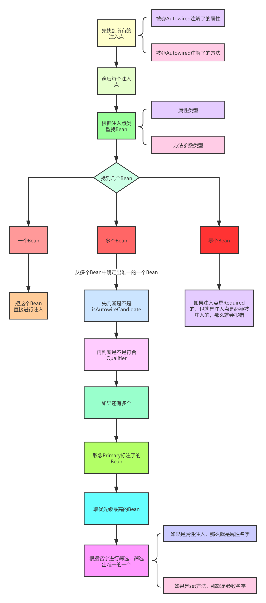

**Spring中到底有几种依赖注入的方式？**


首先分两种：

1. 手动注入
2. 自动注入


## 自动注入

自动注入又分为两种：

1. XML的autowire自动注入
2. @Autowired注解的自动注入


### XML的autowire自动注入


在XML中，我们可以在定义一个Bean时去指定这个Bean的自动注入模式：

1. byType
2. byName
3. constructor
4. default
5. no


比如：

```xml
<bean id="userService" class="com.luban.service.UserService" autowire="byType"/>
```

这么写，表示Spring会自动的给userService中所有的属性自动赋值（**不需要**这个属性上有@Autowired注解，但需要这个属性有对应的**set方法**）。


在创建Bean的过程中，在填充属性时，Spring会去解析当前类，把当前类的所有方法都解析出来，Spring会去解析每个方法得到对应的PropertyDescriptor对象，注意PropertyDescriptor并不是Spring中的类，而是java.beans包下类，也就是jdk自带的类，PropertyDescriptor中有几个属性：

1. **name：这个name并不是方法的名字，而是拿方法名字进过处理后的名字**

1. 1. **如果方法名字以“get”开头，比如“getXXX”,那么name=XXX**
   2. **如果方法名字以“is”开头，比如“isXXX”,那么name=XXX**
   3. **如果方法名字以“set”开头，比如“setXXX”,那么name=XXX**

1. **readMethodRef：表示get方法的Method对象的引用**
2. **readMethodName：表示get方法的名字**
3. **writeMethodRef：****表示set方法的Method对象的引用**
4. **writeMethodName：****表示set方法的名字**
5. **propertyTypeRef：如果有get方法那么对应的就是返回值的类型，如果是set方法那么对应的就是set方法中唯一参数的类型**

get方法的定义是： 方法参数个数为0个，并且 （方法名字以"get"开头 或者 方法名字以"is"开头并且方法的返回类型为boolean）

set方法的定义是：方法参数个数为1个，并且 （方法名字以"set"开头并且方法返回类型为void）


所以，Spring在通过byName的自动填充属性时流程是：

1. 找到所有set方法所对应的XXX部分的名字
2. 根据XXX部分的名字去获取bean


Spring在通过byType的自动填充属性时流程是：

1. 找到所有set方法所对应的XXX部分的名字
2. 根据XXX部分的名字重新再获取得到PropertyDescriptor
3. 获取到set方法中的唯一参数的类型，并且根据该类型去容器中获取bean
4. 如果找到多个，会报错。


以上，autowire的byType和byName情况，那么接下来分析constructor，constructor表示通过构造方法注入，其实这种情况就比较简单了，没有byType和byName那么复杂。


首先，如果是byType或byName，那么该bean一定要有一个无参的构造方法，因为如果只有有参构造方法，那么Spring将无法进行实例化，因为Spring如果要实例化肯定需要利用构造方法，而Spring没法给构造方法传值。


然后，如果是constructor，那么就可以不写set方法了，当某个bean是通过构造方法来注入时，表示Spring在利用构造方法实例化一个对象时，可以利用构造方法的参数信息从Spring容器中去找bean，找到bean之后作为参数传给构造方法，从而实例化得到一个bean对象。


其实构造方法注入相当于byType+byName，普通的byType是根据set方法中的参数类型去找bean，找到多个会报错，而constructor就是通过构造方法中的参数类型去找bean，如果找到多个会根据参数名确定。


另外两个：

1. no，表示关闭autowire
2. default，表示默认值，我们一直演示的某个bean的autowire，而也可以直接在<beans>标签中设置autowire，如果设置了，那么<bean>标签中设置的autowire如果为default，那么则会用<beans>标签中设置的autowire。


@Autowired注解相当于XML中的autowire属性的**注解方式的替代**。这是在官网上有提到的。

> Essentially, the @Autowired annotation provides the same capabilities as described in Autowiring Collaborators but with more fine-grained control and wider applicability


翻译一下：

从本质上讲，@Autowired注解提供了与autowire相同的功能，但是拥有更细粒度的控制和更广泛的适用性。


注意：**更细粒度的控制**。

XML中的autowire控制的是整个bean的所有属性，而@Autowired注解是直接写在某个属性、set方法、构造方法上的。

再举个例子，如果一个类有多个构造方法，那么如果用XML的autowire=constructor，你无法控制到底用哪个构造方法，而你可以用@Autowired注解来直接指定你想用哪个构造方法。

同时，用@Autowired注解，还可以控制，哪些属性想被自动注入，哪些属性不想，这也是细粒度的控制。

但是@Autowired无法区分byType和byName，@Autowired是先byType，如果找到多个则byName。

那么XML的自动注入底层其实也就是:

1. set方法
2. 构造方法