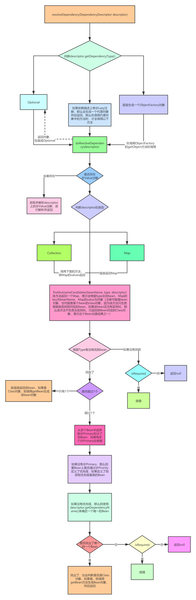
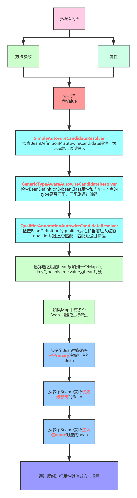

```java
@Nullable
Object resolveDependency(DependencyDescriptor descriptor, @Nullable String requestingBeanName,
        @Nullable Set<String> autowiredBeanNames, @Nullable TypeConverter typeConverter) throws BeansException;
```

该方法表示，传入一个依赖描述（DependencyDescriptor），该方法会根据该依赖描述从BeanFactory中找出对应的唯一的一个Bean对象。

**DefaultListableBeanFactory**中**resolveDependency()**方法的具体实现。




## findAutowireCandidates()实现

1. 找出BeanFactory中类型为type的所有的Bean的名字，注意是名字，而不是Bean对象，因为我们可以根据BeanDefinition就能判断和当前type是不是匹配
2. 把resolvableDependencies中key为type的对象找出来并添加到result中
3. 遍历根据type找出的beanName，判断当前beanName对应的Bean是不是能够被自动注入
4. 先判断beanName对应的BeanDefinition中的autowireCandidate属性，如果为false，表示不能用来进行自动注入，如果为true则继续进行判断
5. 判断当前type是不是泛型，如果是泛型是会把容器中所有的beanName找出来的，如果是这种情况，那么在这一步中就要获取到泛型的真正类型，然后进行匹配，如果当前beanName和当前泛型对应的真实类型匹配，那么则继续判断
6. 如果当前DependencyDescriptor上存在@Qualifier注解，那么则要判断当前beanName上是否定义了Qualifier，并且是否和当前DependencyDescriptor上的Qualifier相等，相等则匹配
7. 当前beanName才能成为一个可注入的，添加到result中

