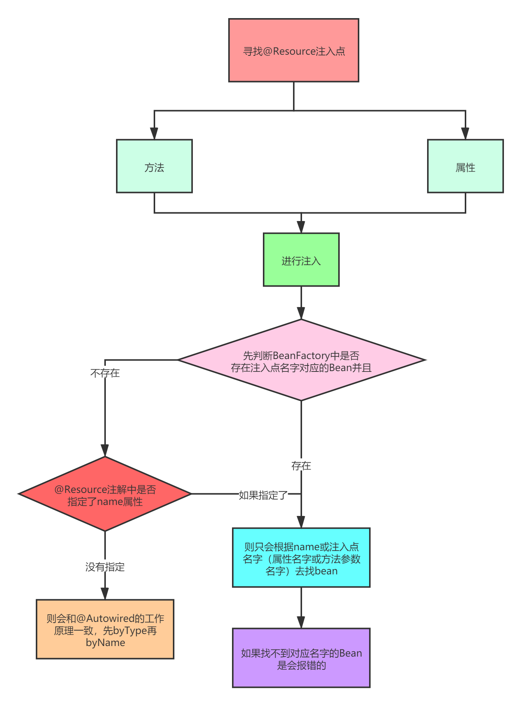

## 自己注入自己


定义一个类，类里面提供了一个构造方法，用来设置name属性

```java
public class UserService { 

    private String name;

    public UserService(String name) {
        this.name = name;
    }

    public String getName() {
        return name;
    }

    @Autowired
    private UserService userService;


    public void test() {
        System.out.println(userService.getName());
    }

}
```


然后针对UserService定义两个Bean:

```java
    @Bean
    public UserService userService1() {
        return new UserService("userService1");
    }

    @Bean
    public UserService userService() {
        return new UserService("userService");
    }
```


按照正常逻辑来说，对于注入点：

```java
@Autowired
private UserService userService;
```

会先根据UserService类型去找Bean，找到两个，然后根据属性名字“userService”找到一个beanName为userService的Bean，但是我们直接运行Spring，会发现注入的是“userService1”的那个Bean。

这是因为Spring中进行了控制，尽量“**自己不注入自己**”。




### 总结

对于@Resource：

1. 如果@Resource注解中指定了name属性，那么则只会根据name属性的值去找bean，如果找不到则报错
2. 如果@Resource注解没有指定name属性，那么会先判断当前注入点名字（属性名字或方法参数名字）是不是存在Bean，如果存在，则直接根据注入点名字取获取bean，如果不存在，则会走@Autowired注解的逻辑，会根据注入点类型去找Bean