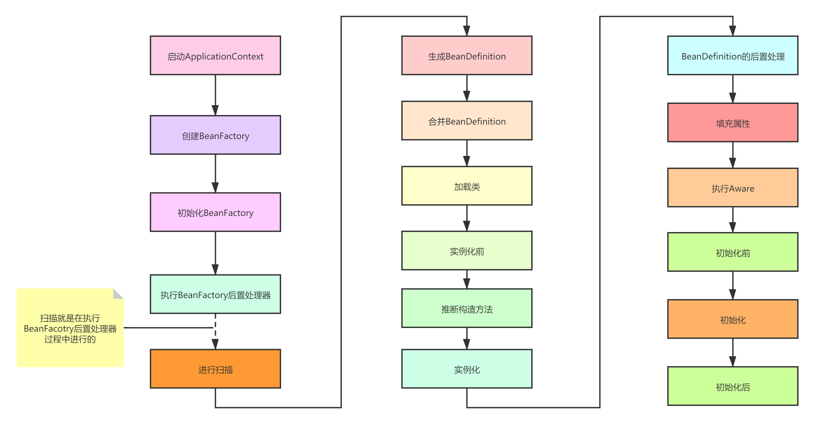

## Spring中的“父子”

1. 父子类
2. 父子BeanDefinition
3. 父子BeanFactory
4. 父子ApplicationContext

### 父子类

父子类是Java中的概念，在Spring中，当给某个类创建Bean的过程中，Spring不仅仅会对本类中的属性进行自动注入，同时也会对父类的属性进行自动注入。

### 父子BeanDefinition

父子BeanDefinition是Spring中的概念，Spring在根据BeanDefinition创建Bean的过程中，会先看当前BeanDefinition是否存在父BeanDefinition，如果存在则需要进行合并，合并就是把子BeanDefinition和父BeanDefinition中所定义的属性整合起来（如果存在某个属性在父子BeanDefinition中都存在，那么取子BeanDefinition中的属性）

### 父子BeanFactory

BeanFactory是一个Bean的容器，在Spring中，当我们在使用某个BeanFactory去获取Bean时，如果本BeanFactory中不存在该Bean，同时又有父BeanFactory，那么则会检查父BeanFactory是否存在该Bean，如果也不存在，那么则会创建Bean

### 父子ApplicationContext

父子ApplicationContext和父子BeanFactory类似，子ApplicationContext除开可以使用父ApplicationContext来获取Bean之外，还可以使用父ApplicationContext中其他的东西，比如ApplicationListener

## BeanPostProcessor(Bean的后置处理器)

Bean的后置处理器是指Spring在创建一个Bean的过程中，可以通过后置处理器来干涉Bean的创建过程

一个简单的Bean的生命周期：

1. 推断构造方法(确定使用哪个构造方法来实例化对象)
2. 实例化
3. 填充属性
4. 初始化

Spring在这个基础上，在这4步中的某些"间隙"中增加了扩展点，比如：

1. **BeanPostProcessor**：提供了**初始化前**、**初始化后**
2. **InstantiationAwareBeanPostProcessor**：在BeanPostProcessor的基础上增加了**实例化前**、**实例化后**、**填充属性后**
3. **MergedBeanDefinitionPostProcessor**：在BeanPostProcessor的基础上增加了在实例化和实例化后**之间**的扩展点

