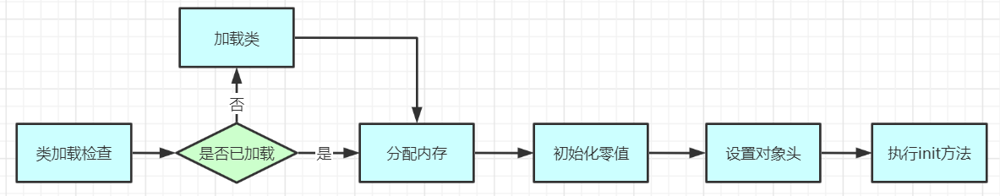
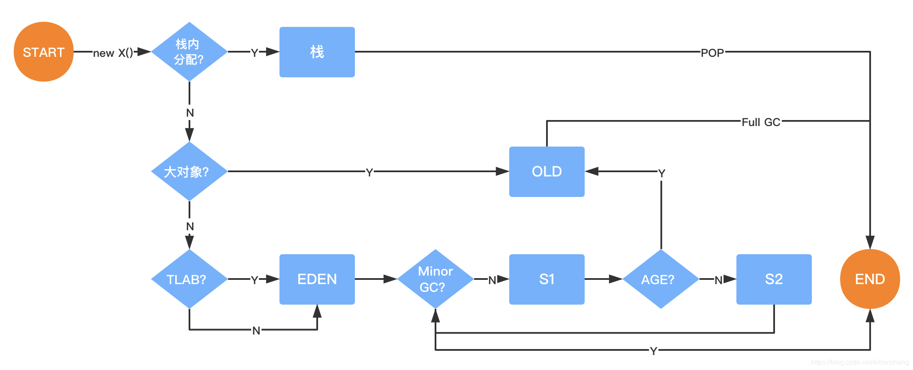

## JVM对象创建与内存分配

[toc]

### 对象的创建

对象创建的主要流程：



#### 类加载检查

虚拟机遇到一条new指令时，首先将去检查这个指令的参数是否能在常量池定位到一个类的符号引用，并且检查这个符号引用代表的类是否已被加载、解析和初始化过。如果没有，那必须先执行相应的类加载过程。

new指令对应到语言层面上讲就是，new关键词、对象科隆、对象序列化等。

#### 分配内存

在类加载检查通过后，接下来虚拟机将为新生对象分配内存。对象所需内存的大小在类加载完成后便可以完全确定，为对象分配空间的任务等同于把一块确定大小的内存从Java堆中划分出来。

##### 划分内存方法

###### 指针碰撞(Bump the Pointer)(默认使用指针碰撞)

如果Java堆中内存是绝对规范的，所有用过的内存都放在一边，空闲的内存放在另一边，中间放着一个指针座位分界点的指示器，那所分配内存就亲亲把那个指针向空闲那边挪动一段与对象大小相等的距离。

###### 空闲列表(Free List)

如果Java堆中内存并不是规整的，已使用的内存和空闲的内存相互交错，那就没有办法简单的进行指针碰撞了，虚拟机就必须维护一个列表，记录上哪些内存块是可用的，在分配的时候从列表中找到一块足够大的空间划分给对象实例，并更新到列表上。

##### 解决并发问题的方法

###### CAS(compare and swap)

虚拟机采用**CAS配上失败重试**的方法保证更新操作的原子性来对分配内存空间的动作进行同步处理。

###### 本地线程分配缓冲(Thread Local Alloction Buffer, TLAB)

把内存分配的动作按照线程划分在不同的空间之中进行，即每个线程在Java堆中预先分配一小块内存。通过**-Xxx:+/-UseTLAB**参数来设定虚拟机是否使用TLAB(JVM会默认开启)，**-XX:TLABSize**指定TLAB大小。

#### 初始化零值

内存分配完成后，虚拟机需要将分配到的内存空间都初始化为零值(不包括对象头)，如果使用TLAB，这一工作过程也可以提前至TLAB分配时进行。这一步操作保证了对象的实例字段在Java代码中可以不赋初始值就直接使用，程序能访问到这些字段的数据类型所对应的初始值。

#### 设置对象头

初始化零值之后，虚拟机要对对象进行必要的设置，例如这个对象是哪个类的实例、如何才能找到类的元数据信息、对象的哈希码、对象的GC分代年龄等信息。这些信息存放在对象的对象头ObjectHeader之中。

在HotSpot虚拟机中，对象在内存中存储的布局可以分为3块区域：对象头（Header）、 实例数据（Instance Data）和对齐填充（Padding）。 HotSpot虚拟机的对象头包括两部分信息，第一部分用于存储对象自身的运行时数据， 如哈希码（HashCode）、GC分代年龄、锁状态标志、线程持有的锁、偏向线程ID、偏向时 间戳等。对象头的另外一部分是类型指针，即对象指向它的类元数据的指针，虚拟机通过这个指针来确定这个对象是哪个类的实例。

对象头在hotspot的C++源码markOop.hpp文件里的注释如下：

```c++
// Bit-format of an object header (most significant first, big endian layout below):
//
//  32 bits:
//  --------
//             hash:25 ------------>| age:4    biased_lock:1 lock:2 (normal object)
//             JavaThread*:23 epoch:2 age:4    biased_lock:1 lock:2 (biased object)
//             size:32 ------------------------------------------>| (CMS free block)
//             PromotedObject*:29 ---------->| promo_bits:3 ----->| (CMS promoted object)
//
//  64 bits:
//  --------
//  unused:25 hash:31 -->| unused:1   age:4    biased_lock:1 lock:2 (normal object)
//  JavaThread*:54 epoch:2 unused:1   age:4    biased_lock:1 lock:2 (biased object)
//  PromotedObject*:61 --------------------->| promo_bits:3 ----->| (CMS promoted object)
//  size:64 ----------------------------------------------------->| (CMS free block)
//
//  unused:25 hash:31 -->| cms_free:1 age:4    biased_lock:1 lock:2 (COOPs && normal object)
//  JavaThread*:54 epoch:2 cms_free:1 age:4    biased_lock:1 lock:2 (COOPs && biased object)
//  narrowOop:32 unused:24 cms_free:1 unused:4 promo_bits:3 ----->| (COOPs && CMS promoted object)
//  unused:21 size:35 -->| cms_free:1 unused:7 ------------------>| (COOPs && CMS free block)
```


##### 32位对象头


##### 64位对象头


#### 执行<init>方法

执行<init>方法，即对象按照程序员的医院进行初始化。对应到语言层面上讲，就是未属性赋值(和上面赋零值不同，这是真正的值)，和执行构造方法。


### 对象内存分配



#### 对象在栈上分配

通过JVM内存分配可以知道Java中的对象都是在堆上进行分配，当对象没有被引用的时候，需要依靠GC进行回收内存，如果对象数量较多的时候，会给GC带来较大压力，也间接影响了应用的性能。为了减少临时对象在堆内分配的数量，JVM通过**逃逸分析**确定该对象不会被外部访问。如果不会逃逸可以将对象在**栈上分配**内存，这样该对象所占用的内存空间就可以随栈帧出栈而销毁，可以减轻了垃圾回收的压力。

**对象逃逸分析**；就是分析对象动态作用于，当一个对象在方法中被定义后，它可能被外部对象所引用，例如座位调用参数传递到其他地方中。

```java
public User test1() {
   User user = new User();
   user.setId(1);
   user.setName("zhuge");
   //TODO
   return user;
}

public void test2() {
   User user = new User();
   user.setId(1);
   user.setName("zhuge");
   //TODO
}
```

很显然test1方法中的user对象被返回了，这个对象的作用域范围不确定，test2方法中的user对象我们可以确定当方法结束这个对象就可以认为是无效对象了，对于这样的对象我们去是可以将其分配在栈内存里，让取方法结束时跟随栈内存一起回收掉。

JVM对于这种情况可以通过开启逃逸分析参数(-XX:+DoEscapeAnalysis)来优化对象内存分配位置，使其通过**标量调换**优先分配在栈上(**栈上分配**)，JDK7之后默认开启逃逸分析。

**标量替换**：通过逃逸分析确定该对象不会被外部访问，并且对象可以进一步分解时，**JVM不会创建该对象**，而是将改对象成员变量分解若干个被这个方法使用的成员变量所替代，这些代替的成员变量在栈帧或寄存器上分配空间，这样就不会因为没有一大块连续空间导致对象内存不够分配。开启标量替换参数(-XX:+EliminateAllocations)。

**标量与聚合量**：标量即不可能被进一步分解的量，而JAVA的基本数据类型就是标量(如：int、long等基本数据类型以及reference类型等)，标量的队里就是可以被进一步分解的量，而这种量称之为聚合量。而在JAVA中对象就是可以被进一步分解的聚合量。

栈上分配实例：

```java
/**
 * 栈上分配，标量替换
 * 代码调用了1亿次alloc()，如果是分配到堆上，大概需要1GB以上堆空间，如果堆空间小于该值，必然会触发GC。
 * 
 * 使用如下参数不会发生GC
 * -Xmx15m -Xms15m -XX:+DoEscapeAnalysis -XX:+PrintGC -XX:+EliminateAllocations
 * 使用如下参数都会发生大量GC
 * -Xmx15m -Xms15m -XX:-DoEscapeAnalysis -XX:+PrintGC -XX:+EliminateAllocations
 * -Xmx15m -Xms15m -XX:+DoEscapeAnalysis -XX:+PrintGC -XX:-EliminateAllocations
 */
public class AllotOnStack {

    public static void main(String[] args) {
        long start = System.currentTimeMillis();
        for (int i = 0; i < 100000000; i++) {
            alloc();
        }
        long end = System.currentTimeMillis();
        System.out.println(end - start);
    }

    private static void alloc() {
        User user = new User();
        user.setId(1);
        user.setName("zhangsan");
    }
}
```

#### 对象在Eden分配

大多数情况下，对象在新生代Eden区分配。当Eden区没有足够空间进行分配时，虚拟机将发起一次Minor GC。

**Minor Gc和Full GC有什么区别**

* Minor GC/Young GC：指发生在新生代的垃圾收集动作，Minor GC非常频繁，回收速度一般也比较快
* Major GC/Full GC：一般会回收老年代，年轻代，方法去的垃圾，Major GC的速度一般会比Minor GC的慢10倍以上。

#### Eden与Survivor区默认8:1:1

大量的对象被分配在eden区，eden区满了之后会触发minor gc，可能会有99%以上的对象成为垃圾被回收掉，剩余存活对象被挪到为空的那块survivor区，下一次eden区满了后又会触发minor gc，把eden区和survior区垃圾对象回收，把剩余存活的对象一次性挪到另外一块为空的survior区，因为新生对象都是朝生夕死的，存活时间很短，所以JVM默认的8:1:1的比例是很合适的，**让eden区尽量的大，survivor取够用即可**，JVM默认有这个参数-XX:+UseAdaptiveSizePolicy(默认开启)，会导致这个8:1:1的比例自动变化，如果不想这个比例有变化可以这只参数-XX:UseAdaptiveSizePolicy。

示例

```java
//添加运行JVM参数： -XX:+PrintGCDetails
public class GCTest {
   public static void main(String[] args) throws InterruptedException {
      byte[] allocation1, allocation2/*, allocation3, allocation4, allocation5, allocation6*/;
      allocation1 = new byte[60000*1024];

      //allocation2 = new byte[8000*1024];

      /*allocation3 = new byte[1000*1024];
     allocation4 = new byte[1000*1024];
     allocation5 = new byte[1000*1024];
     allocation6 = new byte[1000*1024];*/
   }
}

// 运行结果：
Heap
 PSYoungGen      total 76288K, used 65536K [0x000000076b400000, 0x0000000770900000, 0x00000007c0000000)
  eden space 65536K, 100% used [0x000000076b400000,0x000000076f400000,0x000000076f400000)
  from space 10752K, 0% used [0x000000076fe80000,0x000000076fe80000,0x0000000770900000)
  to   space 10752K, 0% used [0x000000076f400000,0x000000076f400000,0x000000076fe80000)
 ParOldGen       total 175104K, used 0K [0x00000006c1c00000, 0x00000006cc700000, 0x000000076b400000)
  object space 175104K, 0% used [0x00000006c1c00000,0x00000006c1c00000,0x00000006cc700000)
 Metaspace       used 3342K, capacity 4496K, committed 4864K, reserved 1056768K
  class space    used 361K, capacity 388K, committed 512K, reserved 1048576K
```

可以看出eden区内存几乎已经被分配完全(即使程序什么也不做，新生代也会使用至少几M内存)。

再为allocation2分配内存

```java
//添加运行JVM参数： -XX:+PrintGCDetails
public class GCTest {
   public static void main(String[] args) throws InterruptedException {
      byte[] allocation1, allocation2/*, allocation3, allocation4, allocation5, allocation6*/;
      allocation1 = new byte[60000*1024];

      allocation2 = new byte[8000*1024];

      /*allocation3 = new byte[1000*1024];
      allocation4 = new byte[1000*1024];
      allocation5 = new byte[1000*1024];
      allocation6 = new byte[1000*1024];*/
   }
}

// 运行结果：
[GC (Allocation Failure) [PSYoungGen: 65253K->936K(76288K)] 65253K->60944K(251392K), 0.0279083 secs] [Times: user=0.13 sys=0.02, real=0.03 secs] 
Heap
 PSYoungGen      total 76288K, used 9591K [0x000000076b400000, 0x0000000774900000, 0x00000007c0000000)
  eden space 65536K, 13% used [0x000000076b400000,0x000000076bc73ef8,0x000000076f400000)
  from space 10752K, 8% used [0x000000076f400000,0x000000076f4ea020,0x000000076fe80000)
  to   space 10752K, 0% used [0x0000000773e80000,0x0000000773e80000,0x0000000774900000)
 ParOldGen       total 175104K, used 60008K [0x00000006c1c00000, 0x00000006cc700000, 0x000000076b400000)
  object space 175104K, 34% used [0x00000006c1c00000,0x00000006c569a010,0x00000006cc700000)
 Metaspace       used 3342K, capacity 4496K, committed 4864K, reserved 1056768K
  class space    used 361K, capacity 388K, committed 512K, reserved 1048576K
```

因为给allocation2分配内存的时候eden区内存几乎已经被分配完了，Eden区没有足够空间进行分配时，虚拟机将发起一次Minor GC，期间虚拟机又发现allocation1无法存入Survior空间，所以只好把新生代的对象**提前转移到老年代**中去，老年代上的空间足够存放allocation1，所以不会出现Full GC。执行Minor GC后，后面分配的对象如果够存在Eden区的话，还是会在Eden区分配内存。

验证：

```java
public class GCTest {
   public static void main(String[] args) throws InterruptedException {
      byte[] allocation1, allocation2, allocation3, allocation4, allocation5, allocation6;
      allocation1 = new byte[60000*1024];

      allocation2 = new byte[8000*1024];

      allocation3 = new byte[1000*1024];
      allocation4 = new byte[1000*1024];
     allocation5 = new byte[1000*1024];
     allocation6 = new byte[1000*1024];
   }
}

// 运行结果：
[GC (Allocation Failure) [PSYoungGen: 65253K->952K(76288K)] 65253K->60960K(251392K), 0.0311467 secs] [Times: user=0.08 sys=0.02, real=0.03 secs] 
Heap
 PSYoungGen      total 76288K, used 13878K [0x000000076b400000, 0x0000000774900000, 0x00000007c0000000)
  eden space 65536K, 19% used [0x000000076b400000,0x000000076c09fb68,0x000000076f400000)
  from space 10752K, 8% used [0x000000076f400000,0x000000076f4ee030,0x000000076fe80000)
  to   space 10752K, 0% used [0x0000000773e80000,0x0000000773e80000,0x0000000774900000)
 ParOldGen       total 175104K, used 60008K [0x00000006c1c00000, 0x00000006cc700000, 0x000000076b400000)
  object space 175104K, 34% used [0x00000006c1c00000,0x00000006c569a010,0x00000006cc700000)
 Metaspace       used 3343K, capacity 4496K, committed 4864K, reserved 1056768K
  class space    used 361K, capacity 388K, committed 512K, reserved 1048576K
```

#### 大对象直接进入老年代

大对象就是需要大量连续内存空间的对象(比如：字符串、数组)。JVM参数-XX:PretenureSizeThreshold可以设置大对象的大小，如果对象超过设置大小会直接进入老年代，不会进入年轻代，这个参数在Serial和ParNew两个垃圾收集器下有小。

这么设计是为了避免对象分配的复制操作从而降低效率。

#### 长期存活的对象将进入老年代

既然虚拟采用了分代收集的思想来管理内存，那么内存回收时就必须能识别哪些对象应放在新生代，哪些对象应放在老年代中。为了做到这一点，虚拟机给每个对象一个对象年龄(Age)计数器。

如果对象在Eden出生并经过第一次Minor GC会后仍然存活，并且能被Survivor容纳的话，将被移动到Survivor空间中，并将对象年龄设为1。对象在Survivor中没熬过一次MinorGC，年龄就增加1岁，当它的年龄增加到一定程度(默认为15岁，CMS收集器默认6岁，不同的垃圾收集器会略微有点不同)，就会被晋升到老年代中。对象晋升到老年代的年龄阈值，可以通过参数-XX:MaxTenuringThreshold来设置。

#### 对象动态年龄判断

当前放对象的Survivor区域里(其中一块区域，放对象的那块s区)，一批对象的总大小大于这块Survivor区域内存大小的50%(-XX:TargetSurvivorRatio可以指定)，那么此时**大于等于**这批对象年龄最大值的对象，就可以**直接进入老年代**了，例如Survivor区域里现在有一批对象，年龄1+年龄2+年龄n的多个年龄对象总和超过了Survivor区域的50%，此时就会把年龄n(含)以上的对象都放入老年代。这个规则其实是希望那些可能是长期存活的对象，尽早进入老年代。**对象动态年龄判断机制一般是在minor gc之后触发的。**

#### 老年代空间分配担保机制

年轻代每次**minor gc**之前JVM都会计算下老年代**剩余可用空间**

如果这个可用空间小于年轻代里现有的所有对象大小之和(**包括垃圾对象**)

就会看一个“-XX:-HandlePromotionFailure”(jdk1.8默认就设置了)的参数是否设置了

如果有这个参数，就会看看老年代的可用内存大小，是否大于之前每一次minor gc后进入老年代的对象的**平均大小**。

如果上一步结果是小于或者之前说的参数没有设置，那么就会触发一次Full gc，对老年代和年轻代一起回收一次垃圾，如果回收完还是没有足够空间存放新的对象就会发生"OOM"

当然，如果minor gc之后剩余存活的需要挪动到老年代的对象大小还是大于老年代可用空间，那么也会触发full gc，full gc完之后如果还是没有空间放minor gc之后的存活对象，则也会发生“OOM”


### 对象内存回收

堆中几乎放着所有的对象实例，对堆垃圾回收前第一步就是要判断哪些对象已经死亡(即不能再被任何途径使用的对象)。

#### 引用计数法

给对象中添加一个引用计数器，当没有一个地方引用它，计数器就+1；当引用失效，计数器就-1；任何时候计数器为0的对象就是不可能再被使用的。

**这个方法实现简单，效率高，但是目前主流的虚拟机中并没有选择这个算法来管理内存，其最主要的原因是它河南解决对象之间相互循环使用的问题。**

```java
public class ReferenceCountingGc {
   Object instance = null;

   public static void main(String[] args) {
      ReferenceCountingGc objA = new ReferenceCountingGc();
      ReferenceCountingGc objB = new ReferenceCountingGc();
      objA.instance = objB;
      objB.instance = objA;
      objA = null;
      objB = null;
   }
}
```

#### 可达性分析算法

将**GC Roots**对象作为起点，从这些节点开始向下搜索引用的对象，找到的对象都标记为**非垃圾对象**，其余未标记的对象都是垃圾对象。

**GC Roots**根节点：线程栈的本地变量、静态变量、本地方法栈的变量等等。


#### 引用引用类型

Java的引用类型一般分为四种：强引用、软引用、弱引用、虚引用

##### 强引用：普通的变量引用

```java
public static User user = new User();
```

##### 软引用：将对象SoftReference软引用类型的对象包裹，正常情况不会被回收，但是GC昨晚后发现释放不出空间存放新对象，则会把这些软引用的对象回收掉。软引用可用来实现内存敏感的高速缓存

```java
public static SoftReference<User> user = new SoftReference<User>(new User());
```

软引用在实际中有重要的应用，例如浏览器的后退按钮。按后退时，这个后退时显示的网页内容是重新进行请求还是从缓存中取出呢？这就要看具体的实现策略了。

1. 如果一个网页在浏览结束时就进行内容的回收，则按后退查看前面浏览过的页面时，需要重新构建
2. 如果将浏览过的网页存储到内存中会造成内存的大量浪费，甚至会造成内存溢出

##### 弱引用：将对象用WeakReference软引用类型的对象包裹，弱引用跟没引用差不多，GC会直接回收掉，很少用

```java
public static WeakReference<User> user = new WeakReference<User>(new User());
```

##### 虚引用：虚引用也成为幽灵引用或者幻影引用，它是最弱的一种引用关系，几乎不用

#### finalize()方法最终判断对象是否存活

即使在可达性分析算法中不可达的对象，也并非是“非死不可”的，这时候它们暂时处于“缓刑”阶段，要真正宣告一个对象死亡，至少要经历再次标记过程。

**标记的前提是对象在进行可达性分析后发现没有与GC Roots相连接的引用链。**

##### 第一次标记并进行一次筛选

筛选的条件是此对象是否有必要执行finalize()方法。

对象没有覆盖finalize方法，对象将直接被回收。

##### 第二次标记

如果这个对象覆盖了finalize方法，finalize方法是对象脱逃死亡命运的最后一次机会，如果对象要在finalize()中成功拯救自己，只要重新与引用链上的任何一个对象建立关联即可。比如把自己赋值给某个变量后者对象的成员变量，那么在第二次标记时它将被移除”即将回收“的集合。如果对象这时还没有逃脱，那么基本上它就是真的被回收了。

```java
public class OOMTest {

   public static void main(String[] args) {
      List<Object> list = new ArrayList<>();
      int i = 0;
      int j = 0;
      while (true) {
         list.add(new User(i++, UUID.randomUUID().toString()));
         new User(j--, UUID.randomUUID().toString());
      }
   }
}


//User类需要重写finalize方法
@Override
protected void finalize() throws Throwable {
    OOMTest.list.add(this);
    System.out.println("关闭资源，userid=" + id + "即将被回收");
}
```

finalize()方法的运行代价高昂，不确定性大，无法保证各个对象的调用顺序，如今已被官方明确声明不推荐使用的语法。

#### 如果判断一个类是无用的类

方法区主要回收的就是无用的类

类需要同时满足下面三个条件才能算是**无用的类**

* 该类所有的对象实例都已经被回收，也就是Java堆中不存在该类的任何实例。
* 加载该类的ClassLoader已经被回收。
* 该类对应的java.lang.Class对象没有任何地方被引用，无法在任何地方通过反射访问该类的方法。